# Electronic Signatures and Infrastructures (ESI); Registered Electronic Mail (REM) Services;
## ETSI EN 319 532-1 V1.1.1 (2018-09) - Phần 1: Khung và kiến trúc

### Lời tựa
Tiêu chuẩn Châu Âu (EN) này được ban hành bởi Ủy ban Kỹ thuật về Chữ ký điện tử và Cơ sở hạ tầng (ESI) thuộc ETSI.  
Tài liệu này là phần 1 trong một bộ tài liệu gồm nhiều phần, đề cập đến các dịch vụ thư điện tử đăng ký (REM),
như được nêu dưới đây:
* Phần 1: "Khung và kiến trúc";
* Phần 2: "Nội dung ngữ nghĩa";
* Phần 3: "Định dạng";
* Phần 4: "Hồ sơ tương tác".

### Giới thiệu
Các mối quan hệ kinh doanh và hành chính giữa các công ty, cơ quan hành chính nhà nước và người dân ngày càng được thực hiện bằng
phương thức điện tử. Lòng tin là yếu tố thiết yếu cho sự thành công và phát triển bền vững của các dịch vụ điện tử. Do đó, điều
quan trọng là bất kỳ tổ chức nào sử dụng dịch vụ điện tử đều phải có các biện pháp kiểm soát và cơ chế bảo mật phù hợp để bảo vệ
các giao dịch của mình và đảm bảo lòng tin với các đối tác.

Chữ ký điện tử được sử dụng phổ biến trên toàn thế giới để đảm bảo tính xác thực và toàn vẹn của các tài liệu điện tử, giúp chuyển
đổi các quy trình truyền thống dựa trên giấy tờ sang quy trình điện tử với mức độ đảm bảo tương đương hoặc thậm chí cao hơn. Khi
giao tiếp ngày càng dựa nhiều vào internet, việc trao đổi tài liệu an toàn và có thể chứng minh được là điều thiết yếu cho quá
trình chuyển đổi số toàn diện.

Dịch vụ chuyển phát điện tử có xác nhận (sau đây gọi là ERDS) cung cấp khả năng chuyển phát an toàn và đáng tin cậy các tin nhắn
điện tử giữa các bên, tạo ra bằng chứng về quá trình chuyển phát để phục vụ cho trách nhiệm pháp lý. Bằng chứng có thể được xem như
một tuyên bố của bên được tin cậy rằng một sự kiện cụ thể liên quan đến quá trình chuyển phát (gửi tin nhắn, chuyển tiếp tin nhắn,
chuyển phát tin nhắn, từ chối tin nhắn, v.v.) đã xảy ra vào một thời điểm nhất định. Bằng chứng có thể được chuyển ngay lập tức cho
bên liên quan (cùng với tin nhắn hoặc riêng biệt) hoặc có thể được lưu trữ trong kho lưu trữ để truy cập sau này. Thông thường,
bằng chứng được thể hiện dưới dạng dữ liệu được ký điện tử. Thư điện tử có xác nhận (sau đây gọi là REM) là một loại hình chuyển
phát điện tử có xác nhận cụ thể, được xây dựng dựa trên các định dạng, giao thức và cơ chế được sử dụng trong việc gửi thư điện tử
thông thường.

Tại một số cộng đồng quốc gia, khu vực hoặc ngành nghề cụ thể, các dịch vụ chuyển phát thư điện tử có đăng ký và thư điện tử đăng
ký đã được triển khai, và thậm chí còn nhiều hơn nữa đang được phát triển. Nếu không định nghĩa các tiêu chuẩn chung, sẽ không có
sự nhất quán trong các dịch vụ được cung cấp, gây khó khăn cho người dùng trong việc so sánh chúng. Trong những trường hợp này,
người dùng có thể khó chuyển sang các nhà cung cấp khác, làm tổn hại đến cạnh tranh tự do. Việc thiếu tiêu chuẩn hóa cũng có thể
ảnh hưởng xấu đến khả năng tương tác giữa các triển khai dựa trên các mô hình khác nhau.

Tài liệu này là một trong số các tài liệu có liên quan với nhau (sau đây gọi là khung tiêu chuẩn ERDS) do ETSI biên soạn nhằm tạo
điều kiện thuận lợi cho một hình thức dịch vụ giao hàng điện tử có đăng ký nhất quán trong và ngoài châu Âu, đặc biệt là về hình
thức bằng chứng được cung cấp, để tối đa hóa khả năng tương tác ngay cả giữa các lĩnh vực được điều chỉnh bởi các quy tắc chính
sách khác nhau. Bộ tài liệu này bao gồm các sản phẩm sau:
* ETSI EN 319 522 [i.16]: Tài liệu nhiều phần cung cấp các thông số kỹ thuật cho Dịch vụ Giao hàng Đăng ký Điện tử.
* ETSI EN 319 532 [i.17]: Tài liệu nhiều phần cung cấp các thông số kỹ thuật cho Dịch vụ Thư điện tử Đăng ký.
* ETSI EN 319 521 [i.18]: Cung cấp các Yêu cầu về Chính sách và Bảo mật cho các Nhà cung cấp Dịch vụ Giao hàng Đăng ký Điện tử.
* ETSI EN 319 531 [i.19]: Cung cấp các Yêu cầu về Chính sách và Bảo mật cho các Nhà cung cấp Dịch vụ Thư điện tử Đăng ký.
* ETSI TS 119 524 [i.20]: Tài liệu nhiều phần cung cấp các yêu cầu để Kiểm tra Sự phù hợp và Khả năng tương tác của Dịch vụ Giao hàng Đăng ký Điện tử.
* ETSI TS 119 534 [i.21]: Tài liệu nhiều phần cung cấp các yêu cầu để Kiểm tra Sự phù hợp và Khả năng tương tác của Dịch vụ Thư điện tử Đăng ký.

Các văn bản quy định về ERDS chứa các khái niệm và yêu cầu chung áp dụng cho tất cả các loại dịch vụ chuyển phát thư điện tử có
đăng ký. Vì REM là một loại hình chuyển phát thư điện tử có đăng ký đặc thù, nên các văn bản quy định về dịch vụ REM được xây dựng
dựa trên các văn bản tương ứng quy định về ERDS bằng cách tham chiếu các điều khoản cần thiết, và xác định cách giải thích cũng
như các yêu cầu cụ thể chỉ áp dụng cho thư điện tử có đăng ký.

Quy định (EU) số 910/2014 của Nghị viện Châu Âu và Hội đồng ngày 23 tháng 7 năm 2014 về nhận dạng điện tử và dịch vụ tin cậy cho
các giao dịch điện tử trong thị trường nội địa và bãi bỏ Chỉ thị 1999/93/EC [i.4] (Quy định (EU) số 910/2014, hoặc sau đây gọi là
Quy định) cung cấp một khuôn khổ pháp lý để tạo điều kiện thuận lợi cho việc công nhận xuyên biên giới giữa các hệ thống pháp luật
quốc gia hiện hành liên quan đến dịch vụ chuyển phát đăng ký điện tử. Khuôn khổ đó nhằm mục đích mở ra các cơ hội thị trường mới
cho các nhà cung cấp dịch vụ tin cậy của Liên minh Châu Âu để cung cấp các dịch vụ chuyển phát đăng ký điện tử toàn châu Âu mới.
Quy định này định nghĩa cái gọi là dịch vụ chuyển phát đăng ký điện tử đủ điều kiện (sau đây gọi là QERDS), là một loại ERDS đặc
biệt, trong đó cả dịch vụ và nhà cung cấp của nó đều cần đáp ứng một số yêu cầu bổ sung mà các ERDS thông thường và nhà cung cấp
của chúng không cần phải đáp ứng.

Khung tiêu chuẩn ERDS nhằm mục đích bao quát các yêu cầu chung và được công nhận trên toàn thế giới để giải quyết việc gửi thư bảo
đảm điện tử một cách an toàn và đáng tin cậy, bất kể khung pháp lý hiện hành. Các tài liệu này chứa các yêu cầu chung có thể được
áp dụng ở bất kỳ khu vực địa lý nào. Đồng thời, khung tiêu chuẩn ERDS nhằm mục đích hỗ trợ chứng minh sự tuân thủ Quy định (EU) số
910/2014 [i.4] (và các văn bản pháp luật thứ cấp liên quan), đối với cả dịch vụ gửi thư bảo đảm điện tử không đủ điều kiện và đủ
điều kiện. Các điều khoản cụ thể được đưa vào để xác định các yêu cầu chỉ dành cho các dịch vụ đủ điều kiện, đặc biệt là trong các
tài liệu bao gồm các yêu cầu về chính sách và an ninh. Tuy nhiên, hiệu lực pháp lý của các dịch vụ được thực hiện theo khung tiêu
chuẩn ERDS nằm ngoài phạm vi của các tài liệu [i.16] đến [i.21].

Tài liệu hiện tại là phần 1 của ETSI EN 319 532 [i.17], là một tài liệu gồm nhiều phần bao gồm các Dịch vụ Thư điện tử Đăng ký
(REM), như đã nêu chi tiết trong Lời nói đầu. ETSI EN 319 522 chứa các khái niệm và yêu cầu chung áp dụng cho tất cả các loại
ERDS. Vì thư điện tử đăng ký là một loại hình giao hàng điện tử đăng ký cụ thể, nên các quy định chung được đưa ra trong ETSI EN
319 522 cũng áp dụng cho thư điện tử đăng ký. Do đó, phần 1 và 2 của ETSI EN 319 532 phù hợp với ETSI EN 319 522 và chúng tham
chiếu đến các quy định cần thiết của phần tương ứng.

### I. Phạm vi
Tài liệu này mô tả mô hình logic và các khái niệm cơ bản của dịch vụ thư điện tử đăng ký (REM).  
Tài liệu hiện tại dựa trên ETSI EN 319 522-1 [1] cho tất cả các khái niệm và yêu cầu áp dụng chung cho tất cả các dịch vụ chuyển
phát điện tử đã đăng ký và xác định cách giải thích và các yêu cầu cụ thể chỉ áp dụng cho thư điện tử đã đăng ký.

### II. Tài liệu tham khảo
#### II.1. Tài liệu tham khảo chuẩn mực
Tài liệu tham khảo có thể là tài liệu cụ thể (được xác định bằng ngày xuất bản và/hoặc số ấn bản hoặc số phiên bản) hoặc không cụ
thể. Đối với tài liệu tham khảo cụ thể, chỉ phiên bản được trích dẫn mới có giá trị. Đối với tài liệu tham khảo không cụ thể,
phiên bản mới nhất của tài liệu được tham khảo (bao gồm cả các sửa đổi) sẽ có giá trị.

Các tài liệu tham khảo không có sẵn công khai ở vị trí dự kiến có thể được tìm thấy tại https://docbox.etsi.org/Reference/.
> LƯU Ý: Mặc dù mọi liên kết trong điều khoản này đều hợp lệ tại thời điểm xuất bản,
ETSI không thể đảm bảo tính hợp lệ lâu dài của chúng.

Các tài liệu tham khảo sau đây là cần thiết cho việc áp dụng văn bản này.
* ETSI EN 319 522-1: "Chữ ký điện tử và cơ sở hạ tầng (ESI); Dịch vụ giao nhận đăng ký điện tử; Phần 1: Khung và kiến trúc".

#### II.2. Tài liệu tham khảo hữu ích
Tài liệu tham khảo có thể là tài liệu cụ thể (được xác định bằng ngày xuất bản và/hoặc số ấn bản hoặc số phiên bản) hoặc không cụ
thể. Đối với tài liệu tham khảo cụ thể, chỉ phiên bản được trích dẫn mới có giá trị. Đối với tài liệu tham khảo không cụ thể,
phiên bản mới nhất của tài liệu được tham khảo (bao gồm cả các sửa đổi) sẽ có giá trị.
```
LƯU Ý: Mặc dù mọi liên kết siêu văn bản được bao gồm trong điều khoản này đều hợp lệ tại thời điểm xuất bản,
ETSI không thể đảm bảo tính hợp lệ lâu dài của chúng.
```
Các tài liệu tham khảo dưới đây không bắt buộc cho việc áp dụng tài liệu này nhưng chúng hỗ trợ người dùng về một lĩnh vực cụ thể.
1. ETSI EN 319 532-2: "Chữ ký điện tử và cơ sở hạ tầng (ESI); Dịch vụ thư điện tử đăng ký (REM); Phần 2: Nội dung ngữ nghĩa".
2. ETSI EN 319 532-3: "Chữ ký điện tử và cơ sở hạ tầng (ESI); Dịch vụ thư điện tử đăng ký (REM); Phần 3: Định dạng".
3. ETSI EN 319 532-4: "Chữ ký điện tử và cơ sở hạ tầng (ESI); Dịch vụ thư điện tử đăng ký (REM); Phần 4: Hồ sơ khả năng tương tác".
4. Quy định (EU) số 910/2014 của Nghị viện Châu Âu và Hội đồng về nhận dạng điện tử và dịch vụ tin cậy cho các giao dịch điện tử trong thị trường nội bộ và bãi bỏ Chỉ thị 1999/93/EC.
5. ETSI EN 319 522-2: "Chữ ký điện tử và cơ sở hạ tầng (ESI); Dịch vụ chuyển phát đăng ký điện tử; Phần 2: Nội dung ngữ nghĩa".
6. ETSI TS 119 612: "Chữ ký điện tử và cơ sở hạ tầng (ESI); Danh sách tin cậy".
7. IETF RFC 5751: "Đặc tả thông báo phiên bản 3.2 của Phần mở rộng thư Internet đa năng/an toàn (S/MIME)"
8. IETF RFC 5321: "Giao thức truyền thư đơn giản".
9. IETF RFC 1939: "Giao thức Bưu điện - Phiên bản 3".
10. IETF RFC 3501: "Giao thức truy cập tin nhắn Internet - Phiên bản 4rev1".
11. IETF RFC 5246: "Giao thức Bảo mật Lớp Vận chuyển (TLS) Phiên bản 1.2".
12. IETF RFC 4422: "Lớp Xác thực và Bảo mật Đơn giản (SASL)".
13. IETF RFC 3207: "Phần mở rộng dịch vụ SMTP cho SMTP an toàn qua Bảo mật Lớp Vận chuyển".
14. IETF RFC 2595: "Sử dụng TLS với IMAP, POP3 và ACAP". [i.15] IETF RFC 7817: "Quy trình kiểm tra danh tính máy chủ Bảo mật Lớp Vận chuyển (TLS) được cập nhật cho các giao thức liên quan đến email".
15. RFC 7817 của IETF: "Quy trình kiểm tra danh tính máy chủ Bảo mật Lớp Vận chuyển (TLS) được cập nhật cho các giao thức liên quan đến email".
16. ETSI EN 319 522 (tất cả các phần): "Chữ ký điện tử và cơ sở hạ tầng (ESI); Dịch vụ chuyển phát đăng ký điện tử".
17. ETSI EN 319 532 (tất cả các phần): "Chữ ký điện tử và cơ sở hạ tầng (ESI); Dịch vụ thư điện tử đăng ký (REM)".
18. ETSI EN 319 521: "Chữ ký điện tử và cơ sở hạ tầng (ESI); Chính sách và yêu cầu bảo mật đối với các nhà cung cấp dịch vụ chuyển phát đăng ký điện tử".
19. ETSI EN 319 531: "Chữ ký điện tử và cơ sở hạ tầng (ESI); Chính sách và yêu cầu bảo mật đối với các nhà cung cấp dịch vụ thư điện tử đăng ký". [i.20] ETSI TS 119 524 (tất cả các phần): "Chữ ký điện tử và cơ sở hạ tầng (ESI); Kiểm tra sự phù hợp và khả năng tương tác của dịch vụ gửi thư điện tử đã đăng ký".
21. ETSI TS 119 534 (tất cả các phần): "Chữ ký điện tử và cơ sở hạ tầng (ESI); Kiểm tra sự phù hợp và khả năng tương tác của dịch vụ thư điện tử đã đăng ký".

### III. Định nghĩa và viết tắt
#### III.1 Định nghĩa
Để phục vụ cho mục đích của tài liệu này, các thuật ngữ và định nghĩa sau đây được áp dụng:
* **consignment**: hành động cung cấp nội dung của người dùng cho người nhận trong phạm vi dịch vụ giao hàng điện tử đã đăng ký.
* **Electronic Registered Delivery Service Provider (ERDSP)**: đơn vị cung cấp dịch vụ chuyển phát có đăng ký điện tử.
* **ERD dispatch**: Thông báo ERD chứa nội dung người dùng, một số siêu dữ liệu chuyển tiếp ERDS và bằng chứng ERDS.
* **ERD event**: sự kiện liên quan trong quá trình phân phối điện tử, có thể được chứng thực bằng bằng chứng ERDS.
* **ERD message**: dữ liệu bao gồm nội dung người dùng tùy chọn, siêu dữ liệu chuyển tiếp ERDS và không hoặc nhiều bằng chứng ERDS.
* **ERD payload**: Thông điệp ERD chứa nội dung người dùng và một số siêu dữ liệu chuyển tiếp ERDS.
* **ERD User Agent/Application (ERD-UA)**: hệ thống bao gồm các thành phần phần mềm và/hoặc phần cứng mà qua đó người gửi và người nhận tham gia vào việc trao đổi dữ liệu với các nhà cung cấp dịch vụ chuyển phát điện tử đã đăng ký.
* **Electronic Registered Delivery Service (ERDS)**: dịch vụ điện tử cho phép truyền dữ liệu giữa người gửi và người nhận bằng phương tiện điện tử và cung cấp bằng chứng liên quan đến việc xử lý dữ liệu đã truyền, bao gồm bằng chứng gửi và nhận dữ liệu, đồng thời bảo vệ dữ liệu đã truyền khỏi nguy cơ mất mát, trộm cắp, hư hỏng hoặc bất kỳ sự thay đổi trái phép nào.
* **ERDS evidence**: dữ liệu được tạo ra bởi dịch vụ giao hàng đăng ký điện tử, nhằm mục đích chứng minh rằng một sự kiện nhất định đã xảy ra vào một thời điểm nhất định.
* **ERDS handover metadata**: dữ liệu liên quan đến nội dung người dùng được tạo ra bởi dịch vụ giao hàng đăng ký điện tử và được chuyển giao cho tác nhân/ứng dụng người dùng ERD của người nhận.
* **ERDS receipt**: Thông báo ERD chứa bằng chứng ERDS và một số siêu dữ liệu chuyển tiếp ERDS.
* **ERDS relay metadata**: dữ liệu liên quan đến nội dung người dùng được tạo ra bởi dịch vụ chuyển phát điện tử đã đăng ký nhằm mục đích chuyển tiếp đến một dịch vụ chuyển phát điện tử đã đăng ký khác.
* **ERDS serviceinfo**: Thông báo ERD chứa một số siêu dữ liệu chuyển tiếp ERDS.
* **handover**: hành động chuyển giao thành công nội dung người dùng thông qua hệ thống dịch vụ chuyển phát điện tử đã đăng ký của người nhận đến ứng dụng/tác nhân người dùng ERD của người nhận.
* **original message**: dữ liệu bao gồm nội dung người dùng và siêu dữ liệu bài gửi
* **recipient**: cá nhân hoặc pháp nhân mà nội dung người dùng hướng đến.
* **Registered Electronic Mail (REM)**: hình thức nâng cao của thư điện tử được gửi qua dịch vụ thư điện tử đăng ký.
* **Registered Electronic Mail Service (REMS)**: dịch vụ chuyển phát thư điện tử đăng ký dựa trên các định dạng, giao thức và cơ chế được sử dụng trong tin nhắn thư điện tử thông thường.
* **Registered Electronic Mail Service Provider (REMSP)**: tổ chức cung cấp dịch vụ thư điện tử đã đăng ký.
* **REM dispatch**: Gửi ERD dưới dạng phong bì REM
* **REM envelope**: cấu trúc dữ liệu đã ký được tạo bởi dịch vụ thư điện tử đã đăng ký, chứa bất kỳ nội dung nào của người dùng, siêu dữ liệu chuyển tiếp ERDS và/hoặc bằng chứng ERDS.
* **REM interoperability domain**: không gian hoạt động đồng nhất bao gồm một tập hợp các REMSP có khả năng tương tác đúng cách với nhau.
* **REM message**: tập hợp các quy tắc xác định miền tương tác REM.
* **REM message**: Thông điệp ERD dưới dạng bao bì REM.
* **REMS notification**: Thông tin dịch vụ ERDS hoặc biên nhận ERDS, dưới dạng phong bì REM, bao gồm tham chiếu đến nội dung người dùng cần được gửi.
* **REM payload**: Tải trọng ERD dưới dạng bao REM.
* **REMS receipt**: Biên lai ERDS dưới dạng phong bì REM.
* **sender**: cá nhân hoặc pháp nhân đã gửi nội dung người dùng.
* **submission metadata**: dữ liệu được gửi đến dịch vụ giao hàng đăng ký điện tử cùng với nội dung người dùng.
* **user content**: dữ liệu gốc do người gửi tạo ra và cần được chuyển đến người nhận.

#### III.2 Từ viết tắt
Để phục vụ cho mục đích của tài liệu này, các chữ viết tắt sau đây được áp dụng:
| Viết tắt | Mô tả                                           |
|----------|-------------------------------------------------|
| CSI      | Common Service Interface                        |
| ERD      | Electronic Registered Delivery                  |
| ERD-UA   | ERD User Agent/Application                      |
| ERDS     | Electronic Registered Delivery Service          |
| ERDSP    | Electronic Registered Delivery Service Provider |
| ESMTP    | Extended SMTP                                   |
| EU       | European Union                                  |
| I-REMS   | Intermediate REMS                               |
| IMAP     | Internet Message Access Protocol                |
| MIME     | Multipurpose Internet Mail Extensions           |
| PDF      | Portable Document Format                        |
| POP      | Post Office Protocol                            |
| POP3     | Post Office Protocol version 3                  |
| R-REMS   | Recipient's REMS                                |
| REM      | Registered Electronic Mail                      |
| REMID    | REM Interoperability Domain                     |
| REMS     | Registered Electronic Mail Service              |
| REMSP    | Registered Electronic Mail Service Provider     |
| S&F      | Store and Forward                               |
| S&N      | Store and Notify                                |
| S-REMS   | Sender's REMS                                   |
| S/MIME   | Secure/Multipurpose Internet Mail Extensions    |
| SASL     | Simple Authentication and Security Layer        |
| SMTP     | Simple Mail Transfer Protocol                   |
| TL       | Trusted Lis                                     |
| TLS      | Transport Layer Security                        |
| TSP      | Trust Service Provider                          |
| URI      | Uniform Resource Identifier                     |
| URL      | Uniform Resource Locator                        |
| XML      | eXtensible Mark-up Language                     |

### IV. Mô hình logic REM
#### IV.1 Giới thiệu
Dịch vụ thư điện tử đăng ký (REMS) là một loại dịch vụ gửi thư điện tử đăng ký cụ thể (ERDS), được xây dựng dựa trên các định
dạng, giao thức và cơ chế được sử dụng trong tin nhắn thư điện tử thông thường. Mô hình logic của ERDS nói chung, như được mô tả
trong điều khoản IV của ETSI EN 319 522-1 [1], có thể áp dụng cho REMS. Xem điều khoản IV.1 của ETSI EN 319 522-1 [1] để biết phần
giới thiệu về ERDS.

Các điều khoản tiếp theo mô tả cách giải thích mô hình ERDS tổng quát được áp dụng trong trường hợp cụ thể của REM. Điều khoản IV.2
quy định chi tiết hơn mô hình hộp đen được mô tả trong điều khoản IV.2 của ETSI EN 319 522-1 [1], tập trung vào các giao diện bên
ngoài của REMS. Điều khoản IV.3 quy định chi tiết hơn mô hình 4 góc được mô tả trong điều khoản IV.3 của ETSI EN 319 522-1 [1], giải
thích sự tương tác giữa các dịch vụ của các REMSP khác nhau. Điều khoản IV.4 quy định chi tiết hơn mô hình mở rộng được mô tả trong
điều khoản IV.4 của ETSI EN 319 522-1 [1], cung cấp chi tiết về sự tương tác của REMS với các REMS khác trong trường hợp có hơn 2
nhà cung cấp tham gia vào quá trình cung cấp.

#### IV.2 Mô hình hộp đen
##### IV.2.1. Quan điểm chức năng
Trong trường hợp đơn giản nhất, REMS có thể được biểu diễn như một hộp đen, truyền tải thông điệp giữa người gửi và người nhận và
tạo ra bằng chứng ERDS thích hợp. Hình 1 bên dưới cung cấp một ví dụ đơn giản.

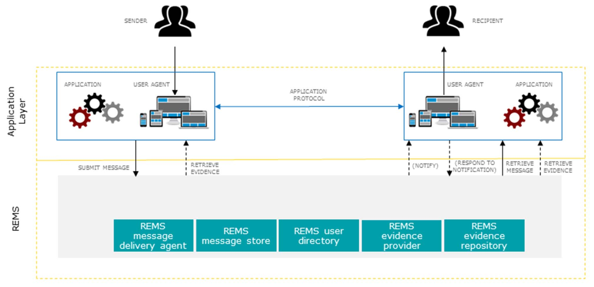

Hệ thống REMS thường được truy cập bởi một "tác nhân người dùng" (tức là một ứng dụng tương tác trực tiếp với người dùng), có thể
là phần mềm email thông thường hoặc phần mềm REM được tùy chỉnh, hoặc bởi một ứng dụng chung (tức là hệ thống tự động), ví dụ như
hệ thống quản lý tài liệu, hệ thống kế toán, v.v. Trong mọi trường hợp, phần mềm máy khách có thể sử dụng các giao thức email tiêu
chuẩn (tức là SMTP và POP/IMAP) và các giao thức web (tức là HTTP) để truy cập REMS. Việc sử dụng các giao thức khác cũng có thể,
nhưng nằm ngoài phạm vi của tài liệu này.

Theo yêu cầu đối với tất cả ERDS, người gửi và người nhận đều có một mã định danh duy nhất, được dùng để tham chiếu trong các tin
nhắn REM và bằng chứng ERDS. Đối với REMS, mã định danh duy nhất của người dùng là địa chỉ email, theo yêu cầu của điều khoản V
của ETSI EN 319 532-3 [i.2].

Để gửi tin nhắn, người gửi cần cung cấp một số siêu dữ liệu nhất định cho REMS, ví dụ: địa chỉ người nhận, kiểu hoạt động được yêu
cầu, tùy chọn gửi. Siêu dữ liệu này được truyền tải trong phần tiêu đề của tin nhắn email. Thông tin chi tiết hơn về nội dung và
định dạng của siêu dữ liệu có thể được tìm thấy trong ETSI EN 319 532-2 [i.1] và ETSI EN 319 532-3 [i.2].

Mô hình logic được trình bày trong hình 1 tinh chỉnh chức năng của REMS thành các thành phần riêng biệt, trước đây cũng được gọi
là "vai trò". Mô hình ERDS tổng quát cũng áp dụng cho REM. Để biết mô tả về các thành phần ERDS, hãy xem điều khoản IV.2.1 của ETSI
EN 319 522-1 [1].

Các thành phần sau đây của REMS tương ứng với các thành phần ERDS chung như được quy định trong bảng 1.

Bảng 1: Ánh xạ các thành phần REMS và các thành phần ERDS:
| Thành phần của REMS                | Thành phần ERDS tương ứng        |
|------------------------------------|----------------------------------|
| Tác nhân chuyển phát tin nhắn REMS | Hệ thống phân phối tin nhắn ERDS |
| Nhà cung cấp bằng chứng REMS       | Nhà cung cấp bằng chứng ERDS     |
| Kho lưu trữ bằng chứng REMS        | Kho lưu trữ bằng chứng ERDS      |
| Thư mục người dùng REMS            | Thư mục người dùng ERDS          |

Ngoài các thành phần ERDS thông thường, REMS còn cung cấp một thành phần lưu trữ tin nhắn REMS. Kho lưu trữ tin nhắn REMS được
phân bổ cho người gửi và người nhận, và người gửi và người nhận có thể truy cập một cách an toàn để lấy các tin nhắn REM được gửi
đến họ.

Hệ thống REMS *sẽ* bao gồm các vai trò cốt lõi sau: tác nhân chuyển phát tin nhắn REMS, kho lưu trữ tin nhắn REMS và nhà cung cấp bằng chứng REMS. Ngoài ra, hệ thống REMS *có thể* bao gồm kho lưu trữ bằng chứng REMS và thư mục người dùng REMS.

##### IV.2.2. Quan điểm trình tự
###### 1 - Các kiểu hoạt động REM
Về mặt quy trình, có nhiều cách khác nhau để gửi thông điệp đến người nhận.

Một khía cạnh cần xem xét là liệu có cần sự chấp thuận của người nhận trước khi nội dung người dùng được chuyển giao cho người
nhận hay không. Về khía cạnh này, có hai lựa chọn:
* Cần có sự chấp thuận: trong trường hợp này, ERDS sẽ yêu cầu người nhận chủ động phản hồi lại ERDS trước khi gửi hàng, và chỉ gửi
nội dung người dùng nếu phản hồi là tích cực.
* Việc chấp thuận không bắt buộc: trong trường hợp này, ERDS có thể thực hiện việc chuyển giao nội dung người dùng mà không cần
chờ bất kỳ hành động nào từ phía người nhận.

Một khía cạnh khác là liệu nội dung do người dùng tạo ra được truyền tải đến người nhận bằng giá trị hay bằng cách tham chiếu.
Về khía cạnh này, có hai lựa chọn:
* Theo giá trị: toàn bộ nội dung người dùng sẽ được chuyển đến ERD-UA của người nhận.
VÍ DỤ 1: Gửi một tập tin trong phần thân của yêu cầu HTTP POST.
VÍ DỤ 2: Lưu trữ một tập tin trong hộp thư của người nhận, để sau đó được tải xuống bởi trình duyệt email thông qua POP3.
* Theo hình thức tham chiếu: một tham chiếu đến nội dung người dùng sẽ được chuyển đến ERD-UA của người nhận, và toàn bộ nội dung
người dùng chỉ được chuyển tiếp hoặc tải xuống khi có yêu cầu từ người nhận.
VÍ DỤ 3: Gửi một liên kết (URL) đến tài liệu được lưu trữ trên máy chủ trực tuyến trong phần thân của yêu cầu HTTP POST.
VÍ DỤ 4: Gửi một liên kết (URL) đến tài liệu được lưu trữ trên máy chủ trực tuyến trong một tin nhắn email.

Hai khía cạnh được mô tả ở trên là độc lập, vì vậy trong một hệ thống ERDS tổng quát, bất kỳ sự kết hợp nào của chúng đều có thể
được áp dụng. Tuy nhiên, trong hệ thống REM, chỉ một số sự kết hợp nhất định được cho phép, được đặc trưng bởi hai kiểu hoạt động.

Hai kiểu hoạt động của REM là: "Lưu trữ và Chuyển tiếp" (S&F) và "Lưu trữ và Thông báo" (S&N).

Theo kiểu S&F, nội dung người dùng do người gửi cung cấp sẽ được chuyển giao cho người nhận một cách có giá trị, và không cần sự
chấp nhận. Hành động của nhà cung cấp dịch vụ REM làm cho nội dung người dùng có sẵn cho người nhận được gọi là chuyển giao. Sau
khi nội dung người dùng được chuyển giao, người nhận không cần thực hiện thêm bất kỳ hành động nào khác để truy cập nội dung người
dùng ngoài việc xác định danh tính và xác thực.
```
VÍ DỤ 5: Việc này thường được thực hiện bằng cách lưu trữ nội dung người dùng vào hộp thư của người nhận.
```
Theo kiểu S&N, nội dung do người gửi cung cấp sẽ được chuyển đến người nhận bằng cách tham chiếu trước, và cần có sự chấp nhận.
Sự chấp nhận có thể là ngầm định (ví dụ: việc tải xuống tài liệu có thể ngụ ý chấp nhận tài liệu đó). Nếu người nhận chấp nhận
thông điệp, thì nội dung do người dùng cung cấp sẽ được chuyển giao (cung cấp cho người nhận).
```
VÍ DỤ 6: Việc này thường được thực hiện bằng cách gửi thông báo (có thể trên một kênh khác hoặc thậm chí nhiều kênh,
ví dụ: email,SMS, thông báo đẩy) cho người nhận về tin nhắn đến, chứa một tham chiếu (ví dụ: URL) đến nội dung người dùng.
Tại thời điểm này, người nhận vẫn chưa thể truy cập nội dung người dùng.
Người nhận cần phản hồi lại thông báo (trên bất kỳ kênh nào được cung cấp bởi REMSP) và chấp nhận hoặc từ chối tin nhắn đến.
```
Hệ thống REMS *phải* hỗ trợ kiểu vận hành S&F. Hệ thống REMS cũng *có thể* hỗ trợ kiểu vận hành S&N.


###### 2-Kiểu vận hành REM Store and Forward
Một chuỗi hành động điển hình trong kiểu vận hành S&F được minh họa trong hình 2 và được mô tả chi tiết bên dưới. Để đơn giản, các
trường hợp thất bại không được xem xét trong chuỗi này. (Các trường hợp thành công và thất bại được quy định trong các loại sự
kiện và lý do có thể xảy ra, xem điều khoản VI bên dưới và ETSI EN 319 522-2 [i.5], điều khoản VIII.3.3.)

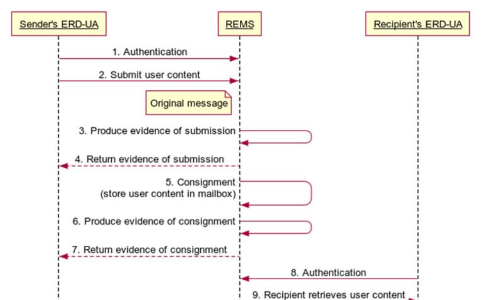

* 1 - Người gửi (có thể là người dùng hoặc hệ thống) xác thực danh tính của mình với dịch vụ REM.
* 2 - Người gửi (có thể là người dùng hoặc hệ thống) chuẩn bị nội dung người dùng, chỉ định một hoặc nhiều người nhận và gửi nội
dung đó đến dịch vụ REM. Bước này trong một số trường hợp có thể được gộp với bước 1 (ví dụ: nếu tin nhắn gốc chứa nội dung người
dùng có chữ ký số được sử dụng để xác định và xác thực người gửi).
* 3 - Dịch vụ REM theo dõi sự kiện nội dung người dùng đã được gửi. Việc này được thực hiện bằng cách tạo ra "giấy chứng nhận gửi"
(bằng chứng gửi ERDS), ví dụ: một tập tin đã ký chứa thông tin cơ bản về sự kiện.
* 4 - Bạn có thể tùy chọn gửi lại bằng chứng nộp hồ sơ ERDS cho người gửi. Xem ghi chú bên dưới.
* 5 - Dịch vụ REM lưu trữ nội dung người dùng trong hộp thư của người nhận. Nó cũng có thể lưu trữ thêm thông tin liên quan (siêu
dữ liệu, ví dụ: danh tính người gửi, thời gian gửi, v.v.) và bằng chứng ERDS (ví dụ: bằng chứng gửi được tạo ra ở bước 3) cùng với
nội dung người dùng. Những thông tin này có thể được đóng gói cùng nhau trong một gói duy nhất, được gọi là lệnh gửi REM, hoặc
cũng có thể được lưu trữ riêng biệt.
* 6 - Dịch vụ REM theo dõi sự kiện nội dung người dùng đã được cung cấp cho người nhận. Một lần nữa, điều này được thực hiện bằng
cách tạo ra một hoặc nhiều chứng thực (bằng chứng gửi hàng ERDS).
* 7 - Bạn có thể tùy chọn gửi lại chứng từ vận chuyển ERDS cho người gửi. Xem ghi chú bên dưới.
* 8 - Bên nhận (người dùng hoặc hệ thống) xác thực danh tính của mình với REMS.
* 9 - Bên nhận (người dùng hoặc hệ thống) truy xuất nội dung người dùng (có thể được đóng gói trong bản tin REM hoặc riêng biệt),
và tùy chọn cũng có thể truy xuất siêu dữ liệu và/hoặc bằng chứng ERDS (có thể được đóng gói trong bản tin REM hoặc riêng biệt).
* 10 - Dịch vụ REM theo dõi sự kiện nội dung người dùng đã được chuyển giao cho người nhận. Trong một số trường hợp, việc này được
thực hiện bằng cách tạo ra một hoặc nhiều chứng thực (bằng chứng chuyển giao ERDS).
* 11 - Bằng chứng chuyển giao ERDS có thể được gửi lại cho người gửi (tùy chọn). Xem ghi chú bên dưới.
```
LƯU Ý: Ở các bước 4, 7 và 11, việc gửi bằng chứng ERDS ngay sau khi tạo cho người dùng chỉ là một trong những cách có thể cung cấp
bằng chứng ERDS, và cũng có những lựa chọn khác, ví dụ: bằng chứng ERDS có thể được REMS lưu trữ để truy cập theo yêu cầu sau này,
có thể được chuyển tiếp đến kho lưu trữ bằng chứng bên ngoài, v.v.
```

###### 3 - Kiểu hoạt động REM Store and Notify
Một chuỗi hành động điển hình trong kiểu vận hành S&N được minh họa trong hình 3 và được mô tả chi tiết bên dưới. Để đơn giản,
các trường hợp thất bại không được xem xét trong chuỗi này. (Các trường hợp thành công và thất bại được quy định trong các loại
sự kiện và lý do có thể xảy ra, xem điều khoản VI bên dưới và ETSI EN 319 522-2 [i.5], điều khoản VIII.3.3.)

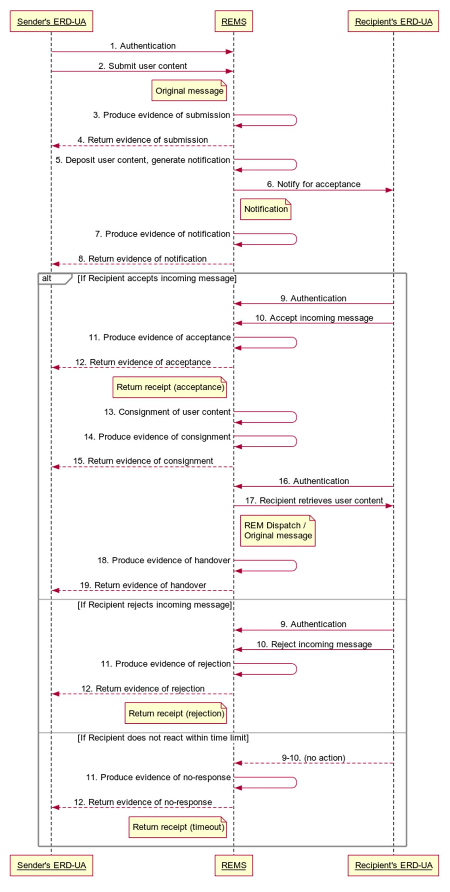

* 1 - Người gửi (có thể là người dùng hoặc hệ thống) xác thực danh tính của mình với dịch vụ REM.
* 2 - Người gửi (có thể là người dùng hoặc hệ thống) chuẩn bị nội dung người dùng, chỉ định một hoặc nhiều người nhận và gửi nội
dung đó đến dịch vụ REM. Bước này trong một số trường hợp có thể được gộp với bước 1 (ví dụ: nếu tin nhắn gốc chứa nội dung người
dùng có chữ ký số được sử dụng để xác định và xác thực người gửi).
* 3 - Dịch vụ REM theo dõi sự kiện nội dung người dùng đã được gửi. Việc này được thực hiện bằng cách tạo ra "giấy chứng nhận gửi"
(bằng chứng gửi ERDS), ví dụ: một tập tin đã ký chứa thông tin cơ bản về sự kiện.
* 4 - Bạn có thể tùy chọn gửi lại bằng chứng nộp hồ sơ ERDS cho người gửi. Xem chú thích 2 bên dưới.
* 5 - Dịch vụ REM lưu trữ nội dung người dùng (và tùy chọn kèm theo siêu dữ liệu và/hoặc bằng chứng ERDS, tùy chọn được bao bọc
trong một thông báo REM) trong bộ nhớ tạm thời mà người nhận chưa thể truy cập được, và tạo ra một thông báo cho người nhận, chứa
một tham chiếu (ví dụ: URL) đến nội dung người dùng.
* 6 - Dịch vụ REM gửi thông báo đến người nhận. Thông báo có thể được gửi dưới dạng tin nhắn ERD hoặc sử dụng bất kỳ kênh nào
khác. Các thông báo được gửi qua các kênh khác (ví dụ: SMS, thông báo đẩy) nằm ngoài phạm vi của tài liệu này.
* 7 - Dịch vụ REM theo dõi sự kiện thông báo đã được gửi. Nó có thể tạo ra một chứng thực tương ứng (bằng chứng thông báo ERDS).
* 8 - Bằng chứng thông báo ERDS có thể được gửi lại cho người gửi. Xem chú thích 2 bên dưới.

Phần tiếp theo của chuỗi hành động phụ thuộc vào hành động của người nhận. Có ba khả năng xảy ra:
* Người nhận chấp nhận tin nhắn;
* Người nhận từ chối tin nhắn;
* Người nhận không phản hồi trong thời hạn đã định trước.
Nếu nội dung do người dùng đăng tải được gửi đến nhiều người nhận, thì điều này sẽ áp dụng riêng cho từng người nhận.

**Phương án 1**: nếu người nhận chấp nhận tin nhắn:
* 9 - Bên nhận (người dùng hoặc hệ thống) xác thực danh tính của mình với REMS.
* 10 - Người nhận thực hiện một hành động để xác nhận việc chấp nhận tin nhắn đến bằng bất kỳ phương tiện nào được cung cấp bởi
dịch vụ REM (ví dụ: gửi tin nhắn trả lời, truy cập URL, nhấp vào nút, ký xác nhận đã nhận, v.v.).
* 11 - Dịch vụ REM theo dõi sự kiện tin nhắn đã được người nhận cụ thể đó chấp nhận. Việc này được thực hiện bằng cách tạo ra một
chứng thực tương ứng (bằng chứng chấp nhận ERDS).
* 12 - Bằng chứng chấp nhận ERDS, kèm theo các dữ liệu bổ sung (ví dụ: xác nhận đã nhận có chữ ký của người nhận), có thể được gửi
lại cho người gửi. Xem chú thích 2 bên dưới.
* 13 - Dịch vụ REM lưu trữ nội dung người dùng trong hộp thư của người nhận. Nó cũng có thể lưu trữ thêm thông tin liên quan (siêu
dữ liệu, ví dụ: danh tính người gửi, thời gian gửi, v.v.) và bằng chứng ERDS (ví dụ: bằng chứng ERDS được tạo ra ở bước 3, bước 7,
bước 10 hoặc bước 11) cùng với nội dung người dùng. Những thông tin này có thể được đóng gói cùng nhau trong một gói duy nhất,
được gọi là lệnh gửi REM, hoặc cũng có thể được lưu trữ riêng biệt.  
Ngoài ra, nội dung người dùng (và bất kỳ siêu dữ liệu đi kèm nào) cũng có thể được cung cấp để tải xuống trực tiếp thông qua kênh
mà việc chấp nhận đã được thực hiện (ví dụ: trên trang web của REMS). Nội dung người dùng được coi là đã được gửi đi bất kể kênh
nào, miễn là người nhận có thể truy cập nội dung đó bất cứ lúc nào sau khi xác thực đúng cách.
* 14 - Dịch vụ REM theo dõi sự kiện nội dung người dùng đã được cung cấp cho người nhận. Một lần nữa, điều này được thực hiện bằng
cách tạo ra một hoặc nhiều chứng thực (bằng chứng gửi hàng ERDS).
* 15 - Giấy biên nhận gửi hàng ERDS có thể được gửi lại cho người gửi. Xem chú thích 2 bên dưới.
* 16 - Bên nhận (người dùng hoặc hệ thống) xác thực danh tính của mình với REMS.
* 17 - Bên nhận (người dùng hoặc hệ thống) truy xuất nội dung người dùng (có thể được đóng gói trong bản tin REM hoặc riêng biệt),
và tùy chọn cũng có thể truy xuất siêu dữ liệu và/hoặc bằng chứng ERDS (có thể được đóng gói trong bản tin REM hoặc riêng biệt).
* 18 - Dịch vụ REM theo dõi sự kiện nội dung người dùng đã được chuyển giao cho người nhận. Trong một số trường hợp, việc này được
thực hiện bằng cách tạo ra một hoặc nhiều chứng thực (bằng chứng chuyển giao ERDS).
* 19 - The ERDS evidence of handover can be sent back to the sender. See note 2 below.

**Phương án 2**: nếu người nhận từ chối tin nhắn:
* 9 - Bên nhận (người dùng hoặc hệ thống) xác thực danh tính của mình với REMS.
* 10 - Người nhận thực hiện một hành động để xác nhận việc từ chối tin nhắn đến bằng bất kỳ phương tiện nào được cung cấp bởi dịch
vụ REM (ví dụ: gửi tin nhắn trả lời, truy cập URL, nhấp vào nút, ký vào tuyên bố từ chối, v.v.).
* 11 - Dịch vụ REM theo dõi sự kiện tin nhắn bị người nhận cụ thể đó từ chối. Việc này được thực hiện bằng cách tạo ra một xác
nhận tương ứng (bằng chứng từ chối ERDS).
* 12 - Bằng chứng từ chối ERDS, kèm theo dữ liệu bổ sung (nếu có), có thể được gửi lại cho người gửi. Xem chú thích 2 bên dưới.

**Phương án 3**: nếu người nhận không phản hồi trong thời hạn đã định trước (xem chú thích 1 bên dưới):
* 9, 10 - Người nhận không có hành động gì.
* 11 - Dịch vụ REM theo dõi sự kiện khi thời hạn chấp nhận đã được xác định trước cho người nhận cụ thể đó đã trôi qua mà không có
phản hồi nào. Việc này được thực hiện bằng cách tạo ra một chứng thực tương ứng (bằng chứng ERDS về việc không có phản hồi).
* 12 - Bằng chứng ERDS về việc không nhận được phản hồi, cùng với các dữ liệu bổ sung (nếu có), có thể được gửi lại cho người gửi.
Xem chú thích 2 bên dưới.
```
LƯU Ý 1: Khoảng thời gian cho phép chấp nhận/từ chối có thể được xác định bởi luật pháp, quy tắc chính sách hoặc các thông số do
người gửi đưa ra. Phương pháp xác định khoảng thời gian này có thể được quy định trong chính sách REM hoặc tuyên bố thực tiễn REM
của bất kỳ nhà cung cấp nào cung cấp dịch vụ kiểu S&N.
```
```
LƯU Ý 2: Trong các bước 4, 8, 12, 15 và 19, việc gửi bằng chứng ERDS ngay sau khi tạo cho người dùng chỉ là một trong những cách
có thể cung cấp bằng chứng ERDS, và cũng có những lựa chọn khác, ví dụ: bằng chứng ERDS có thể được REMS lưu trữ để truy cập theo
yêu cầu sau này, có thể được chuyển tiếp đến kho lưu trữ bằng chứng bên ngoài, v.v.
```

#### IV.3 Mô hình 4 góc
##### IV.3.1 Quan điểm chức năng
Khi người gửi và người nhận là khách hàng của cùng một hệ thống REMS thì không cần thêm bất kỳ sự liên lạc nào giữa các bên khác
nhau, và điều khoản IV.2 mô tả tất cả các tương tác phải tuân theo tiêu chuẩn hóa. (Luồng dữ liệu và quá trình xử lý nội bộ của một
hệ thống REMS nằm ngoài phạm vi của tài liệu này.) Tuy nhiên, điều này không phải lúc nào cũng đúng.

Khi người gửi và người nhận đăng ký các hệ thống REMS khác nhau, các hệ thống REMS tương ứng sẽ liên lạc với nhau để chuyển tiếp
nội dung người dùng, cùng với một số siêu dữ liệu liên quan, và cung cấp bằng chứng cho người dùng về mọi sự kiện liên quan trong
quá trình này. Việc liên lạc này có thể diễn ra trực tiếp, trong trường hợp đó chỉ có 2 hệ thống REMS tham gia. Mô hình 4 góc này
được mô tả trong điều khoản này. Trong các trường hợp khác, việc liên lạc có thể diễn ra gián tiếp, liên quan đến một số hệ thống
REMS trung gian, được mô tả trong điều khoản IV.4.

Sự tương tác giữa các dịch vụ riêng lẻ của REMSP đảm bảo việc cung cấp nội dung và bằng chứng cho người dùng từ đầu đến cuối. Giao
diện giữa người dùng dịch vụ và REMSP mà họ giao tiếp tương tự như mô tả trong mô hình hộp đen ở trên.

Điều khoản này tập trung vào sự tương tác giữa hai hệ thống REMS giao tiếp trực tiếp với nhau, như minh họa trong hình 4.

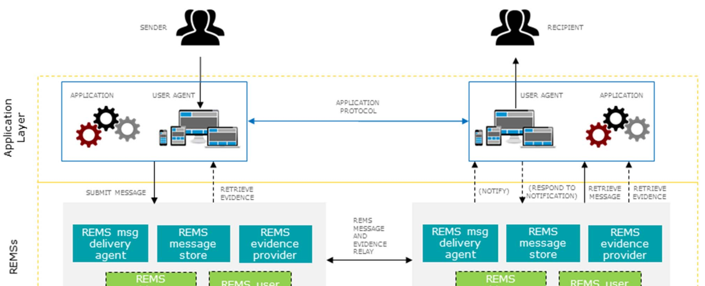

Tương tự như các ERDS được kết nối nói chung, cơ sở hạ tầng dùng chung có thể hỗ trợ việc giao tiếp của các REMS được kết nối.
Đây là một thực thể trừu tượng, có thể bao gồm nhiều tác nhân khác nhau trong thực tế. Điều này có thể cung cấp các chức năng như
định tuyến tin nhắn, thiết lập độ tin cậy, quản lý năng lực, hỗ trợ quản trị, như được mô tả trong điều khoản IV.3.1 của
ETSI EN 319 522-1 [1].

Trong REM, theo yêu cầu của điều khoản V của ETSI EN 319 532-3 [i.2], định danh của người dùng là một địa chỉ email, bao gồm một
phần cụ thể của tên miền. Việc định tuyến các tin nhắn REM có thể dựa trên các bản ghi DNS được liên kết với tên miền của địa chỉ
người nhận, giống như trong tin nhắn email thông thường. Trong trường hợp đó, có thể thư mục người dùng chung, như được minh họa
trong hình 4, là không cần thiết.

Các hệ thống REMS hoạt động theo các kiểu vận hành khác nhau có thể tương tác với nhau theo nhiều cách kết hợp, chẳng hạn như:
* S&F đến S&F, như được mô tả trong điều khoản IV.3.2.1;
* S&F đến S&N, như được mô tả trong điều khoản IV.3.2.2;
* S&N sang S&F, trong đó tham chiếu đến nội dung người dùng được chuyển tiếp đến REMS của người nhận và được gửi đến đó bằng dịch
vụ S&F, như được mô tả trong điều khoản IV.3.2.3;
* Từ S&N đến S&N, trong đó một tham chiếu đến nội dung người dùng được lưu trữ bởi REMS của người gửi được chuyển tiếp đến REMS
của người nhận, thường hoạt động theo kiểu S&N. R-REMS phải nhận biết xem tin nhắn đến có phải là thông báo hay không, và trong
trường hợp đó, nó sẽ hoạt động theo kiểu S&F, tức là nó sẽ xử lý thông báo và thông báo cho người nhận, và sẽ không tạo ra một
thông báo khác có tham chiếu đến thông báo đầu tiên. Luồng tin nhắn trong trường hợp này giống hệt với luồng được mô tả trong điều
khoản IV.3.2.3.

##### IV.3.2 Quan điểm trình tự
###### IV.3.2.1 Tương tác REM S&F tới S&F
Điều khoản này mô tả trường hợp khi cả REMS của người gửi và REMS của người nhận đều hoạt động theo kiểu S&F trong việc xử lý nội
dung người dùng cụ thể.

Một chuỗi hành động điển hình trong tương tác S&F tới S&F được mô tả trong hình 5 và được trình bày chi tiết bên dưới. Để đơn
giản, các trường hợp thất bại không được xem xét trong chuỗi này. (Các trường hợp thành công và thất bại được chỉ định trong các
loại sự kiện và lý do có thể xảy ra, xem điều khoản VI bên dưới và ETSI EN 319 522-2 [i.5], điều khoản VIII.3.3.) Các REMS có thể theo
dõi từng sự kiện liên quan trong chuỗi bằng cách tạo ra bằng chứng ERDS tương ứng, như được trình bày chi tiết trong điều khoản
IV.2.2.2, nhưng để dễ hình dung hơn, việc tạo ra các bằng chứng này không được hiển thị trong hình 5. Bằng chứng được tạo ra cũng
có thể được gửi cho người dùng hoặc có thể được cung cấp theo những cách khác, như được mô tả trong điều khoản IV.2.2.2. Việc trả
lại bằng chứng tùy chọn cho người dùng không được hiển thị trong hình 5.

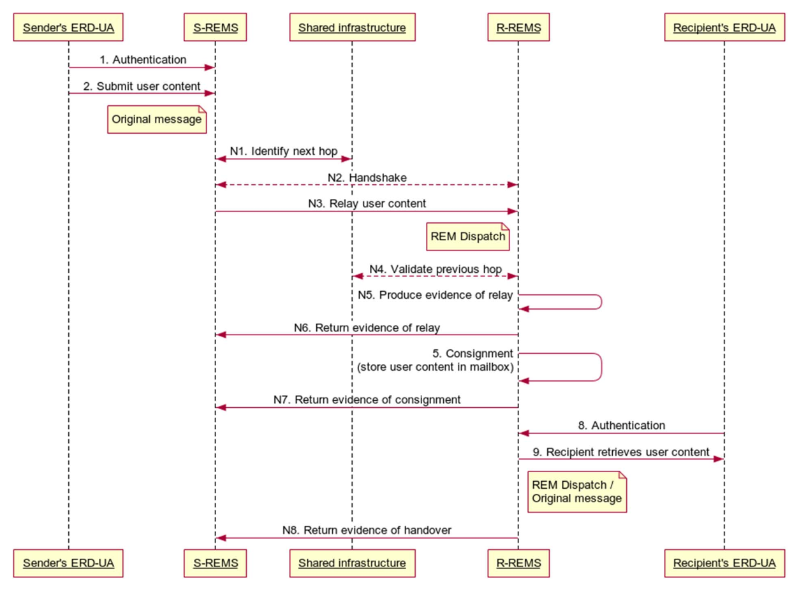

Các tương tác với người dùng giống như được định nghĩa trong điều khoản IV.2.2.2 cho kiểu Lưu trữ & Chuyển tiếp trong mô hình hộp
đen. Do đó, chỉ số của các hành động liên quan đến người dùng cuối REM được giữ nguyên như trong hình 2. Các hành động mới được mô
tả trong hình 5 là các bước giao tiếp giữa các REMS, hay nói cách khác, là các giao tiếp nội bộ trong mạng phân phối REM. Chúng
được đánh số bằng 'N#'. Các bước của quy trình được mô tả chi tiết như sau.
```
LƯU Ý: Các bước N# của chuỗi được định nghĩa một cách tổng quát để chúng có thể được sử dụng lại trong mô hình mở rộng (xem điều
khoản 4.4), trong đó việc chuyển tiếp tin nhắn REM được thực hiện trên một chuỗi nhiều REMS. Mô hình 4 góc là một trường hợp
đặc biệt của điều này, trong đó chỉ có hai REMS tham gia, cụ thể là REMS của người gửi và REMS của người nhận.
```
* 1, 2, 3, 4 - Nội dung người dùng được gửi đi, như trong điều khoản IV.2.2.2.
* N1. Hệ thống REMS của người gửi (S-REMS) cần tìm cách liên lạc với hệ thống REMS của người nhận (R-REMS).
Trong trường hợp tổng quát, điều này diễn ra thông qua một cơ sở hạ tầng chung (Shared infrastructure).
Đây là một thực thể trừu tượng, có thể tương ứng với nhiều tác nhân khác nhau. Bước này có thể bao gồm nhiều hành động:
	* S-REMS cần xác định REMS của người nhận. Điều này có thể thực hiện được bằng cách sử dụng địa chỉ hộp thư
	của người nhận, vì địa chỉ email chứa tên miền của nhà cung cấp.
	* S-REMS cần tìm một tuyến đường thư đến R-REMS. Điều này có thể thực hiện được bằng cách sử dụng tra cứu DNS,
	như trường hợp của các tin nhắn email thông thường, hoặc bằng các kỹ thuật khác. Trong mô hình 4 góc (điều khoản IV.3),
	giả định rằng tin nhắn REM có thể được chuyển tiếp trực tiếp đến R-REMS. Trong mô hình mở rộng (điều khoản IV.4),
	giả định rằng tin nhắn REM được chuyển tiếp thông qua một số REMS trung gian.
	* Hệ thống S-REMS cần kiểm tra khả năng của các hệ thống REMS dọc theo tuyến đường gửi thư (ví dụ: kiểu hoạt động được hỗ
	trợ, chính sách được hỗ trợ, v.v.) để tìm ra tuyến đường phù hợp.
	* S-REMS cần thiết lập mối quan hệ tin cậy với REMS tiếp theo dọc theo tuyến thư. Ví dụ, điều này có thể được thực hiện
	bằng cách sử dụng Danh sách Tin cậy, như được định nghĩa trong ETSI TS 119 612 [i.6].
* N2. REMS thực hiện quá trình bắt tay với REMS tiếp theo. Quá trình này có thể bao gồm đàm phán về các khía cạnh khác nhau
(khả năng, kiểu hoạt động được hỗ trợ, bằng chứng ERDS, mức độ xác thực của các thực thể cuối, phí, v.v.). Quá trình bắt tay có
thể được bỏ qua trong các hệ thống khép kín, nơi thông tin này được xác định trước hoặc có sẵn thông qua cơ sở hạ tầng tập trung.
* N3. REMS chuyển tiếp thông điệp REM đến REMS tiếp theo. Nó cũng có thể chuyển tiếp thêm thông tin liên quan (siêu dữ liệu,
ví dụ: danh tính người gửi, thời gian gửi, v.v.) và bằng chứng ERDS (ví dụ: bằng chứng ERDS về việc gửi được tạo ra ở bước 3)
cùng với thông điệp đó.
* N4. REMS nhận được thông điệp REM được chuyển tiếp cũng có thể tra cứu REMS chuyển tiếp trong cơ sở hạ tầng dùng chung và
lấy thông tin (ví dụ: chứng chỉ), thiết lập độ tin cậy, v.v.
* N5. Nếu thông điệp REM đã được nhận thành công và quá trình xác thực của REMS chuyển tiếp không báo cáo sự cố nào, thì REMS
sẽ theo dõi sự kiện này bằng cách tạo ra bằng chứng chuyển tiếp tương ứng.
* N6. Thông tin về việc chuyển tiếp được trả về cho REMS chuyển tiếp, như một dấu hiệu cho thấy trách nhiệm xử lý thông điệp
REM được chuyển tiếp đã được chuyển giao cho REMS tiếp theo.
* 5, 6 - Nội dung người dùng được chuyển giao, như trong điều khoản IV.2.2.2.
* N7. Bằng chứng gửi hàng ERDS cần được chuyển tiếp trở lại REMS trước đó dọc theo tuyến đường bưu điện để REMS đó có thể hoàn
tất giao dịch, và người gửi cũng có thể cần xác nhận này.
* 7 - Giấy tờ chứng minh việc gửi hàng ERDS có thể được trả lại cho người gửi, như trong điều khoản IV.2.2.2.
* 8, 9, 10 - Nội dung người dùng được chuyển giao cho người nhận, như trong điều khoản IV.2.2.2.
* N8. Bằng chứng chuyển giao ERDS cần được chuyển tiếp trở lại REMS trước đó dọc theo tuyến đường thư,
trong trường hợp người gửi cần xác nhận này.
* 11 - Bằng chứng bàn giao ERDS có thể được trả lại cho người gửi, như trong điều khoản IV.2.2.2.

###### IV.3.2.2 Tương tác REM S&F tới S&N
Điều khoản này mô tả trường hợp khi REMS của người gửi hoạt động theo kiểu S&F và REMS của người nhận hoạt động theo kiểu S&N
trong việc xử lý nội dung người dùng cụ thể. Nội dung người dùng được chuyển tiếp đến R-REMS theo cùng cách thức như đã nêu chi
tiết trong điều khoản IV.3.2.1. R-REMS thực hiện quy trình chấp nhận/từ chối theo kiểu S&N như đã mô tả trong điều khoản IV.2.2.3,
ngoại trừ việc bằng chứng không được trả lại trực tiếp cho người gửi mà được chuyển tiếp lại thông qua S-REMS.

Một chuỗi hành động điển hình trong tương tác S&F tới S&N được mô tả trong hình 6 và được trình bày chi tiết bên dưới.
Để đơn giản, các trường hợp thất bại không được xem xét trong chuỗi này. (Các trường hợp thành công và thất bại được chỉ định trong các loại sự kiện và lý do có thể xảy ra, xem điều khoản VI bên dưới và điều khoản VIII.3.3 của ETSI EN 319 522-2 [i.5].)
Các REMS có thể theo dõi từng sự kiện liên quan trong chuỗi bằng cách tạo ra bằng chứng ERDS tương ứng, như được trình bày
chi tiết trong điều khoản IV.2.2.3, nhưng để dễ hình dung hơn, việc tạo ra các bằng chứng này không được hiển thị trong hình 6.
Bằng chứng được tạo ra cũng có thể được gửi đến người dùng hoặc có thể được cung cấp theo những cách khác,
như được mô tả trong điều khoản IV.2.2.3. Việc trả lại bằng chứng tùy chọn cho người dùng không được hiển thị trong hình 6.

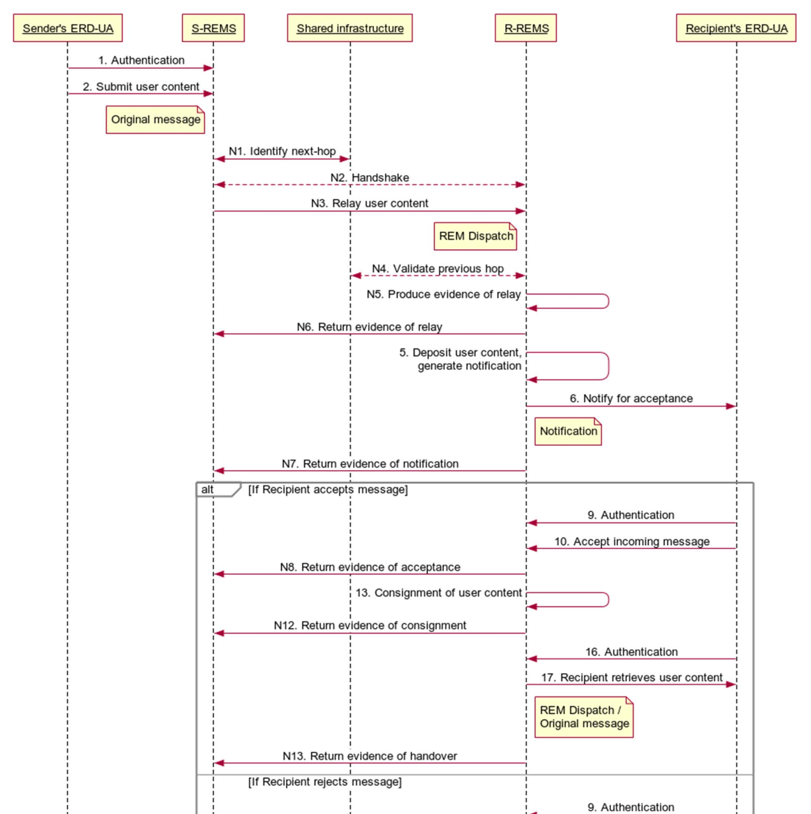

Các tương tác với người dùng giống như được định nghĩa trong điều khoản IV.2.2.3 cho kiểu Lưu trữ & Thông báo trong mô hình
hộp đen. Do đó, chỉ số của các hành động liên quan đến người dùng cuối REM được giữ nguyên như trong hình 3.
Các hành động mới được mô tả trong hình 6 là các bước giao tiếp giữa các REMS, hay nói cách khác, là các giao tiếp nội bộ trong
mạng phân phối REM. Chúng được đánh số bằng 'N#'. Các bước của quy trình được mô tả chi tiết như sau.

* 1, 2, 3, 4 - Nội dung người dùng được gửi đi, như trong điều khoản IV.2.2.3.
* N1, N2, N3, N4, N5, N6. Nội dung người dùng được chuyển tiếp, như trong điều khoản IV.3.2.1.
(Thông báo REM trong mô tả các bước N1-N6 trong trường hợp này là một thông báo REM.
Bằng chứng được tạo ra trong bước N5 là bằng chứng ERDS.)
* 5, 6, 7 - Nội dung người dùng được lưu trữ tạm thời và một thông báo được gửi đi, như trong điều khoản IV.2.2.3.
* N7. Bằng chứng thông báo ERDS cần được chuyển tiếp trở lại REMS trước đó dọc theo tuyến đường thư,
trong trường hợp người gửi cần xác nhận này.
* 8 - Bằng chứng thông báo ERDS có thể được trả lại cho người gửi, như trong điều khoản IV.2.2.3.
* 9, 10, 11 - Người nhận chấp nhận/từ chối/không phản hồi tin nhắn đến, và kết quả được theo dõi như trong điều khoản IV.2.2.3.
* N8. Bằng chứng ERDS về việc chấp nhận/từ chối/không phản hồi cần được chuyển tiếp trở lại REMS trước đó dọc theo
tuyến đường thư, trong trường hợp người gửi cần xác nhận này.
* 12 - Bằng chứng chấp nhận/từ chối/không phản hồi của ERDS có thể được trả lại cho người gửi, như trong điều khoản IV.2.2.3.

**Điều kiện**: nếu người nhận chấp nhận tin nhắn đến:
* 13, 14 - Nội dung người dùng được chuyển giao, như trong điều khoản IV.2.2.3.
* N12. Bằng chứng gửi hàng ERDS cần được chuyển tiếp trở lại REMS trước đó dọc theo tuyến đường bưu điện để REMS đó có thể
hoàn tất giao dịch, và người gửi cũng có thể cần xác nhận này.
* 15 - Giấy tờ chứng minh việc gửi hàng ERDS có thể được trả lại cho người gửi, như trong điều khoản IV.2.2.3.
* 16, 17, 18 - Bên nhận truy xuất nội dung người dùng, như trong điều khoản IV.2.2.3.
* N13. Bằng chứng chuyển giao ERDS cần được chuyển tiếp trở lại REMS trước đó dọc theo tuyến đường thư,
trong trường hợp người gửi cần xác nhận này.
* 19 - Bằng chứng chuyển giao ERDS có thể được trả lại cho người gửi, như trong điều khoản IV.2.2.3.

###### IV.3.2.3 Tương tác REM S&N tới S&F
Điều khoản này mô tả trường hợp khi REMS của người gửi hoạt động theo kiểu S&N và REMS của người nhận hoạt động theo kiểu S&F
trong việc xử lý nội dung người dùng cụ thể. Thay vì chính nội dung người dùng, trước tiên thông báo được chuyển tiếp đến R-REMS
theo cách tương tự như việc chuyển tiếp nội dung người dùng được mô tả chi tiết trong điều khoản IV.3.2.1. S-REMS thực hiện quy
trình chấp nhận/từ chối theo kiểu S&N như được mô tả trong điều khoản IV.2.2.3, ngoại trừ việc nội dung người dùng không được gửi
trực tiếp đến hộp thư của người nhận mà được chuyển tiếp đến R-REMS trước. (Nội dung người dùng cũng có thể được chuyển trực tiếp
cho người nhận, nhưng điều này không được mô tả chi tiết trong điều khoản này.) Thông báo luôn được xử lý bởi một thành phần phụ
S&F ngay cả khi REMS thường hoạt động theo kiểu S&N, vì vậy trình tự vẫn giống nhau ngay cả khi R-REMS hoạt động theo kiểu S&N.

Một chuỗi hành động điển hình trong tương tác S&N với S&F - cũng áp dụng trong trường hợp S&N với S&N - được mô tả trong hình 7
và được trình bày chi tiết bên dưới. Để đơn giản, các trường hợp thất bại không được xem xét trong chuỗi này. (Các trường hợp thành
công và thất bại được chỉ định trong các loại sự kiện và lý do có thể xảy ra, xem điều khoản VI bên dưới và ETSI EN 319 522-2 [i.5
, điều khoản VIII.3.3.) Các REMS có thể theo dõi từng sự kiện liên quan trong chuỗi bằng cách tạo ra bằng chứng ERDS tương ứng, như
được trình bày chi tiết trong điều khoản IV.2.2.3, nhưng để dễ hình dung hơn, việc tạo ra các bằng chứng này không được hiển thị
trong hình 7. Bằng chứng được tạo ra cũng có thể được gửi đến người dùng hoặc có thể được cung cấp theo những cách khác, như được
mô tả trong điều khoản IV.2.2.3. Việc trả lại bằng chứng tùy chọn cho người dùng không được hiển thị trong hình 7.

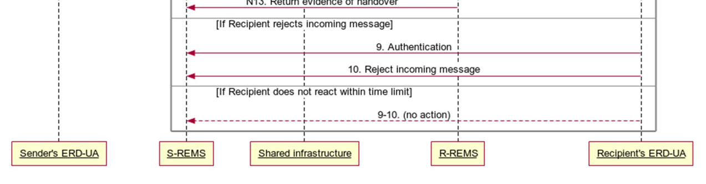

Các tương tác với người dùng giống như được định nghĩa trong điều khoản IV.2.2.3 cho kiểu Lưu trữ & Thông báo trong mô hình
hộp đen. Do đó, chỉ số của các hành động liên quan đến người dùng cuối REM được giữ nguyên như trong hình 3.
Các hành động mới được mô tả trong hình 7 là các bước giao tiếp giữa các REMS, hay nói cách khác, là các giao tiếp nội bộ
trong mạng phân phối REM. Chúng được đánh số bằng 'N#'. Các bước của quy trình được mô tả chi tiết như sau.

* 1, 2, 3, 4 - Nội dung người dùng được gửi đi, như trong điều khoản IV.2.2.3.
* 5 - Nội dung người dùng được lưu trữ tạm thời và một thông báo được tạo ra, như trong điều khoản IV.2.2.3.
* N1, N2, N3, N4, N5, N6 - S-REMS chuyển tiếp thông báo, như trong điều khoản IV.3.2.1. (Thông báo REM trong mô tả các bước N1-N6
trong trường hợp này là thông báo REMS. Bằng chứng được tạo ra trong bước N5 thường không phải là bằng chứng ERDS, vì hoạt động
chuyển tiếp này không liên quan đến nội dung người dùng. Tuy nhiên, S-REMS thường cần một số phản hồi xác thực cho dù việc chuyển
tiếp có thành công hay không.)
* 6, 7. R-REMS diễn giải thông báo REMS đến (chứa tham chiếu đến nội dung người dùng). Sau đó, nó thông báo cho người nhận bằng
bất kỳ kênh nào mà họ đã đồng ý và theo dõi sự kiện này, như trong điều khoản IV.2.2.3.
* N7 - Bằng chứng thông báo ERDS cần được chuyển tiếp trở lại REMS trước đó dọc theo tuyến đường thư,
trong trường hợp người gửi cần xác nhận này.
* 8 - Bằng chứng thông báo ERDS có thể được trả lại cho người gửi, như trong điều khoản IV.2.2.3.
* 9, 10, 11 - Người nhận chấp nhận/từ chối/không phản hồi tin nhắn đến, liên lạc trực tiếp với S-REMS khi cần thiết,
và kết quả được theo dõi như trong điều khoản IV.2.2.3.
* 12 - Bằng chứng chấp nhận/từ chối/không phản hồi có thể được trả lại cho người gửi, như trong điều khoản IV.2.2.3.

**Điều kiện**: nếu người nhận chấp nhận tin nhắn đến:
* N9 - REMS chuyển tiếp nội dung người dùng đến REMS tiếp theo. Nó cũng có thể chuyển tiếp thêm thông tin liên quan (siêu dữ liệu,
ví dụ: danh tính người gửi, thời gian gửi, v.v.) và bằng chứng ERDS (ví dụ: bằng chứng ERDS về việc gửi được tạo ra ở bước 3) cùng
với nội dung đó. REMS cũng có thể chuyển trực tiếp nội dung người dùng cho người nhận. (Điều này không được hiển thị trong hình 7.)
* N10. Nếu thông báo REM đã được nhận thành công và quá trình xác thực của REMS chuyển tiếp báo cáo không có vấn đề gì,
thì REMS sẽ theo dõi sự kiện này bằng cách tạo ra bằng chứng chuyển tiếp ERDS tương ứng.
* N11 - Bằng chứng chuyển tiếp ERDS được trả về cho REMS chuyển tiếp, như một dấu hiệu cho thấy trách nhiệm xử lý thông điệp
REM được chuyển tiếp đã được chuyển giao cho REMS tiếp theo.
* 13, 14 - Nội dung người dùng được chuyển giao, như trong điều khoản IV.2.2.3.
* N12. Bằng chứng gửi hàng ERDS cần được chuyển tiếp trở lại REMS trước đó dọc theo tuyến đường bưu điện để REMS đó có thể
hoàn tất giao dịch, và người gửi cũng có thể cần xác nhận này.
* 15 - Giấy tờ chứng minh việc gửi hàng ERDS có thể được trả lại cho người gửi, như trong điều khoản IV.2.2.3.
* 16, 17, 18 - Bên nhận truy xuất nội dung người dùng, như trong điều khoản IV.2.2.3.
* N13 - Bằng chứng chuyển giao ERDS cần được chuyển tiếp trở lại REMS trước đó dọc theo tuyến đường thư,
trong trường hợp người gửi cần xác nhận này.
* 19 - Bằng chứng chuyển giao ERDS có thể được trả lại cho người gửi, như trong điều khoản IV.2.2.3.

#### IV.4 Mô hình mở rộng
##### IV.4.1 Quan điểm chức năng
Trong kịch bản tổng quát, quy trình phân phối có thể đi qua nhiều hệ thống REMS được kết nối với nhau, như thể hiện trong hình 8.
Sự tương tác giữa các dịch vụ riêng lẻ của các hệ thống REMSP đảm bảo việc phân phối nội dung cho người dùng từ đầu đến cuối và
cung cấp bằng chứng. Giao diện giữa người dùng của các dịch vụ và các hệ thống REMS mà họ giao tiếp giống như mô tả
trong mô hình hộp đen ở trên.

Điều khoản này tập trung vào sự tương tác giữa các REMS khác nhau trong trường hợp có hơn 2 REMS tham gia vào quá trình giao hàng.

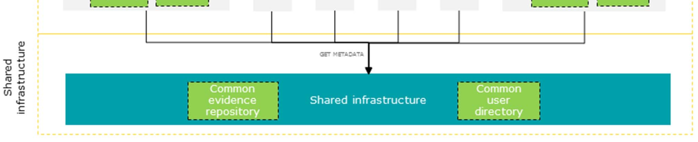

Khi người gửi và người nhận đăng ký các hệ thống quản lý yêu cầu (REMS) khác nhau, các REMS tương ứng sẽ liên lạc với nhau để
chuyển tiếp nội dung người dùng, cùng với một số siêu dữ liệu liên quan, và cung cấp bằng chứng cho người dùng về mọi sự kiện liên
quan trong quá trình này. Việc liên lạc này có thể diễn ra gián tiếp, liên quan đến một số REMS trung gian, có thể cung cấp hỗ trợ
định tuyến, cổng tin cậy và các chức năng phụ trợ khác.

Trong trường hợp tổng quát nhất, một nhà cung cấp dịch vụ hoạt động như một REMSP cũng có thể giao tiếp bằng các định dạng
và giao thức khác với REM, và do đó cung cấp kết nối liên mạng với các loại ERDS khác. Một ERDS trung gian cũng có thể
cung cấp dịch vụ chuyển đổi giao thức như vậy, do đó hoạt động như một cổng kết nối giữa một REM và một ERDS không phải REM.

Tài liệu này (và cả phần 2 [i.1] và phần 3 [i.2] của tài liệu nhiều phần này) mô tả sự tương tác giữa các REMS chỉ dựa trên các 
định dạng và giao thức REM dựa trên email. Việc giao tiếp với các ERDS không phải REM khác nằm ngoài phạm vi của tài liệu này.
Xem ETSI EN 319 522-1 [1] để được hướng dẫn trong lĩnh vực đó.

Tương tự như các hệ thống ERDS liên kết với nhau nói chung, cơ sở hạ tầng dùng chung có thể hỗ trợ việc giao tiếp giữa các hệ
thống REMS liên kết. Đây là một thực thể trừu tượng, trên thực tế có thể bao gồm nhiều tác nhân khác nhau. Trong kịch bản phân
phối đa ERDS, một số thành phần thường được triển khai bởi một ERDS (các ô chấm trong hình 8) có thể được chuyển sang cơ sở hạ
tầng dùng chung, ví dụ như: thư mục người dùng dùng chung, kho lưu trữ bằng chứng dùng chung.

Mỗi REMS tham gia vào quá trình gửi có thể hoạt động theo kiểu S&F hoặc S&N (hoặc hỗ trợ cả hai). Tuy nhiên, trong bất kỳ chuỗi
REMS nào, chỉ có một REMS có thể hoạt động hiệu quả theo kiểu S&N, vì thông báo luôn phải được xử lý bởi một thành phần phụ S&F.
Do đó, tất cả các REMS dọc theo chuỗi sau REMS S&N đầu tiên sẽ hoạt động như các REMS S&F. Sự tương tác giữa hai REMS liền kề bất
kỳ tuân theo một trong các mẫu được mô tả trong điều khoản IV.3.2. Nếu không có REMS S&N trong chuỗi, thì tất cả các tương tác đều
giống như trong điều khoản IV.3.2.1. Ngược lại, tất cả các tương tác trước (phía người gửi) REMS S&N đều giống như trong điều khoản
4.3.2.2, và tất cả các tương tác sau (phía người nhận) REMS S&N đều giống như trong điều khoản IV.3.2.3. Hai tùy chọn này được
trình bày chi tiết trong điều khoản tiếp theo.

##### IV.4.2 Quan điểm trình tự
###### IV.4.2.1 Chuỗi đa bước nhảy chỉ trên các nút S&F
Khi tất cả các REMS trong chuỗi hoạt động theo kiểu S&F, nội dung người dùng sẽ được chuyển tiếp dọc theo chuỗi đến R-REMS, và
bằng chứng ERDS sẽ được chuyển tiếp ngược lại dọc theo chuỗi đến S-REMS. Tương tác với người dùng vẫn giống như được định nghĩa
trong điều khoản IV.2.2.2 cho kiểu Store & Forward trong mô hình hộp đen. Việc giao tiếp giữa bất kỳ hai REMS liền kề nào tuân theo
mô hình được mô tả trong điều khoản IV.3.2.1. Trình tự các bước N1, N2, N3, N4, N5, N6 sẽ được lặp lại nhiều lần nếu cần để chuyển
tiếp nội dung người dùng. Các bước N7 và N8 sẽ được lặp lại riêng lẻ nhiều lần nếu cần để chuyển tiếp bất kỳ bằng chứng ERDS nào.

Ví dụ, toàn bộ quy trình liên lạc liên quan đến 3 REMS, mỗi REMS hoạt động theo kiểu S&F, được mô tả trong hình 9. Để đơn giản,
các trường hợp lỗi không được xem xét trong chuỗi này. (Các trường hợp thành công và lỗi được quy định trong các loại sự kiện và
lý do có thể xảy ra, xem điều khoản VI bên dưới và ETSI EN 319 522-2 [i.5], điều khoản VIII.3.3.) Các REMS có thể theo dõi từng sự
kiện liên quan trong chuỗi bằng cách tạo ra bằng chứng ERDS tương ứng, như được mô tả chi tiết trong điều khoản IV.2.2.2, nhưng để
dễ hình dung hơn, việc tạo ra các bằng chứng này không được hiển thị trong hình 9. Bằng chứng được tạo ra cũng có thể được gửi đến
người dùng hoặc có thể được cung cấp theo những cách khác, như được mô tả trong điều khoản IV.2.2.2. Việc trả lại bằng chứng tùy
chọn cho người dùng không được hiển thị trong hình 9.

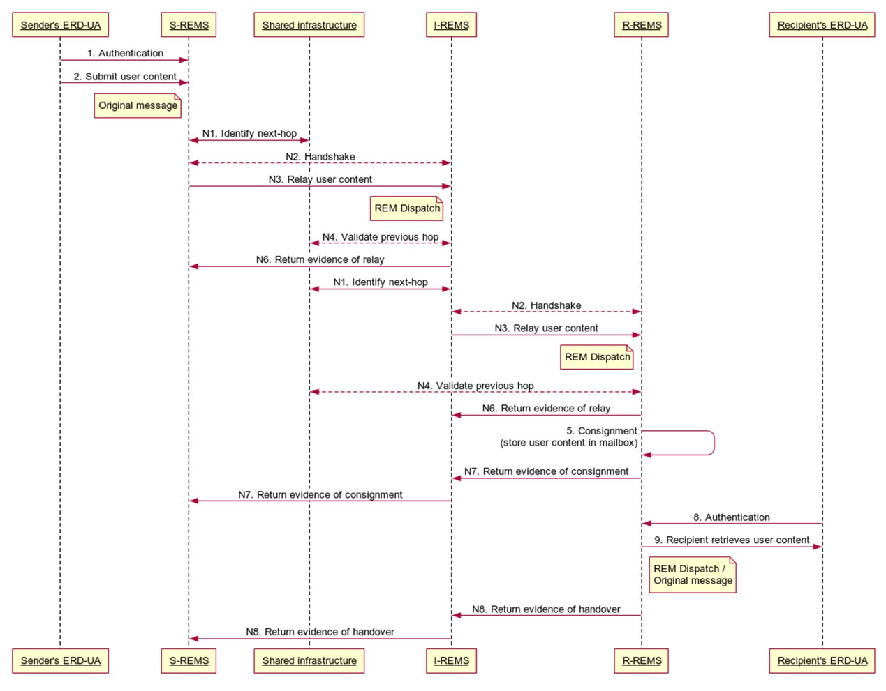

###### IV.4.2.2 Chuỗi nhiều bước nhảy liên quan đến nút S&N
Khi một trong các REMS trong chuỗi hoạt động theo kiểu S&N, nội dung người dùng sẽ được chuyển tiếp dọc theo chuỗi đến REMS này,
nơi nó sẽ được lưu trữ tạm thời, và từ đó thông báo REMS sẽ được chuyển tiếp dọc theo chuỗi đến R-REMS. Bất kỳ bằng chứng ERDS nào
sẽ được chuyển tiếp ngược lại dọc theo chuỗi đến S-REMS. Các tương tác với người dùng vẫn giống như được định nghĩa trong điều
khoản 4.2.2.3 cho kiểu Lưu trữ & Thông báo trong mô hình hộp đen. Việc giao tiếp giữa bất kỳ hai REMS liền kề nào trước (phía
người gửi) REMS S&N tuân theo mẫu được mô tả trong điều khoản IV.3.2.2, và việc giao tiếp giữa bất kỳ hai REMS liền kề nào sau 
phía người nhận) REMS S&N tuân theo mẫu được mô tả trong điều khoản IV.3.2.3. Trình tự các bước là N1, N2, N3, N4, N5, N6. Trình tự
các bước N9, N10, N11 sẽ được lặp lại nhiều lần nếu cần để chuyển tiếp nội dung người dùng lên nút S&N, và từ đó chuyển tiếp thông
báo REMS lên R-REMS. Trình tự các bước N7, N8, N12 và N13 sẽ được lặp lại riêng lẻ nhiều lần nếu cần để chuyển tiếp bất kỳ bằng
chứng ERDS nào.

Ví dụ, toàn bộ quy trình liên lạc liên quan đến 3 REMS, trong đó REMS ở giữa hoạt động theo kiểu S&N, được minh họa trong hình 10.
Để đơn giản, các trường hợp lỗi không được xem xét trong chuỗi này. (Các trường hợp thành công và thất bại được quy định trong các
loại sự kiện và lý do có thể xảy ra, xem điều khoản VI bên dưới và ETSI EN 319 522-2 [i.5], điều khoản VIII.3.3.) REMS S&N cũng có thể
chuyển trực tiếp nội dung người dùng cho người nhận, nhưng điều này không được hiển thị trong hình 10. Các REMS có thể theo dõi
từng sự kiện liên quan trong chuỗi bằng cách tạo ra bằng chứng ERDS tương ứng, như được nêu chi tiết trong điều khoản IV.2.2.3,
nhưng để dễ hình dung hơn, việc tạo ra các bằng chứng này không được hiển thị trong hình 10. Bằng chứng được tạo ra cũng có thể
được gửi cho người dùng hoặc có thể được cung cấp theo những cách khác, như được mô tả trong điều khoản IV.2.2.3. Việc tùy chọn trả
lại bằng chứng cho người dùng không được hiển thị trong hình 10.

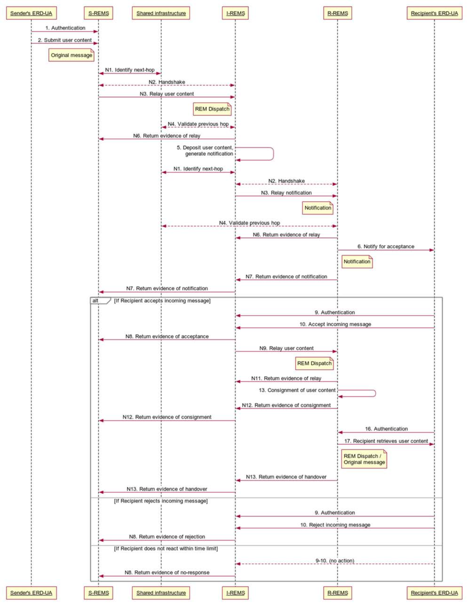

### V. Giao diện REM
Vì REMS là một loại ERDS cụ thể, nên các giao diện ERD được mô tả trong điều khoản V của ETSI EN 319 522-1 [1] cũng có thể được áp
dụng cho REM. Tuy nhiên, trong ERDS, các cơ chế vận chuyển có thể khác nhau và do đó chỉ có một sự trừu tượng cấp cao về các giao
diện được quy định trong ETSI EN 319 522-1 [1]. Mặt khác, trong REM, các cơ chế vận chuyển chủ yếu dựa trên tin nhắn email thông
thường, vì vậy một đặc tả chi tiết hơn được đưa ra cho các giao diện REM trong điều khoản này.

Hình 11 minh họa giao diện của các dịch vụ REM. Mô hình 4 góc được sử dụng cho hình minh họa này, nhưng bất kỳ REMS nào cũng có
thể cung cấp tất cả các giao diện được trình bày. Thông số kỹ thuật chi tiết của các giao diện và mối quan hệ của chúng với các
giao diện ERDS trừu tượng được cung cấp bên dưới trong bảng 2.

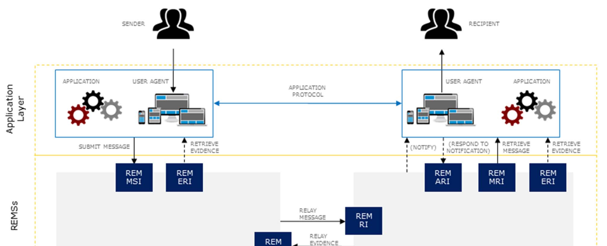

#### V.1 Yêu cầu đối với giao diện REM
##### V.1.1 REM MSI (Message Submission Interface)
1. Giao diện ERDS tương ứng trong ETSI ETSI EN 319 522-1
Giao diện gửi tin nhắn ERDS MSI (Message Submission Interface): giao diện này được sử dụng bởi ERD-UA của người gửi để gửi các tin
nhắn gốc đến ERDS của người gửi, để chúng được chuyển tiếp đến người nhận. Giao diện này phải yêu cầu nhận dạng và xác thực, trực
tiếp (ví dụ: thông qua kiểm tra thông tin đăng nhập) hoặc gián tiếp (ví dụ: thông qua mã thông báo từ bên thứ ba). Giao diện này
phải thực hiện các biện pháp bảo mật và bảo toàn tính toàn vẹn.

2. Các yêu cầu cụ thể bổ sung cho REM
```
REM MSI phải được cung cấp.  
Các yêu cầu đối với ERDS MSI sẽ áp dụng cho REM MSI.  
REM MSI nên được cung cấp bằng SMTP [i.8] qua TLS [i.11]. 
Xem thêm [i.13], [i.14] và [i.15].  
Các giao thức khác chỉ có thể được sử dụng nếu chúng tạo ra một kênh an toàn cung cấp tính bảo mật,
tính toàn vẹn và tính xác thực của dữ liệu được gửi qua kênh đó (ví dụ: TLS).  
Ví dụ: HTTPS tạo ra một kênh an toàn như vậy.  
Xem chú thích 1.
```

##### V.1.2 REM MRI (Message Retrieval Interface) & REM ERI (Evidence Retrieval Interface)
1. Giao diện ERDS tương ứng trong ETSI ETSI EN 319 522-1
ERDS MERI (Giao diện truy xuất tin nhắn và bằng chứng - Message and Evidence Retrieval Interface):
giao diện này được ERD-UA sử dụng để truy xuất nội dung người dùng, siêu dữ liệu bàn giao và bằng chứng liên quan (chế độ kéo).
Giao diện này phải yêu cầu nhận dạng và xác thực, trực tiếp (ví dụ: thông qua kiểm tra thông tin đăng nhập) hoặc gián tiếp (ví dụ:
thông qua mã thông báo từ bên thứ ba). Giao diện này phải thực hiện các biện pháp bảo mật và bảo toàn tính toàn vẹn.

2. Các yêu cầu cụ thể bổ sung cho REM
```
REM MRI phải được cung cấp. Các yêu cầu về ERDS MERI sẽ áp dụng cho REM MRI.  
REM MRI nên được cung cấp bằng IMAP [i.10] qua TLS hoặc POP3 [i.9] qua TLS.  
Các giao thức khác chỉ có thể được sử dụng nếu chúng tạo ra một kênh an toàn cung cấp tính bảo mật,
tính toàn vẹn và tính xác thực của dữ liệu được gửi qua kênh đó (ví dụ: TLS).  
Ví dụ: HTTPS tạo ra một kênh an toàn như vậy.  
Xem chú thích 2.
```
```
Thiết bị REM ERI phải được cung cấp.  
Các yêu cầu đối với ERDS MERI cũng áp dụng cho REM ERI.  
REM ERI có thể sử dụng cùng một kênh với REM MRI, nhưng cũng có thể sử dụng các kênh riêng biệt.  
Xem chú thích 2.
```

##### V.1.3 REM RI (Relay Interface)
1. Giao diện ERDS tương ứng trong ETSI ETSI EN 319 522-1
ERDS RI (Giao diện chuyển tiếp): giao diện này cho phép chuyển tiếp các thông điệp ERD giữa các ERDS.
Giao diện này phải thực hiện các biện pháp xác thực, bảo mật và duy trì tính toàn vẹn dữ liệu.

2. Các yêu cầu cụ thể bổ sung cho REM
```
Cần cung cấp REM RI.  
Các yêu cầu đối với ERDS RI sẽ áp dụng cho REM RI.  
REM RI cần được cung cấp bằng SMTP qua TLS.  
Các giao thức khác chỉ có thể được sử dụng nếu chúng tạo ra một kênh an toàn cung cấp tính bảo mật,
tính toàn vẹn và tính xác thực của dữ liệu được gửi qua kênh đó (ví dụ: TLS).  
Ví dụ: HTTPS tạo ra một kênh an toàn như vậy.  
Việc triển khai giao diện này phải tuân theo các yêu cầu được định nghĩa trong điều khoản V của ETSI EN 319 532-4 [i.3].  
Một REMS có thể cung cấp nhiều hơn một REM RI.  
REM RI có thể được cung cấp bằng các giao thức khác.  
Xem ghi chú 3.
```

##### V.1.4 REM ARI (Acceptance/ Rejection Interface)
1. Giao diện ERDS tương ứng trong ETSI ETSI EN 319 522-1
Giao diện này cũng có thể được cung cấp bởi ERDS không phải REM, nhưng nó không được quy định trong ETSI ETSI EN 319 522-1 [1].

2. Các yêu cầu cụ thể bổ sung cho REM
```
Giao diện này được người nhận sử dụng để phản hồi thông báo và báo hiệu việc chấp nhận hoặc từ chối tin nhắn đến.  
Mã REM ARI phải được cung cấp khi hệ thống REMS hoạt động theo kiểu S&N.  
Mã REM ARI có thể được cung cấp bằng bất kỳ kỹ thuật nào.  
Hệ thống REMS nên bao gồm trong thông báo REMS đủ thông tin để người nhận có thể sử dụng mã REM ARI.
```

3. ERD-UA MEPI (Message and Evidence Push Interface - Giao diện đẩy tin nhắn và bằng chứng)
Trong việc gửi tin nhắn email thông thường, tác nhân người dùng đóng vai trò là máy khách đối với nhà cung cấp dịch vụ
thư điện tử. Do đó, trong REM, việc đẩy tin nhắn đến ERD-UA không phải là điển hình. Vì lý do này,
không có giao diện REMS tương ứng nào được định nghĩa cho ERD-UA MEPI.

##### V.1.5 CSI (Common Service Interface)
1. Giao diện ERDS tương ứng trong ETSI ETSI EN 319 522-1
CSI (Giao diện dịch vụ chung): giao diện này cung cấp quyền truy cập vào các chức năng định tuyến tin nhắn,
chức năng quản lý độ tin cậy, chức năng quản lý năng lực và chức năng quản trị.
2. Các yêu cầu cụ thể bổ sung cho REM
```
Một hệ thống REMS có khả năng tương tác (giao tiếp với các hệ thống REMS khác)  
nên sử dụng CSI. CSI có thể là một tập hợp các giao diện riêng biệt cung cấp các chức năng khác nhau.  
Hệ thống REMS có thể cung cấp một số chức năng có thể được sử dụng thay thế cho CSI  
(ví dụ: công bố khả năng, thông tin định tuyến, v.v.).
```
* LƯU Ý 1: Việc xác thực trong REM MSI có thể dựa vào các tính năng được cung cấp bởi SASL [i.12], TLS
(ví dụ: xác thực dựa trên chứng chỉ), chữ ký số S/MIME [i.7] trên thông báo đã gửi hoặc các cơ chế khác.
* LƯU Ý 2: Việc xác thực trong REM MRI và REM ERI có thể dựa vào các tính năng được cung cấp bởi SASL [i.12], TLS
(ví dụ: xác thực dựa trên chứng chỉ) hoặc các cơ chế khác.
* LƯU Ý 3: Việc cung cấp REM RI bằng các giao thức khác có thể hữu ích khi REMS giao tiếp với các ERDS không phải REM khác.

##### Ghi chú
1. Các giao diện REM MSI, REM MRI, REM ERI và REM RI yêu cầu phải thực hiện các biện pháp bảo mật thông tin. Bên gửi có thể đảm
bảo tính bảo mật của nội dung người dùng bằng cách áp dụng mã hóa đầu cuối trước khi gửi. Trong trường hợp này, tính bảo mật của
nội dung người dùng sẽ được bảo vệ thêm ngay cả bên ngoài các kênh bảo mật của các giao diện này, và ngay cả các REMSP cũng không
thể đọc được nội dung người dùng.
2. Hệ thống REMS sẽ xác thực người gửi và cung cấp bằng chứng ERDS liên quan đến người dùng đã được xác thực về các sự kiện ERD
có liên quan. Người gửi cũng có thể tự đảm bảo tính toàn vẹn và xác thực của nội dung người dùng bằng cách áp dụng chữ ký số trước
khi gửi. Trong trường hợp này, chữ ký số của người gửi trở thành một phần của nội dung người dùng và có thể cung cấp sự đảm bảo
cho người nhận ngoài sự đảm bảo được cung cấp bởi bằng chứng ERDS.


### VI. sự kiện và bằng chứng REM
#### VI.1. Tổng quan
Các loại sự kiện được liệt kê trong điều khoản VI.1 của ETSI EN 319 522-1 [1] sẽ được áp dụng.  

Các định nghĩa về các loại sự kiện trong điều khoản VI.2 của ETSI EN 319 522-1 [1] sẽ được áp dụng,
như được quy định thêm trong điều khoản VI.2 của tài liệu này.

Các yêu cầu về việc sản xuất bằng chứng ERDS cho từng loại sự kiện được xác định trong điều khoản VI.1
của ETSI EN 319 522-1 [1] sẽ được áp dụng.

Các yêu cầu bổ sung đối với REM về việc cung cấp bằng chứng ERDS cho từng loại sự kiện được quy định
trong điều khoản VI.2 của tài liệu này.

#### VI.2. Các sự kiện và bằng chứng
##### VI.2.1. A. Các sự kiện liên quan đến **submission**
**Submission** là giao dịch trong đó thông điệp gốc, đến từ bên ngoài, đi qua giao diện gửi thông điệp REM MSI
(Message Submission Interface) của hệ thống REMS. Giao dịch này bao gồm việc xác thực người gửi.

Trong REM, thông điệp gốc là tải trọng của giao dịch được hệ thống nhận được dưới trách nhiệm của REMSP.

Khi REM MSI được cung cấp bằng SMTP thì giao dịch này là một giao dịch SMTP.
Máy khách có thể là một tác nhân người dùng hoặc một tác nhân chuyển thư.

Sau khi gửi, REMS có thể kiểm tra tin nhắn gốc đã gửi để quyết định về việc chấp nhận hay không (ví dụ: có thể xác thực chữ ký số
- nếu có - trên tin nhắn, có thể xác minh rằng tiêu đề của tin nhắn tương ứng với người dùng đã được xác thực, có thể kiểm tra xem
tin nhắn có tuân thủ các quy tắc chính sách hay không, v.v.). Quyết định của REMS sẽ là một trong các sự kiện được liệt kê trong
bảng 2.

###### Table 2: Events related to the submission
| Event type                | Giao diện liên quan | Phát hành REMS | Giải thích                                                                                                                                                                                                                                              |
|---------------------------|---------------------|----------------|---------------------------------------------------------------------------------------------------------------------------------------------------------------------------------------------------------------------------------------------------------|
| A.1. SubmissionAcceptance | **REM MSI**         | S-REMS         | Hệ thống REMS đã chấp nhận tin nhắn gốc được gửi đi. Và hệ thống REMSP chịu trách nhiệm cố gắng chuyển tiếp tin nhắn đó đến tất cả người nhận được chỉ định, tuân thủ các quy tắc chính sách và tất cả các tùy chọn gửi tin nhắn do người gửi cung cấp. |
| A.2. SubmissionRejection  | **REM MSI**         | S-REMS         | REMS đã từ chối tin nhắn gốc được gửi. REMS sẽ thông báo cho người gửi về lý do từ chối. Xem ETSI EN 319 522-2 [i.5], điều khoản VIII.3.3 về các lý do có thể xảy ra.                                                                                      |

##### VI.2.2 B. Các sự kiện liên quan đến việc chuyển tiếp giữa các REMS
Một REMS có thể liên lạc với các REMS hoặc ERDS khác để chuyển tiếp nội dung người dùng đến người nhận không đăng ký REMS đó,
hoặc để phân phối nội dung người dùng từ người gửi không đăng ký REMS đó. Khi một REMS tương tác với một REMS khác,
nó phải cung cấp bằng chứng ERDS tương ứng với các sự kiện được mô tả trong điều khoản này.

Relay là quá trình chuyển giao một thông điệp REM chứa nội dung người dùng từ một REMS (sau đây gọi là REMS gửi)
đến một REMS khác (sau đây gọi là REMS nhận) thông qua REM RI (Giao diện chuyển tiếp).
Khi REM RI được cung cấp bằng SMTP thì giao dịch này là một giao dịch SMTP.

Sau khi chuyển tiếp thành công tin nhắn REM chứa nội dung người dùng, REMSP vận hành REMS nhận sẽ chịu trách nhiệm xử lý nội dung
người dùng theo các yêu cầu trong tài liệu này và các quy tắc chính sách. REMS nhận có thể kiểm tra tin nhắn REM để quyết định
việc chấp nhận (ví dụ: nó có thể xác minh độ tin cậy của REMS gửi, kiểm tra sự tuân thủ của tin nhắn REM với các quy tắc chính
sách, v.v.). REMS nhận sẽ phát hành bằng chứng ERDS về quyết định của mình đối với nội dung người dùng được chuyển tiếp và sẽ
chuyển bằng chứng ERDS này cho REMS gửi. Nếu REMS nhận từ chối nội dung người dùng được chuyển tiếp, thì REMSP vận hành REMS gửi
sẽ lại chịu trách nhiệm xử lý nội dung người dùng được chuyển tiếp theo các yêu cầu.

Nếu việc chuyển tiếp tin nhắn REM chứa nội dung người dùng bị lỗi, thì trách nhiệm xử lý nội dung người dùng
theo các yêu cầu trong tài liệu này và các quy tắc chính sách sẽ thuộc về REMSP vận hành REMS gửi.
REMS gửi sẽ phát hành bằng chứng ERDS về lỗi chuyển tiếp.

REMS sẽ phát hành các bằng chứng ERDS nêu trên về việc chuyển tiếp nội dung của mỗi người dùng (bất kể nội dung đó có được
bao bọc trong gói tin REM hay không) thuộc trách nhiệm của mình, bất kể đó là REMS của người gửi hay REMS trung gian.

REMS không cần phải cung cấp bằng chứng ERDS về việc chuyển tiếp các tin nhắn REM không chứa nội dung người dùng
(nhưng có thể ghi lại chúng chẳng hạn).

###### Bảng 3: Các sự kiện liên quan đến việc chuyển tiếp giữa các hệ thống REMS
| Loại sự kiện         | Giao diện liên quan | Issuing REMS   | Giải thích                                                                                                                                                                                                                                                             |
|----------------------------|---------------------|----------------|------------------------------------------------------------------------------------------------------------------------------------------------------------------------------------------------------------------------------------------------------------------------|
| B.1. RelayAcceptance | **REM RI**          | Receiving REMS | REMS nhận đã chấp nhận thông điệp REM được chuyển tiếp chứa nội dung người dùng, và REMSP chịu trách nhiệm xử lý thông điệp đó theo các yêu cầu trong tài liệu này và các quy tắc chính sách.                                                                          |
| B.2. RelayRejection  | **REM RI**          | Receiving REMS | REMS nhận đã từ chối tin nhắn REM được chuyển tiếp có chứa nội dung người dùng. REMS nhận phải thông báo cho REMS gửi về lý do từ chối.  Xem ETSI EN 319 522-2 [i.5], điều khoản VIII.3.3 về các lý do có thể xảy ra.                                                     |
| B.3. RelayFailure    | **REM RI**          | Receiving REMS | Hệ thống REMS gửi không thể chuyển tiếp tin nhắn REM chứa nội dung người dùng đến hệ thống REMS nhận trong một khoảng thời gian nhất định, hoặc hệ thống REMS nhận không trả về bằng chứng ERDS về việc chấp nhận hoặc từ chối tin nhắn REM trong khoảng thời gian đó. |

##### VI.2.3 C. Các sự kiện liên quan đến việc người nhận chấp nhận/từ chối
Khi một hệ thống REMS hoạt động theo kiểu S&N hoặc tương tác với một hệ thống REMS khác cũng hoạt động theo kiểu S&N,
thì hệ thống đó phải cung cấp bằng chứng ERDS tương ứng với các sự kiện được mô tả trong điều khoản này.

Trong trường hợp tổng quát nhất, nội dung người dùng có thể được chuyển tiếp thông qua một chuỗi các REMS. Chỉ một trong số đó mới
có thể hoạt động hiệu quả theo kiểu S&N (xem điều khoản IV.4.1) (sau đây gọi là REMS thông báo). REMS thông báo sẽ tạo ra thông báo
và theo dõi phản hồi của người nhận. Khoảng thời gian phản hồi của người nhận có thể được quy định bởi luật pháp, quy tắc chính
sách hoặc các tham số do người gửi cung cấp. REMS thông báo sẽ phát hành bằng chứng ERDS về chính xác một trong các sự kiện liên
quan đến phản hồi của mỗi người nhận (C.3, C.4, C.5 trong bảng 5) cho mỗi nội dung người dùng.

Thông báo sẽ được chuyển tiếp đến R-REMS. Sau khi nhận được thông báo gửi đến một trong những người đăng ký của mình, R-REMS sẽ
thông báo cho người đăng ký đó. R-REMS có thể sử dụng bất kỳ kênh nào để thông báo cho người nhận. R-REMS nên cung cấp bằng chứng
ERDS về việc thông báo thành công hoặc không thành công cho người nhận (C.1, C.2 trong bảng 4).

###### Bảng 4: Các sự kiện liên quan đến việc người nhận chấp nhận/từ chối
| Loại sự kiện                          | Giao diện liên quan | Issuing REMS   | Giải thích                                                                                                                                      |
|---------------------------------------|---------------------|----------------|-------------------------------------------------------------------------------------------------------------------------------------------------|
| C.1. NotificationForAcceptance        | **n/a**             | R-REMS         | R-REMS đã thông báo cho người nhận về sự có sẵn của tin nhắn tại REMS thông báo.                                                                |
| C.2. NotificationForAcceptanceFailure | **n/a**             | R-REMS         | Hệ thống R-REMS không thể thông báo cho người nhận về việc tin nhắn đã có sẵn tại hệ thống REMS thông báo trong một khoảng thời gian nhất định. |
| C.3. ConsignmentAcceptance            | **REM ARI**         | Notifying REMS | Sau khi xác thực thành công, người nhận đã thực hiện một hành động cho thấy họ chấp nhận việc nhận tin nhắn.                                    |
| C.4. ConsignmentRejection             | **REM ARI**         | Notifying REMS | Sau khi xác thực thành công, người nhận đã thực hiện một hành động cho thấy họ từ chối nhận tin nhắn.                                           |
| C.5. AcceptanceRejectionExpiry        | **REM ARI**         | Notifying REMS | Thời hạn chấp nhận/từ chối đã hết hạn mà người nhận vẫn chưa phản hồi.                                                                          |

##### VI.2.4 D. Các sự kiện liên quan đến chuyển giao nội dung
Việc chuyển giao nội dung là hoạt động của R-REMS giúp người nhận có thể truy cập nội dung người dùng mà không cần thực hiện thêm
bất kỳ thao tác nào ngoài việc xác thực. Việc chuyển giao được coi là do REMS thực hiện nội bộ, không thông qua bất kỳ giao diện
bên ngoài nào. R-REMS sẽ phát hành bằng chứng ERDS về việc chuyển giao thành công hay không thành công của mỗi nội dung người
dùng, bất kể nội dung đó được chuyển giao bên trong một gói tin REM hay riêng biệt. Nếu nội dung người dùng được chuyển tiếp bởi
một REMS khác, thì R-REMS sẽ cung cấp bằng chứng ERDS về việc chuyển giao thành công hay không thành công cho REMS chuyển tiếp đó.
```
VÍ DỤ: Việc gửi thư có thể được thực hiện bằng cách lưu trữ tin nhắn trong hộp thư mà người nhận có thể truy cập sau khi xác thực.
```

Khi REMS chuyển tiếp nội dung người dùng đến một REMS khác, REMS này phải giám sát xem REMS kia có cung cấp bằng chứng ERDS về
việc chuyển giao nội dung người dùng thành công hay không thành công trong một khoảng thời gian nhất định hay không. Nếu REMS kia
không cung cấp bằng chứng ERDS trong khoảng thời gian này, thì REMS phải phát hành bằng chứng ERDS về việc chuyển giao thất bại,
chỉ rõ khoảng thời gian đó. Nếu nội dung người dùng được chuyển tiếp bởi một REMS khác, thì REMS phải cung cấp bằng chứng này cho
REMS chuyển tiếp.

```
LƯU Ý: Khoảng thời gian để xác nhận việc gửi hàng thành công hay không thành công có thể được xác định bởi luật pháp, quy định
chính sách hoặc các thông số do người gửi đưa ra. Phương pháp xác định khoảng thời gian này có thể được quy định trong chính sách
REM hoặc tuyên bố thực tiễn REM của REMS.

```

R-REMS có thể tùy chọn thông báo cho người nhận về nội dung người dùng được ủy thác. Việc này có thể được thực hiện bằng bất kỳ
kênh nào mà họ đã thỏa thuận, không nhất thiết phải sử dụng bất kỳ giao diện tiêu chuẩn nào. R-REMS cũng có thể phát hành bằng
chứng ERDS về việc thông báo thành công hoặc không thành công cho người nhận về nội dung người dùng được ủy thác.

###### Bảng 5: Các sự kiện liên quan đến chuyển giao nội dung
| Loại sự kiện                        | Giao diện liên quan | Issuing REMS | Giải thích                                                                                                                                                                                                                                                                                                 |
|-------------------------------------|---------------------|--------------|------------------------------------------------------------------------------------------------------------------------------------------------------------------------------------------------------------------------------------------------------------------------------------------------------------|
| D.1. ContentConsignment             | **n/a**             | R-REMS       | R-REMS đã cung cấp nội dung người dùng cho người nhận.                                                                                                                                                                                                                                                     |
| D.2. ContentConsignmentFailure      | **n/a**             | R-REMS       | REMS không thể cung cấp nội dung người dùng cho người nhận trong một khoảng thời gian nhất định, hoặc REMS không nhận được bằng chứng ERDS trong một khoảng thời gian nhất định về việc gửi thành công hay không thành công nội dung người dùng từ REMS khác mà nó đã chuyển tiếp nội dung người dùng đến. |
| D.3. ConsignmentNotification        | **n/a**             | R-REMS       | R-REMS đã thông báo cho người nhận về nội dung người dùng được gửi kèm.                                                                                                                                                                                                                                    |
| D.4. ConsignmentNotificationFailure | **n/a**             | R-REMS       | R-REMS không thể thông báo cho người nhận về nội dung người dùng được gửi trong khoảng thời gian quy định.                                                                                                                                                                                                 |

##### VI.2.5 E. Các sự kiện liên quan đến việc bàn giao cho người nhận
Chuyển giao là giao dịch trong đó nội dung người dùng (được đóng gói trong một thông điệp REM hoặc riêng biệt) được chuyển qua
giao diện truy xuất thông điệp REM (REM MRI) của REMS, từ REMS đến ERD-UA của người nhận. Giao dịch này bao gồm việc xác thực
người dùng thực hiện chuyển giao. Trong giao dịch này, siêu dữ liệu liên quan và/hoặc bằng chứng ERDS cũng có thể được chuyển giao
cùng với nội dung người dùng (được đóng gói trong một thông điệp REM hoặc riêng biệt).
```
LƯU Ý 1: Việc chuyển giao thường được thực hiện bằng cách sử dụng tác nhân người dùng hoặc ứng dụng khác,
kết nối với máy chủ cung cấp REM MRI như một máy khách.
```

Khi REM MRI được cung cấp bằng IMAP/POP3, thì giao dịch này là giao dịch IMAP/POP3, có thể bao gồm việc chuyển giao nhiều hơn một
tin nhắn chứa nội dung người dùng. Khi sử dụng IMAP, việc chỉ lấy phần tiêu đề của tin nhắn (không có phần thân thư) không được
coi là chuyển giao. Khi REM MRI được cung cấp bằng HTTP, thì việc tải xuống tin nhắn bởi máy khách HTTP được coi là chuyển giao.
```
LƯU Ý 2: Trước đây, việc tải xuống tin nhắn được định nghĩa là một sự kiện riêng biệt so với việc truy xuất tin nhắn.
Tài liệu này xem hai trường hợp đó là một, do đó không có sự kiện tải xuống riêng biệt nào được định nghĩa.
```

REMS **có thể** cung cấp bằng chứng ERDS về việc chuyển giao thành công hoặc không thành công.

###### Bảng 6: Các sự kiện liên quan đến việc bàn giao cho người nhận
| Loại sự kiện                | Giao diện liên quan | Issuing REMS | Giải thích                                                                                                               |
|-----------------------------|---------------------|--------------|--------------------------------------------------------------------------------------------------------------------------|
| E.1. ContentHandover        | **REM MRI**         | R-REMS       | Nội dung người dùng đã được chuyển thành công qua hệ thống REM MRI từ REMS đến máy khách dưới sự quản lý của người nhận. |
| E.2. ContentHandoverFailure | **REM MRI**         | R-REMS       | Nội dung do người dùng đăng tải không được xử lý qua REM RMI trong khoảng thời gian quy định.                            |

##### VI.2.6 F. Các sự kiện liên quan đến kết nối với các hệ thống không thuộc ERDS
Hệ thống REMS có thể hỗ trợ kết nối với các dịch vụ không phải là ERDS (ví dụ: thư tín vật lý, email thông thường, hệ thống phân
phối chuyên ngành, v.v.) và do đó không thể cung cấp bằng chứng ERDS về các sự kiện xảy ra thuộc trách nhiệm của chúng. Khi nội
dung người dùng được nhận từ một dịch vụ như vậy hoặc được chuyển tiếp đến một dịch vụ như vậy, thì không thể coi việc phân phối
nội dung người dùng này được thực hiện bởi một ERDS. Tuy nhiên, trong một số trường hợp, việc cho phép giao tiếp giữa các hệ
thống như vậy vẫn có giá trị đối với người dùng và do đó có thể là điều mong muốn.

Nếu hệ thống REMS hỗ trợ tính năng này, nó nên phát hành bằng chứng ERDS
tương ứng với các sự kiện được mô tả trong điều khoản này.

###### Bảng 7: Các sự kiện liên quan đến kết nối với các hệ thống không thuộc ERDS
| Loại sự kiện               | Giao diện liên quan | Issuing REMS  | Giải thích                                                                                                                                                                                                                           |
|----------------------------|---------------------|---------------|--------------------------------------------------------------------------------------------------------------------------------------------------------------------------------------------------------------------------------------|
| F.1. RelayToNonERDS        | **n/a**             | Relaying REMS | Hệ thống REMS đã chuyển tiếp thành công nội dung người dùng đến hệ thống không phải ERDS được chỉ định.                                                                                                                              |
| F.2. RelayToNonERDSFailure | **n/a**             | Relaying REMS | Hệ thống REMS không thể chuyển tiếp nội dung người dùng đến hệ thống không phải ERDS trong một khoảng thời gian nhất định.                                                                                                           |
| F.3. ReceivedFromNonERDS   | **n/a**             | Relaying REMS | Hệ thống REMS đã nhận được nội dung người dùng từ một hệ thống không phải ERDS, do đó, tất cả thông tin liên quan đến việc gửi nội dung đó, chẳng hạn như mã định danh người gửi và thời gian gửi, không thể được tin cậy hoàn toàn. |
