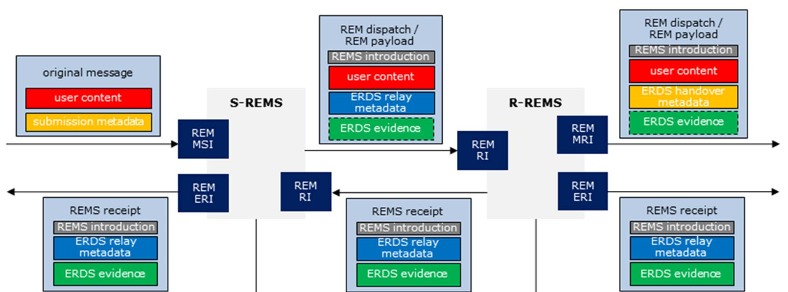
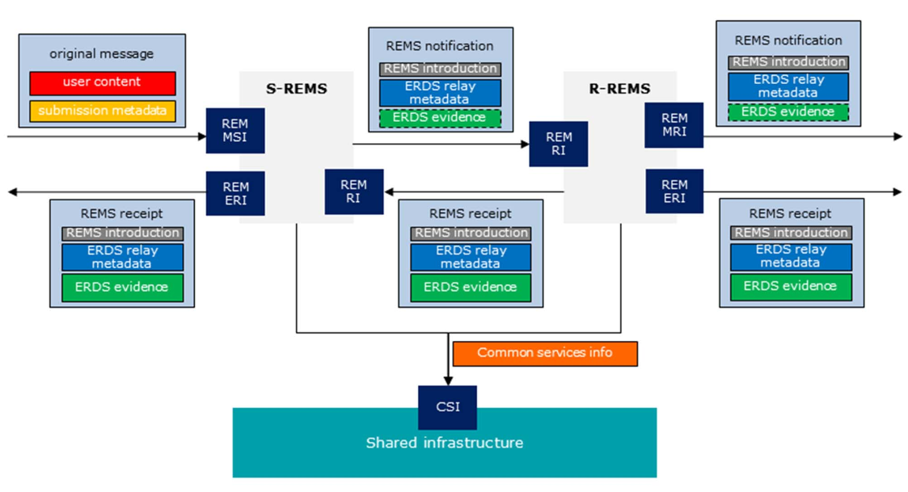

# Electronic Signatures and Infrastructures (ESI); Registered Electronic Mail (REM) Services;
## Phần 2: Nội dung ngữ nghĩa

### Lời tựa
Tiêu chuẩn Châu Âu (EN) này được ban hành bởi Ủy ban Kỹ thuật về Chữ ký điện tử và Cơ sở hạ tầng (ESI) thuộc ETSI.

Tài liệu này là phần 2 của một sản phẩm gồm nhiều phần. Có thể tìm thấy đầy đủ chi tiết của toàn bộ loạt bài trong phần 1 [2].

### Giới thiệu
Các mối quan hệ kinh doanh và hành chính giữa các công ty, cơ quan hành chính nhà nước và người dân ngày càng được thực hiện bằng
phương thức điện tử. Lòng tin là yếu tố thiết yếu cho sự thành công và phát triển bền vững của các dịch vụ điện tử. Do đó, điều
quan trọng là bất kỳ tổ chức nào sử dụng dịch vụ điện tử đều phải có các biện pháp kiểm soát và cơ chế bảo mật phù hợp để bảo vệ
các giao dịch của mình và đảm bảo lòng tin với các đối tác.

Chữ ký điện tử được sử dụng phổ biến trên toàn thế giới để đảm bảo tính xác thực và toàn vẹn của các tài liệu điện tử, giúp chuyển
đổi các quy trình truyền thống dựa trên giấy tờ sang quy trình điện tử với mức độ đảm bảo tương đương hoặc thậm chí cao hơn. Khi
giao tiếp ngày càng dựa nhiều vào internet, việc trao đổi tài liệu an toàn và có thể chứng minh được là điều thiết yếu cho quá
trình chuyển đổi số toàn diện.

Dịch vụ chuyển phát điện tử có xác nhận (sau đây gọi là ERDS) cung cấp khả năng chuyển phát an toàn và đáng tin cậy các tin nhắn
điện tử giữa các bên, tạo ra bằng chứng về quá trình chuyển phát để phục vụ cho trách nhiệm pháp lý. Bằng chứng có thể được xem
như một tuyên bố của bên được tin cậy rằng một sự kiện cụ thể liên quan đến quá trình chuyển phát (gửi tin nhắn, chuyển tiếp tin
nhắn, chuyển phát tin nhắn, từ chối tin nhắn, v.v.) đã xảy ra vào một thời điểm nhất định. Bằng chứng có thể được chuyển ngay lập
tức cho bên liên quan (cùng với tin nhắn hoặc riêng biệt) hoặc có thể được lưu trữ trong kho lưu trữ để truy cập sau này. Thông
thường, bằng chứng được thể hiện dưới dạng dữ liệu được ký điện tử. Thư điện tử có xác nhận (sau đây gọi là REM) là một loại hình
chuyển phát điện tử có xác nhận cụ thể, được xây dựng dựa trên các định dạng, giao thức và cơ chế được sử dụng trong việc gửi thư
điện tử thông thường.

Tại một số cộng đồng quốc gia, khu vực hoặc ngành nghề cụ thể, các dịch vụ chuyển phát thư điện tử có đăng ký và thư điện tử đăng
ký đã được triển khai, và thậm chí còn nhiều hơn nữa đang được phát triển. Nếu không định nghĩa các tiêu chuẩn chung, sẽ không có
sự nhất quán trong các dịch vụ được cung cấp, gây khó khăn cho người dùng trong việc so sánh chúng. Trong những trường hợp này,
người dùng có thể khó chuyển sang các nhà cung cấp khác, làm tổn hại đến cạnh tranh tự do. Việc thiếu tiêu chuẩn hóa cũng có thể
ảnh hưởng xấu đến khả năng tương tác giữa các triển khai dựa trên các mô hình khác nhau.

Tài liệu này là một trong số các tài liệu có liên quan với nhau (sau đây gọi là khung tiêu chuẩn ERDS) do ETSI biên soạn nhằm tạo
điều kiện thuận lợi cho một hình thức dịch vụ giao hàng điện tử có đăng ký nhất quán trong và ngoài châu Âu, đặc biệt là về hình
thức bằng chứng được cung cấp, để tối đa hóa khả năng tương tác ngay cả giữa các lĩnh vực được điều chỉnh bởi các quy tắc chính
sách khác nhau. Bộ tài liệu này bao gồm các sản phẩm sau:
* ETSI EN 319 522 [i.10]: một tài liệu nhiều phần cung cấp các thông số kỹ thuật cho Dịch vụ Giao hàng Đăng ký Điện tử.
* ETSI EN 319 532 [i.11]: một tài liệu nhiều phần cung cấp các thông số kỹ thuật cho Dịch vụ Thư điện tử Đăng ký.
* ETSI EN 319 521 [i.12]: Cung cấp các yêu cầu về chính sách và an ninh cho các nhà cung cấp dịch vụ giao hàng đăng ký điện tử.
* ETSI EN 319 531 [i.13]: Cung cấp các yêu cầu về chính sách và bảo mật cho các nhà cung cấp dịch vụ thư điện tử đã đăng ký.
* ETSI TS 119 524 [i.14]: một tài liệu gồm nhiều phần cung cấp các yêu cầu để kiểm tra sự phù hợp và khả năng tương tác của các
dịch vụ giao hàng đăng ký điện tử
* ETSI TS 119 534 [i.15]: một tài liệu gồm nhiều phần cung cấp các yêu cầu để kiểm tra sự phù hợp và khả năng tương tác của các
dịch vụ thư điện tử đã đăng ký
Các văn bản quy định về ERDS chứa các khái niệm và yêu cầu chung áp dụng cho tất cả các loại dịch vụ chuyển phát thư điện tử có
đăng ký. Vì REM là một loại hình chuyển phát thư điện tử có đăng ký đặc thù, nên các văn bản quy định về dịch vụ REM được xây dựng
dựa trên các văn bản tương ứng quy định về ERDS bằng cách tham chiếu các điều khoản cần thiết, và xác định cách giải thích cũng
như các yêu cầu cụ thể chỉ áp dụng cho thư điện tử có đăng ký.

Quy định (EU) số 910/2014 của Nghị viện Châu Âu và Hội đồng ngày 23 tháng 7 năm 2014 về nhận dạng điện tử và dịch vụ tin cậy cho
các giao dịch điện tử trong thị trường nội địa và bãi bỏ Chỉ thị 1999/93/EC [i.2] (Quy định (EU) số 910/2014, hoặc sau đây gọi là
Quy định) cung cấp một khuôn khổ pháp lý để tạo điều kiện thuận lợi cho việc công nhận xuyên biên giới giữa các hệ thống pháp luật
quốc gia hiện hành liên quan đến dịch vụ chuyển phát đăng ký điện tử. Khuôn khổ đó nhằm mục đích mở ra các cơ hội thị trường mới
cho các nhà cung cấp dịch vụ tin cậy của Liên minh Châu Âu để cung cấp các dịch vụ chuyển phát đăng ký điện tử toàn châu Âu mới.
Quy định này định nghĩa cái gọi là dịch vụ chuyển phát đăng ký điện tử đủ điều kiện (sau đây gọi là QERDS), là một loại ERDS đặc
biệt, trong đó cả dịch vụ và nhà cung cấp của nó đều cần đáp ứng một số yêu cầu bổ sung mà các ERDS thông thường và nhà cung cấp
của chúng không cần phải đáp ứng.

Khung tiêu chuẩn ERDS nhằm mục đích bao quát các yêu cầu chung và được công nhận trên toàn thế giới để giải quyết việc gửi thư bảo
đảm điện tử một cách an toàn và đáng tin cậy, bất kể khung pháp lý hiện hành. Các tài liệu này chứa các yêu cầu chung có thể được
áp dụng ở bất kỳ khu vực địa lý nào. Đồng thời, khung tiêu chuẩn ERDS nhằm mục đích hỗ trợ chứng minh sự tuân thủ Quy định (EU) số
910/2014 (và các văn bản pháp luật thứ cấp liên quan), đối với cả dịch vụ gửi thư bảo đảm điện tử không đủ điều kiện và đủ điều
kiện. Các điều khoản cụ thể được đưa vào để xác định các yêu cầu chỉ dành cho các dịch vụ đủ điều kiện, đặc biệt là trong các tài
liệu bao gồm các yêu cầu về chính sách và an ninh. Tuy nhiên, hiệu lực pháp lý của các dịch vụ được thực hiện theo khung tiêu
chuẩn ERDS nằm ngoài phạm vi của các tài liệu [i.10] đến [i.15].

Tài liệu này là phần 2 của ETSI EN 319 532 [i.11], một tài liệu gồm nhiều phần bao gồm các Dịch vụ Thư điện tử Đăng ký (REM), như
đã nêu chi tiết trong Lời nói đầu. ETSI EN 319 522 [i.10] chứa các khái niệm và yêu cầu chung áp dụng cho tất cả các loại ERDS. Vì
thư điện tử đăng ký là một loại hình giao hàng điện tử đăng ký cụ thể, nên các quy định chung được đưa ra trong ETSI EN 319 522 
i.10] cũng áp dụng cho thư điện tử đăng ký. Do đó, phần 1 và 2 của ETSI EN 319 532 [i.11] phù hợp với ETSI EN 319 522 [i.11] và
chúng tham chiếu đến các quy định cần thiết của phần tương ứng.

### I. Phạm vi
Tài liệu này định nghĩa nội dung ngữ nghĩa của các tin nhắn và bằng chứng được sử dụng trong dịch vụ thư điện tử đăng ký (REM).

Tài liệu này dựa trên ETSI EN 319 522-2 [1] cho tất cả nội dung ngữ nghĩa và yêu cầu áp dụng chung cho tất cả các dịch vụ chuyển phát điện tử đã đăng ký, và xác định cách giải thích và các yêu cầu cụ thể chỉ áp dụng cho thư điện tử đã đăng ký.

### II. Tài liệu tham khảo
#### II.1. Tài liệu tham khảo chuẩn mực
Tài liệu tham khảo có thể là tài liệu cụ thể (được xác định bằng ngày xuất bản và/hoặc số ấn bản hoặc số phiên bản) hoặc không cụ
thể. Đối với tài liệu tham khảo cụ thể, chỉ phiên bản được trích dẫn mới có giá trị. Đối với tài liệu tham khảo không cụ thể,
phiên bản mới nhất của tài liệu được tham khảo (bao gồm cả các sửa đổi) sẽ có giá trị.

Các tài liệu tham khảo không có sẵn công khai ở vị trí dự kiến có thể được tìm thấy tại https://docbox.etsi.org/Reference/
```
LƯU Ý: Mặc dù mọi liên kết siêu văn bản được bao gồm trong điều khoản này đều hợp lệ tại thời điểm xuất bản,
ETSI không thể đảm bảo tính hợp lệ lâu dài của chúng.
```
Các tài liệu tham khảo sau đây là cần thiết cho việc áp dụng văn bản này.
* ETSI EN 319 522-2: "Chữ ký điện tử và cơ sở hạ tầng (ESI); Dịch vụ chuyển phát đăng ký điện tử; Phần 2: Nội dung ngữ nghĩa".
* ETSI EN 319 532-1: "Chữ ký điện tử và cơ sở hạ tầng (ESI); Dịch vụ thư điện tử đăng ký (REM); Phần 1: Khung và kiến trúc"

#### II.2. Tài liệu tham khảo hữu ích
Tài liệu tham khảo có thể là tài liệu cụ thể (được xác định bằng ngày xuất bản và/hoặc số ấn bản hoặc số phiên bản) hoặc không cụ
thể. Đối với tài liệu tham khảo cụ thể, chỉ phiên bản được trích dẫn mới có giá trị. Đối với tài liệu tham khảo không cụ thể,
phiên bản mới nhất của tài liệu được tham khảo (bao gồm cả các sửa đổi) sẽ có giá trị.
```
LƯU Ý: Mặc dù mọi liên kết trong điều khoản này đều hợp lệ tại thời điểm xuất bản,
ETSI không thể đảm bảo tính hợp lệ lâu dài của chúng.
```
Các tài liệu tham khảo dưới đây không bắt buộc cho việc áp dụng tài liệu này nhưng chúng hỗ trợ người dùng về một lĩnh vực cụ thể.
* ETSI EN 319 532-3: "Chữ ký điện tử và cơ sở hạ tầng (ESI); Dịch vụ thư điện tử đăng ký (REM); Phần 3: Định dạng".
* Quy định (EU) số 910/2014 của Nghị viện Châu Âu và Hội đồng về nhận dạng điện tử và dịch vụ tin cậy cho các giao dịch điện tử
trong thị trường nội địa và bãi bỏ Chỉ thị 1999/93/EC.
* ETSI TS 119 612: "Chữ ký điện tử và cơ sở hạ tầng (ESI); Danh sách đáng tin cậy"
* IETF RFC 5321: "Simple Mail Transfer Protocol".
* ETF RFC 1939: "Post Office Protocol - Version 3".
* IETF RFC 3501: "INTERNET MESSAGE ACCESS PROTOCOL - VERSION 4rev1
* ETF RFC 5246: "The Transport Layer Security (TLS) Protocol Version 1.2".
* IETF RFC 4422: "Simple Authentication and Security Layer (SASL)"
* ETSI EN 319 522-1: "Chữ ký điện tử và cơ sở hạ tầng (ESI); Dịch vụ giao nhận đăng ký điện tử; Phần 1: Khung và kiến trúc".
* ETSI EN 319 522 (tất cả các phần): "Chữ ký điện tử và cơ sở hạ tầng (ESI); Dịch vụ giao hàng đăng ký điện tử".
* ETSI EN 319 532 (tất cả các phần): "Chữ ký điện tử và cơ sở hạ tầng (ESI); Dịch vụ thư điện tử đăng ký (REM)".
* ETSI EN 319 521: "Chữ ký điện tử và cơ sở hạ tầng (ESI); Chính sách và yêu cầu bảo mật đối với các nhà cung cấp dịch vụ giao
nhận điện tử có đăng ký".
* ETSI EN 319 531: "Chữ ký điện tử và cơ sở hạ tầng (ESI); Chính sách và yêu cầu bảo mật đối với các nhà cung cấp dịch vụ
thư điện tử đã đăng ký".
* ETSI TS 119 524 (tất cả các phần): "Chữ ký điện tử và cơ sở hạ tầng (ESI); Kiểm tra sự phù hợp và khả năng tương tác của
các dịch vụ chuyển phát thư bảo đảm điện tử".
* Tiêu chuẩn ETSI TS 119 534 (tất cả các phần): "Chữ ký điện tử và cơ sở hạ tầng (ESI); Kiểm tra sự phù hợp và khả năng tương tác của các dịch vụ thư điện tử đã đăng ký"

### III. Định nghĩa và viết tắt
#### III.1. Định nghĩa
Đối với mục đích của tài liệu này, các thuật ngữ và định nghĩa được đưa ra trong ETSI EN 319 532-1 [2] được áp dụng.

#### III.2 Từ viết tắt
Đối với mục đích của tài liệu này, các chữ viết tắt được đưa ra trong ETSI EN 319 532-1 [2] được áp dụng.

### IV. Tổng quan
#### IV.1. Cấu trúc dữ liệu ERDS và REM
Dịch vụ thư điện tử đăng ký (REM) là một loại dịch vụ chuyển phát điện tử đăng ký (ERD) cụ thể.

Nội dung ngữ nghĩa chảy qua các giao diện của dịch vụ ERD nói chung, như được quy định trong điều khoản 4 của ETSI EN 319 522-2
[1], cũng sẽ áp dụng cho các dịch vụ REM. Tài liệu này quy định cách diễn giải các khái niệm ERD trong trường hợp cụ thể của REM.
Các giao diện của dịch vụ REM phải tuân thủ các yêu cầu được nêu trong
điều khoản 5 của ETSI EN 319 532-1 [2]

Quy ước đặt tên được sử dụng trong tài liệu này như sau: Một thuật ngữ chứa "ERD" hoặc "ERDS" khi nó đề cập đến một khái niệm
chung được định nghĩa bởi ETSI EN 319 522-1 [i.9] hoặc ETSI EN 319 522-2 [1]. Một thuật ngữ chứa "REM" hoặc "REMS" khi nó đề cập
đến một khái niệm cụ thể của REM được định nghĩa trong ETSI EN 319 532-1 [2] hoặc trong tài liệu này. Các thuật ngữ đề cập đến các
cấu trúc có nội dung được tạo hoàn toàn bởi dịch vụ được đặt tiền tố bằng "ERDS" hoặc "REMS", trong khi các thuật ngữ đề cập đến
các cấu trúc có nội dung bao gồm dữ liệu do người dùng tạo được đặt tiền tố bằng "ERD" hoặc "REM".

Các đối tượng ERDS truyền qua các giao diện có thể chứa các loại thông tin được mô tả chi tiết bên dưới. Cách diễn giải của chúng
trong trường hợp cụ thể của REM như sau:
* **user content**: dữ liệu gốc do người gửi tạo ra và cần được chuyển đến người nhận. Nội dung này có thể bao gồm một hoặc nhiều
tệp. Khi nội dung người dùng được gửi trong một tin nhắn email, phần thân của tin nhắn và phần thân của tất cả các tệp đính kèm -
nếu có - đều được coi là nội dung người dùng.
* **submission metadata**: dữ liệu được gửi đến dịch vụ chuyển phát đã đăng ký điện tử cùng với nội dung người dùng. Điều này có
thể bao gồm bất kỳ thông tin kèm theo nào mà người gửi chỉ định liên quan đến nội dung đã gửi. Khi nội dung người dùng được gửi
dưới dạng thư điện tử, tiêu đề của thư và tiêu đề của các tệp đính kèm - nếu có - được coi là một phần của siêu dữ liệu gửi đi.
Điều này bao gồm các tiêu đề do người gửi chỉ định và các tiêu đề được thêm bởi bất kỳ máy chủ nào mà thư điện tử đi qua trước khi
đến ranh giới của REMS của người gửi. Các dữ liệu khác được chỉ định trong giao dịch SMTP (ví dụ: địa chỉ người gửi và người nhận)
cũng là một phần của siêu dữ liệu gửi đi.
* **ERDS relay metadata**: dữ liệu liên quan đến nội dung người dùng được tạo ra bởi dịch vụ chuyển phát điện tử đã đăng ký
nhằm mục đích chuyển tiếp đến một dịch vụ chuyển phát điện tử đã đăng ký khác. Dữ liệu này có thể bao gồm sự biến đổi của siêu dữ
liệu gửi đi và cả dữ liệu bổ sung. Trong REM, siêu dữ liệu chuyển tiếp ERDS là tiêu đề của tin nhắn được chuyển tiếp (hoặc bất kỳ
phần nào của nó)
* **ERDS evidence**: dữ liệu được tạo ra bởi dịch vụ giao hàng đăng ký điện tử, nhằm mục đích chứng minh rằng một sự kiện nhất định đã xảy ra vào một thời điểm nhất định. Điều này cũng tương tự trong REMS như đối với bất kỳ loại ERDS nào khác.
* **ERDS handover metadata**: dữ liệu liên quan đến nội dung người dùng được tạo ra bởi dịch vụ giao hàng đăng ký điện tử và
được chuyển giao cho tác nhân/ứng dụng người dùng ERD. Khi nội dung người dùng được chuyển giao dưới dạng thư điện tử, tiêu đề của
thư (hoặc bất kỳ phần nào của thư) được coi là một phần của siêu dữ liệu chuyển giao ERDS.

Dịch vụ ERD xây dựng các cấu trúc dữ liệu bằng cách sử dụng thông tin trên nhằm mục đích lưu trữ hoặc truyền thông giữa các ERDS
hoặc với người dùng cuối. Các cấu trúc dữ liệu khác nhau bao gồm:
* **ERD message**: dữ liệu bao gồm nội dung người dùng tùy chọn, siêu dữ liệu chuyển tiếp ERDS và không hoặc nhiều bằng chứng
ERDS. Thông điệp này được tạo ra hoặc tập hợp bởi dịch vụ chuyển phát đăng ký điện tử. Thông điệp ERD là một thuật ngữ chung, bao
gồm các loại phụ sau: gửi ERD, tải trọng ERD, thông tin dịch vụ ERDS, biên nhận ERDS.
* **ERD dispatch**: Thông báo ERD chứa nội dung người dùng, một số siêu dữ liệu chuyển tiếp ERDS và bằng chứng ERDS.
* **ERD payload**: Thông điệp ERD chứa nội dung người dùng và một số siêu dữ liệu chuyển tiếp ERDS.
Nội dung ERD không chứa bằng chứng ERDS.
* **ERDS serviceinfo**: Thông báo ERD chỉ chứa một số siêu dữ liệu chuyển tiếp ERDS.
* **ERDS receipt**: Thông báo ERD chứa bằng chứng ERDS và một số siêu dữ liệu chuyển tiếp ERDS. Nó không chứa nội dung người dùng.

Một cấu trúc dữ liệu bổ sung có thể xuất hiện trên giao diện của ERDS, cấu trúc này không được xây dựng bởi ERDS mà đến từ bên ngoài.
* **original message**: dữ liệu bao gồm nội dung người dùng và siêu dữ liệu gửi đi. Để phục vụ mục đích gửi đi, tác nhân người dùn
/ứng dụng ERD của người gửi sẽ xây dựng một cấu trúc dữ liệu, ví dụ như một tin nhắn email. Bất kỳ máy chủ nào chuyển tiếp tin
nhắn đều có thể sửa đổi cấu trúc này trước khi nó đến hệ thống của ERDS (ví dụ: thêm tiêu đề bổ sung, sửa lỗi định dạng, v.v.).
Thông điệp gốc là cấu trúc dữ liệu kết quả, được truyền qua ERDS MSI: Giao diện gửi tin nhắn do ERDS của người gửi cung cấp.

Ngoài ra, các đối tượng đặc thù của REM sau đây cũng được giới thiệu:
* **REMS introduction**: dữ liệu do REMS tạo ra chứa thông tin cho người dùng về cấu trúc dữ liệu mà nó thuộc về. Thông tin này có
thể là văn bản được định dạng hoặc văn bản thuần túy. Mục đích là để hiển thị cho người dùng khi nhận được thông báo REM, và nó có
thể cung cấp hướng dẫn về cách diễn giải hoặc sử dụng các phần khác nhau của nội dung thông báo REM.
* **REMS extension**: dữ liệu được tạo ra bởi REMS ở dạng máy đọc được, chứa thông tin bổ sung cho các REMS khác hoặc ERD-UA của
người dùng. Nội dung và định dạng của phần mở rộng REMS có thể được xác định bởi các quy tắc cụ thể của ứng dụng hoặc ngành; điều
này nằm ngoài phạm vi của sản phẩm bàn giao hiện tại.
* **REM envelope**: cấu trúc dữ liệu đã ký được tạo bởi dịch vụ thư điện tử đã đăng ký, chứa bất kỳ phần nào trong số phần giới
thiệu REMS, nội dung người dùng, siêu dữ liệu chuyển tiếp ERDS, bằng chứng ERDS và/hoặc phần mở rộng REMS. Phong bì REM phải được
tạo theo định dạng được quy định trong ETSI EN 319 532-3 [i.1]. Phong bì REM phải mang chữ ký số của REMS tạo ra nó.

Tất cả các thông điệp ERD đều có thể được cấu trúc thành các phong bì REM. Do đó, các loại thông điệp REM sau đây được định nghĩa:
* **REM message**: Thông điệp ERD dưới dạng bao thư REM.
* **REM dispatch**: Thông báo ERD dưới dạng phong bì REM.
* **REM payload**: Tải trọng ERD dưới dạng bao bì REM.
* **REMS notification**: Thông tin dịch vụ ERDS hoặc biên nhận ERDS, dưới dạng phong bì REM, bao gồm tham chiếu đến nội dung người
dùng cần được gửi. Thông báo REMS không được chứa nội dung người dùng. Thông báo REMS có thể chứa bằng chứng ERDS tùy chọn.
* **REMS receipt**: Biên lai ERDS dưới dạng phong bì REM. Biên lai REMS không được chứa nội dung của người dùng.

> LƯU Ý: Nếu một thông báo REMS truyền tải bằng chứng ERDS và cả tham chiếu đến nội dung người dùng trong cùng một thông báo REM
thìthông báo REMS đó sẽ là một trường hợp của biên nhận ERDS. Mặt khác, một thông báo REMS không chứa bằng chứng ERDS sẽ là một
trường hợp của thông tin dịch vụ ERDS. Biên nhận REMS luôn chứa bằng chứng, vì vậy nó luôn là một trường hợp của biên nhận ERDS,
nhưng nó không chứa tham chiếu đến nội dung người dùng.

Các thành phần cơ bản (giới thiệu REMS, nội dung người dùng, siêu dữ liệu chuyển tiếp ERDS, bằng chứng ERDS, phần mở rộng REMS)
trong mỗi loại phụ của thông điệp REM được sử dụng trong REM (gửi REM, tải trọng REM, thông báo REMS, nhận REMS) phải có số lượng
như được định nghĩa trong bảng 1.

**Bảng 1: Số lượng thành phần trong thông điệp REM**
| Type of message   | REMS introduction | user content | ERDS relay metadata | ERDS evidence | REMS extension |
|-------------------|-------------------|--------------|---------------------|---------------|----------------|
| REM dispatch      | 1                 | 1            | 1                   | 1..n          | 0..n           |
| REM payload       | 1                 | 1            | 1                   | 0             | 0..n           |
| REMS notification | 1                 | 0            | 1                   | 0..n          | 0..n           |
| REMS receipt      | 1                 | 0            | 1                   | 1..n          | 0..n           |

#### IV.2. Luồng thông báo REM điển hình
##### IV.2.1. Giới thiệu
Các điều khoản dưới đây cho thấy cách các cấu trúc dữ liệu được quy định trong điều khoản 4.1 thường luân chuyển giữa người gửi,
người nhận và các REMS. Mô hình 4 góc (xem điều khoản 4.3 của ETSI EN 319 532-1 [2]) được sử dụng cho hình minh họa này, nhưng
điều này không loại trừ sự tham gia của nhiều nhà cung cấp dịch vụ hơn trong quá trình phân phối, như trong mô hình mở rộng (xem
điều khoản 4.4 của ETSI EN 319 532-1 [2]). Khi có nhiều hơn hai REMS tham gia, các đối tượng tương tự sẽ luân chuyển đến hoặc từ
bất kỳ REMS trung gian nào như giữa S-REMS và R-REMS được mô tả trong các hình.

##### IV.2.2. Sử dụng cấu trúc dữ liệu theo kiểu Store and Forward.
Hình 1 cho thấy các loại đối tượng thường xuất hiện trên giao diện khi tất cả các REMS hoạt động theo kiểu Lưu trữ và Chuyển tiếp 
xem điều khoản 4.3.2.1 của ETSI EN 319 532-1 [2] để biết trình tự thông báo trong trường hợp này). Các thành phần mở rộng REMS tùy
chọn không được hiển thị trong hình.



Trong kiểu S&F, các đối tượng được chuyển tiếp giữa các REMS - thông qua giao diện chuyển tiếp REM RI - luôn phải ở dạng lệnh gửi
REM, tải trọng REM hoặc biên nhận REMS. Các đối tượng được chuyển tiếp đến người nhận thông qua giao diện truy xuất tin nhắn REM
MRI phải ở dạng lệnh gửi REM hoặc tải trọng REM. Các đối tượng được chuyển tiếp đến người gửi hoặc người nhận thông qua giao diện
truy xuất bằng chứng REM ERI có thể ở dạng biên nhận REMS.

> LƯU Ý: Tài liệu này chỉ khuyến nghị sử dụng các thông báo REM giữa hệ thống REMS và người dùng cuối, chứ không bắt buộc (ví dụ:
hệ thống R-REMS được phép truyền tải nội dung người dùng và bằng chứng ERDS liên quan đến người nhận trong các cấu trúc dữ liệu
riêng biệt).

Khi nội dung người dùng được chuyển giao cho người nhận được bao bọc trong gói tin REM hoặc tải trọng REM, thì siêu dữ liệu chuyển
giao ERDS sẽ giống hệt với siêu dữ liệu chuyển tiếp ERDS; ngược lại, chúng có thể khác nhau.

Các thông báo REM khác nhau liên quan đến cùng một nội dung người dùng có thể chứa một tập hợp con khác nhau của siêu dữ liệu
chuyển tiếp ERDS liên quan đến nội dung người dùng đó.

#### IV.3. Sử dụng cấu trúc dữ liệu theo kiểu Store và Notify.
Hình 2 cho thấy các loại đối tượng thường xuất hiện trên giao diện khi REMS của người gửi hoạt động theo kiểu Lưu trữ và Thông báo
(xem điều khoản 4.3.2.3 của ETSI EN 319 532-1 [2] về trình tự các thông báo trong trường hợp này). Chỉ những đối tượng được sử
dụng trước khi người nhận phản hồi thông báo mới được hiển thị trong hình. Các thành phần mở rộng REMS tùy chọn không được hiển
thị trong hình.



Theo kiểu S&N, trước khi người nhận chấp nhận, đối tượng chứa tham chiếu đến nội dung người dùng được chuyển tiếp - thông qua REM
RI: Giao diện chuyển tiếp - bởi S&N REMS (S-REMS trong hình) và bất kỳ REMS tiếp theo nào đến REMS tiếp theo đều phải ở dạng thông
báo REMS. Đối tượng được R-REMS chuyển tiếp đến người nhận để thông báo về tin nhắn đến có thể ở dạng thông báo REMS, hoặc có thể
ở bất kỳ dạng nào khác được thỏa thuận giữa R-REMS và người nhận.

Nếu người nhận chấp nhận tin nhắn đến dựa trên thông báo thì gói tin REM hoặc dữ liệu REM có thể được chuyển tiếp đến người nhận
theo cùng cách như trong kiểu S&F. Cấu trúc dữ liệu được sử dụng trong giao tiếp này được thể hiện trong hình 1. Các quy tắc tương
tự được áp dụng: đối tượng được chuyển tiếp giữa các REMS phải là gói tin REM hoặc dữ liệu REM, đối tượng được R-REMS chuyển giao
cho người nhận cũng phải là gói tin REM hoặc dữ liệu REM.

Ngoài ra, một khi người nhận báo hiệu chấp nhận, nội dung người dùng có thể được S-REMS chuyển giao trực tiếp cho người nhận.
(Tùy chọn này không được hiển thị trong hình.) Trong trường hợp này, đối tượng được chuyển giao cho người nhận phải là một
gói tin REM hoặc tải trọng REM.

Các đối tượng được chuyển tiếp đến người gửi hoặc người nhận thông qua giao diện truy xuất bằng chứng REM ERI
có thể ở dạng biên nhận REMS.

Khi hệ thống REMS của người gửi hoạt động theo kiểu S&F và hệ thống REMS của người nhận hoạt động theo kiểu S&N,
các quy tắc như trên vẫn được áp dụng, với những thay đổi cần thiết.

Khi nội dung người dùng được chuyển giao cho người nhận được bao bọc trong gói tin REM hoặc tải trọng REM,
thì siêu dữ liệu chuyển giao ERDS sẽ giống hệt với siêu dữ liệu chuyển tiếp ERDS; ngược lại, chúng có thể khác nhau.

Các thông báo REM khác nhau liên quan đến cùng một nội dung người dùng có thể chứa một tập hợp con khác nhau của siêu dữ liệu
chuyển tiếp ERDS liên quan đến nội dung người dùng đó.

### V. Xác định các thực thể cuối cùng trong REM
Một REMS cần tạo, trao đổi và xác thực các thuộc tính để hỗ trợ việc nhận dạng và xác thực các thực thể cuối cùng như người gửi,
người nhận hoặc người được ủy quyền. Tất cả các điều khoản về nhận dạng và xác thực trong ERDS được quy định trong điều khoản 5
của ETSI EN 319 522-2 [1] cũng sẽ áp dụng cho REM.

Có thể cung cấp dịch vụ REM cho những người dùng mà danh tính thực tế của họ chưa được nhà cung cấp dịch vụ xác minh. Ngay cả
trong trường hợp đó, việc xác thực những người dùng này vẫn có thể cần thiết, ví dụ như để cấp quyền truy cập vào hộp thư hoặc để
cung cấp quyền truy cập vào bằng chứng liên quan đến nội dung người dùng đã gửi.

Trong trường hợp danh tính thực tế của người dùng cuối được nhà cung cấp dịch vụ xác định,
việc xác định này có thể được thực hiện theo hai cách:
1. Thực hiện kiểm tra đầy đủ các thuộc tính nhận dạng và liên kết với thực thể trong thế giới thực cho mỗi thao tác
mà người dùng thực hiện trong hệ thống; hoặc
2. Thực hiện kiểm tra đầy đủ các thuộc tính nhận dạng và liên kết với thực thể trong thế giới thực một lần duy nhất tại thời điểm
đăng ký, và cấp hoặc đăng ký một phương thức xác thực người dùng, sau đó được sử dụng trong mỗi thao tác mà người dùng thực hiện
trong hệ thống.

REMS có thể cung cấp thông tin về mức độ đảm bảo và phương pháp xác minh danh tính ban đầu cũng như xác thực.

Việc xác minh danh tính ban đầu của người dùng cuối được thực hiện khi đăng ký nằm ngoài phạm vi của tài liệu này.

Các giao thức được sử dụng bởi email thông thường và thường được sử dụng bởi các dịch vụ REM - cụ thể là SMTP [i.4], IMAP [i.6] và
POP3 [i.5] - đều hỗ trợ xác thực người dùng dựa trên Lớp Xác thực và Bảo mật Đơn giản (SASL), được định nghĩa trong IETF RFC 4422 
i.8], và cũng hỗ trợ giao tiếp an toàn qua TLS [i.7]. Khi xác thực được thực hiện dựa trên SASL hoặc TLS thì REMS nên bao gồm trong các thành phần xác thực thông tin đầy đủ về cơ chế để mức độ đảm bảo được báo cáo là hợp lý.

### VI. Nội dung siêu dữ liệu REM
#### VI.1. Giới thiệu
Siêu dữ liệu chuyển tiếp ERDS được xác định trong điều khoản 6 của ETSI EN 319 522-2 [1] cũng sẽ áp dụng cho REM.

Ngoài ra, các thành phần được định nghĩa trong điều khoản tiếp theo cũng được áp dụng.

#### VI.2. Các thành phần siêu dữ liệu
##### VI.2.1. Vị trí giao diện chấp nhận/từ chối
|               |                                                                                                                                                                                                                                                                                                                            |
|---------------|----------------------------------------------------------------------------------------------------------------------------------------------------------------------------------------------------------------------------------------------------------------------------------------------------------------------------|
| **Mô tả**     | Vị trí giao diện chấp nhận/từ chối                                                                                                                                                                                                                                                                                         |
| **Định dạng** | URL                                                                                                                                                                                                                                                                                                                        |
| **Nghĩa**     | Trong thông báo REMS được tạo bởi hệ thống REMS hoạt động theo kiểu S&N, thành phần này chứa vị trí mà người nhận có thể phản hồi thông báo, và chấp nhận hoặc từ chối việc gửi nội dung người dùng được đề cập trong thông báo REMS.                                                                                      |
| **Yêu cầu**   | Thành phần này phải luôn có mặt trong thông báo REMS. Thành phần này không được có mặt trong bất kỳ thông báo REM nào khác. Nội dung của thành phần này sẽ do S&N REMS tạo ra thông báo REMS cung cấp. R-REMS và các REMS trung gian sẽ truyền tải thành phần này như đã nhận được từ REMS trước đó trong chuỗi phân phối. |

### VII. Chữ ký số trong REM
Các yêu cầu đối với chữ ký số trong ERDS được quy định trong điều khoản 7 của ETSI EN 319 522-2 [1] cũng sẽ áp dụng cho REM.
Ngoài ra, các yêu cầu sau đây cũng áp dụng.

Thông điệp REM phải mang chữ ký số của REMS tạo ra nó.

Chữ ký số trên thông điệp REM phải bao gồm tất cả các thành phần cơ bản, như được định nghĩa trong điều khoản 4.1, có trong thông
điệp REM, ngoại trừ siêu dữ liệu ERDS (tức là không chỉ các thành phần bắt buộc, mà còn cả các thành phần tùy chọn hiện có và tất
cả các lần xuất hiện của một thành phần được bao gồm trong nhiều trường hợp).

Để biết các yêu cầu chi tiết hơn về định dạng chữ ký số được áp dụng trong REM, xem ETSI EN 319 532-3 [i.1] điều khoản 8.

### VIII. Bộ bằng chứng và các thành phần của REM
Bộ bằng chứng ERDS và các thành phần được xác định trong điều khoản 8 của ETSI EN 319 522-2 [1]
cũng sẽ áp dụng cho các dịch vụ REM.

###  IX. Nội dung giao diện dịch vụ chung
#### IX.1. Giới thiệu
Giao diện dịch vụ chung (CSI) là giao diện trừu tượng mà qua đó cơ sở hạ tầng dùng chung hỗ trợ việc cung cấp trong kịch bản đa
nhà cung cấp có thể truy cập được. Cơ sở hạ tầng dùng chung là một thực thể trừu tượng, có thể bao gồm nhiều tác nhân khác nhau.
Trên thực tế, Giao diện dịch vụ chung có thể bao gồm nhiều giao diện khác nhau, vì các chức năng khác nhau của CSI có thể được
cung cấp bởi các thực thể khác nhau. CSI có thể được sử dụng, trong số những mục đích khác, cho bốn mục đích được mô tả trong điều
khoản 4.3.1 của ETSI EN 319 522-1 [i.9]:
1. Message routing.
2. Trust establishment.
3. Capability management.
4. Governance support.
Các mục đích này được mô tả trong các điều khoản sau, với việc thành lập và quản trị quỹ tín thác nằm trong cùng một điều khoản.

Có thể cung cấp các dịch vụ REM cơ bản với cơ sở hạ tầng dùng chung gọn nhẹ, bao gồm:
* thông tin định tuyến được cung cấp trong DNS công cộng, và
* thông tin đáng tin cậy được cung cấp trong Danh sách đáng tin cậy, như được định nghĩa trong ETSI TS 119 612 [i.3].
Nếu cần các ràng buộc chính sách phức tạp hơn hoặc đàm phán về năng lực chặt chẽ hơn, thì việc mở rộng các yếu tố nêu trên hoặc bổ
sung thêm các yếu tố khác vào cơ sở hạ tầng dùng chung có thể là cần thiết.

#### IX.2. Định tuyến tin nhắn REM
Các yêu cầu và giải thích được đưa ra trong điều khoản 9.2 của ETSI EN 319 522-2 [1] sẽ áp dụng cho REM, với những sửa đổi sau đây.

Trong REM, định danh của người nhận là một địa chỉ email. Hệ thống REMS có thể sử dụng Hệ thống Tên miền (DNS) để tìm máy chủ cung
cấp giao diện chuyển tiếp REM (REM RI) của hệ thống REMS chịu trách nhiệm cho miền được xác định trong phần miền của địa chỉ người
nhận. Hệ thống REMS có thể cố gắng chuyển tiếp tin nhắn REM trực tiếp đến máy chủ được xác định hoặc có thể sử dụng một chiến lược
định tuyến khác.

Việc định tuyến đa chặng của một thông điệp REM thông qua một đường dẫn gồm một hoặc nhiều REMS trung gian nằm
ngoài phạm vi của tài liệu này.
> LƯU Ý: Một cách để cấu hình định tuyến đa chặng như vậy là đảm bảo rằng các tra cứu DNS, như đã mô tả ở trên, cho tên miền của
người nhận bởi bất kỳ máy chủ nào trên đường dẫn luôn trả về máy chủ chặng tiếp theo trên đường dẫn đó.

#### IX.3. REM trust establishment and governance
Các yêu cầu và giải thích được đưa ra trong điều khoản 9.3 của ETSI EN 319 522-2 [1] sẽ áp dụng cho REM, với những sửa đổi sau đây.

REMS nên sử dụng Danh sách Tin cậy (TL) để thiết lập mối quan hệ tin cậy với các REMS khác.
> LƯU Ý: Danh sách tin cậy này có thể là hệ thống Danh sách tin cậy Châu Âu được thiết lập theo Quy định (EU) số 910/2014 [i.2],
hoặc có thể là một danh sách tin cậy khác được thiết lập riêng cho một miền tin cậy của các dịch vụ REM

REMS nên đảm bảo công bố thông tin về chính mình trên TL để tạo điều kiện thuận lợi cho việc thiết lập lòng tin giữa các REMS khác.

Thông tin chi tiết hơn về thông tin ủy thác về REMS trong TL có thể được tìm thấy trong điều khoản 9.3 của ETSI EN 319 532-3 [i.1].

#### IX.4. Capability management
##### IX.4.1. Giới thiệu
Quản lý năng lực cung cấp chức năng phân giải mã định danh duy nhất của người nhận thành:
1. Xác định R-REMS mà người nhận là thuê bao.
2. Siêu dữ liệu về các khả năng của hệ thống REMS đã được xác định.
3. Siêu dữ liệu về khả năng của người nhận trong R-REMS.

##### IX.4.2. Giải quyết vấn đề nhận dạng người nhận thành nhận dạng ERDS
Trong REM, định danh của người nhận là một địa chỉ email. Phần tên miền của địa chỉ email này sẽ xác định REMS chịu trách nhiệm
cho tên miền đó (mà người nhận là người đăng ký): R-REMS.

Nếu REMS hỗ trợ nhận tin nhắn chuyển tiếp từ các REMS khác (tức là nó có thể hoạt động như I-REMS hoặc R-REMS trong chuỗi REMS)
bằng SMTP, thì REMS phải đảm bảo rằng tên máy chủ cung cấp REM RI có sẵn trong bản ghi MX của DNS cho tất cả các REMS khác cần
chuyển tiếp tin nhắn đến REMS này. Tên máy chủ được cung cấp phải giống với tên máy chủ được bao gồm trong URI có trong điểm cung
cấp dịch vụ của mục nhập TL (xem điều khoản 9.3 của ETSI EN 319 532-3 [i.1]), nếu REMS sử dụng TL để công bố thông tin tin cậy về
chính nó và phần tử điểm cung cấp dịch vụ có mặt.

##### IX.4.3. Siêu dữ liệu người nhận - Recipient metadata
Các yêu cầu và giải thích được đưa ra trong điều khoản 9.4.3 của ETSI EN 319 522-2 [1] sẽ được áp dụng.

##### IX.4.4. Siêu dữ liệu khả năng REMS - REMS capability metadata
Các yêu cầu và giải thích được đưa ra trong điều khoản 9.4.4 của ETSI EN 319 522-2 [1] sẽ được áp dụng cho việc cung cấp REMS,
với những sửa đổi sau đây.

Khả năng của hệ thống REMS phải chỉ rõ liệu hệ thống REMS có hỗ trợ kiểu hoạt động Lưu trữ và Thông báo (S&N) trong trường khả
năng "Chế độ ký gửi được hỗ trợ" theo quy tắc sau: khi có "Đã đồng ý" hoặc "Đã ký đồng ý" hoặc cả hai, điều đó có nghĩa là kiểu
S&N được hỗ trợ; khi không có cả hai, điều đó có nghĩa là kiểu S&N không được hỗ trợ.

Nếu REMS sử dụng TL để công bố thông tin tin cậy về chính nó, siêu dữ liệu khả năng của REMS cũng có thể được truy cập bằng TL; để
biết thêm chi tiết, xem điều khoản 9.4 của ETSI EN 319 532-3 [i.1]
