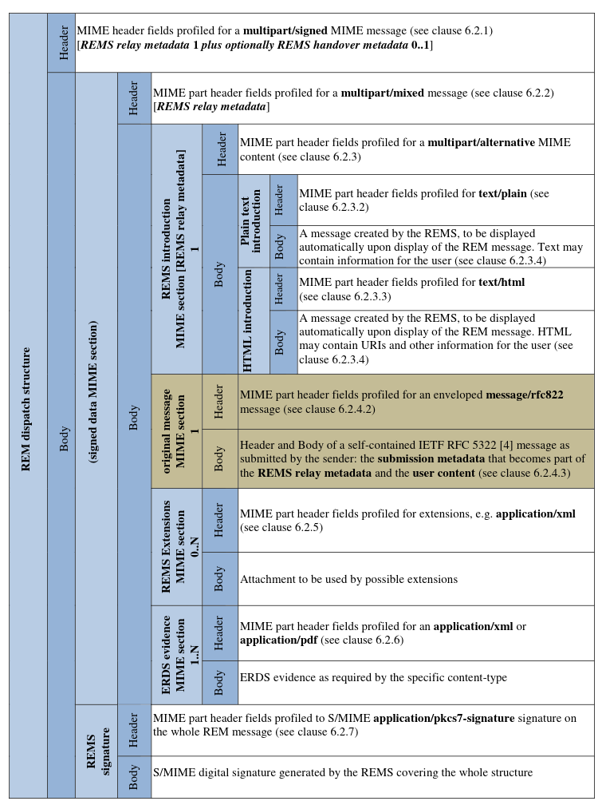
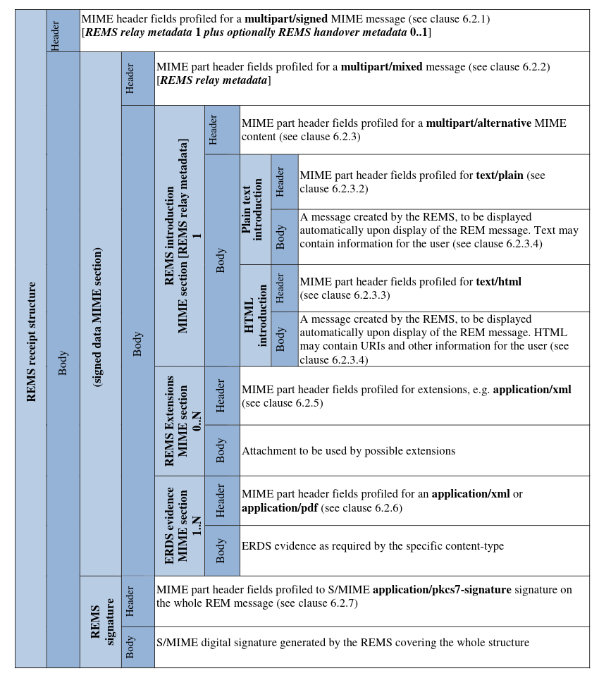
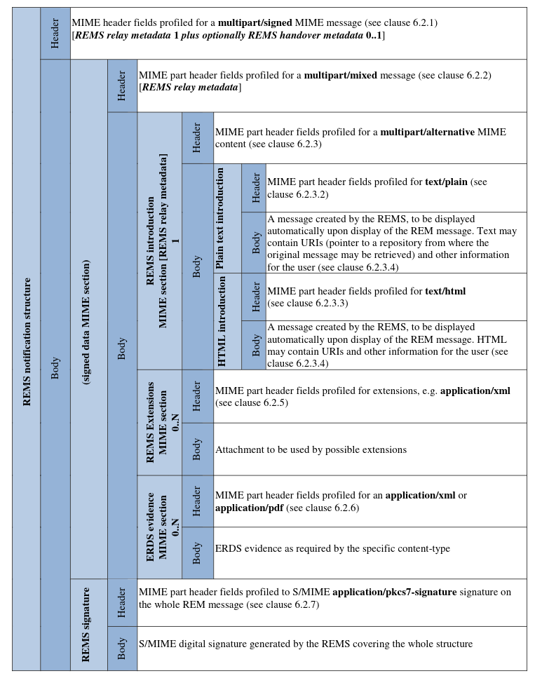
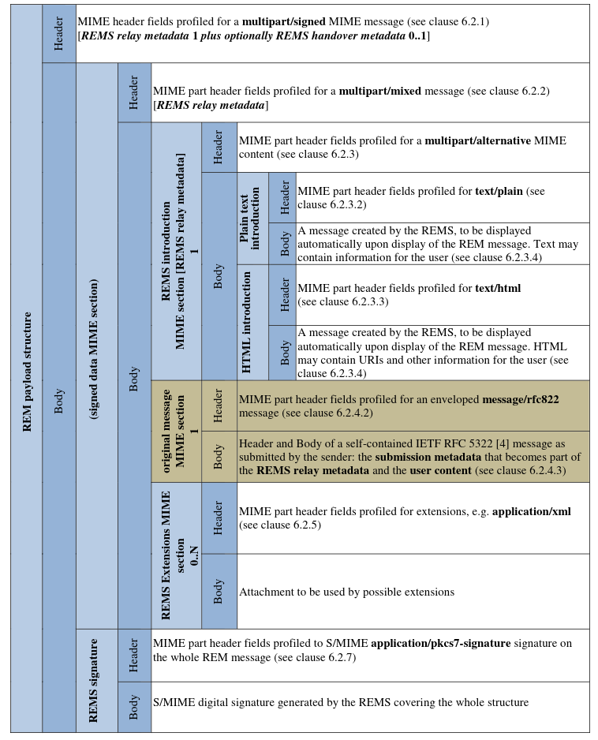
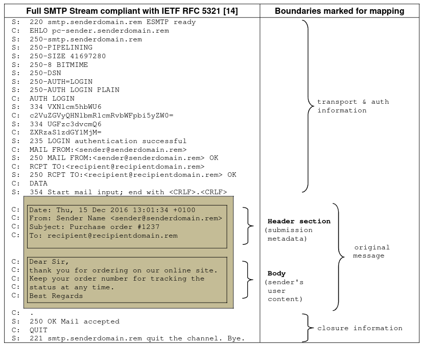
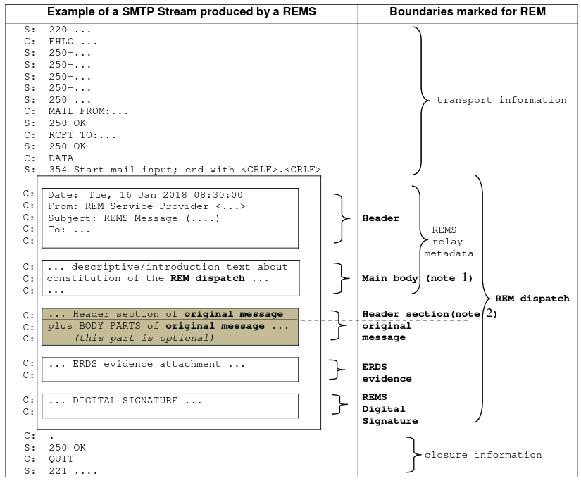
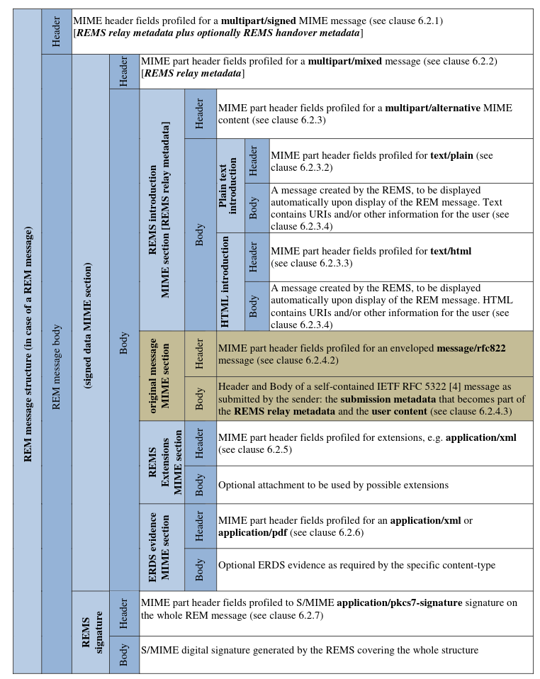

# Electronic Signatures and Infrastructures (ESI); Registered Electronic Mail (REM) Services;
## Phần 3: Định dạng

### Lời tựa
Tiêu chuẩn Châu Âu (EN) này được ban hành bởi Ủy ban Kỹ thuật về Chữ ký điện tử và Cơ sở hạ tầng (ESI) thuộc ETSI.

Tài liệu này là phần 3 của một sản phẩm bàn giao nhiều phần.
Toàn bộ chi tiết của toàn bộ loạt bài có thể được tìm thấy trong phần 1.

### Giới thiệu
Thư điện tử đăng ký (REM) là một trường hợp cụ thể của "Dịch vụ chuyển phát điện tử đăng ký" (ERDS). Email tiêu chuẩn, được sử
dụng làm xương sống, giúp việc tương tác diễn ra suôn sẻ và tăng tính khả dụng. Đồng thời, việc áp dụng các cơ chế bảo mật bổ sung
đảm bảo tính toàn vẹn, bảo mật và không thể phủ nhận (việc gửi, giao nhận, chuyển giao, v.v.), và bảo vệ chống lại rủi ro mất mát,
trộm cắp, hư hỏng và bất kỳ sự sửa đổi bất hợp pháp nào.

Tài liệu này nhằm mục đích đề cập đến các yêu cầu chung và được công nhận trên toàn thế giới để giải quyết việc gửi thư bảo đảm
điện tử một cách an toàn và đáng tin cậy. Đặc biệt chú trọng đến Quy định (EU) số 910/2014. Tuy nhiên, hiệu lực pháp lý nằm
ngoài phạm vi của tài liệu này.

### I. Phạm vi
Tài liệu này quy định các định dạng cho các tin nhắn được tạo ra và xử lý bởi dịch vụ Thư điện tử đăng ký (REM)
theo các khái niệm và ngữ nghĩa được xác định trong ETSI EN 319 522 phần 1 và 2 và ETSI EN 319 532 phần 1 và 2.
Cụ thể hơn, tài liệu này:
* Xác định cách các khái niệm ERDS chung như nội dung người dùng và siêu dữ liệu được nhận dạng và ánh xạ trong cấu trúc email tiêu chuẩn.
* Xác định cách các khái niệm đã đề cập được ánh xạ trong cấu trúc thông điệp của dịch vụ REM.
* Xác định cách thức bộ bằng chứng ERDS được tích hợp vào cấu trúc nhắn tin của dịch vụ REM.
* Chỉ định các cơ chế bổ sung như chữ ký số và các biện pháp kiểm soát bảo mật khác.

### II. Tài liệu tham khảo
#### II.1. Tài liệu tham khảo chuẩn mực
Tài liệu tham khảo có thể là tài liệu cụ thể (được xác định bằng ngày xuất bản và/hoặc số ấn bản hoặc số phiên bản) hoặc không cụ
thể. Đối với tài liệu tham khảo cụ thể, chỉ phiên bản được trích dẫn mới có giá trị. Đối với tài liệu tham khảo không cụ thể,
phiên bản mới nhất của tài liệu được tham khảo (bao gồm cả các sửa đổi) sẽ có giá trị.

Các tài liệu tham khảo không có sẵn công khai ở vị trí dự kiến có thể được tìm thấy tại https://docbox.etsi.org/Reference/.
> LƯU Ý: Mặc dù mọi liên kết trong điều khoản này đều hợp lệ tại thời điểm xuất bản,
ETSI không thể đảm bảo tính hợp lệ lâu dài của chúng.
Các tài liệu tham khảo sau đây là cần thiết cho việc áp dụng văn bản này.
1. [IETF RFC 8118](https://www.rfc-editor.org/info/rfc8118): "Kiểu dữ liệu application/pdf".
2. [RFC 2183 của IETF](https://www.rfc-editor.org/info/rfc2183):
"Truyền tải thông tin trình bày trong các thông điệp Internet: Trường tiêu đề Content-Disposition".
3. [IETF RFC 8551](https://www.rfc-editor.org/info/rfc8551):
"Thông số kỹ thuật tin nhắn mở rộng thư điện tử Internet đa năng/bảo mật (S/MIME) phiên bản 4.0".
4. [IETF RFC 5322](https://www.rfc-editor.org/info/rfc5322): "Định dạng thông báo Internet".
5. [IETF RFC 2854](https://www.rfc-editor.org/info/rfc2854): "Kiểu dữ liệu 'text/html'".
6. [ETF RFC 7303](https://www.rfc-editor.org/info/rfc7303): "Các loại phương tiện XML".
7. ETSI EN 319 522-1: "Chữ ký điện tử và cơ sở hạ tầng (ESI); Dịch vụ giao nhận đăng ký điện tử; Phần 1: Khung và kiến trúc".
8. ETSI EN 319 522-2: "Chữ ký điện tử và cơ sở hạ tầng (ESI); Dịch vụ giao nhận đăng ký điện tử; Phần 2: Nội dung ngữ nghĩa".
9. ETSI EN 319 522-3: "Chữ ký điện tử và cơ sở hạ tầng (ESI); Dịch vụ giao nhận đăng ký điện tử; Phần 3: Định dạng".
10. ETSI EN 319 532-1: "Chữ ký điện tử và cơ sở hạ tầng (ESI); Dịch vụ thư điện tử đăng ký (REM); Phần 1: Khung và kiến trúc".
11. ETSI EN 319 532-2: "Chữ ký điện tử và cơ sở hạ tầng (ESI); Dịch vụ thư điện tử đăng ký (REM); Phần 2: Nội dung ngữ nghĩa".
12. [IETF RFC 2045](https://www.rfc-editor.org/info/rfc2045): "Phần một của các phần mở rộng thư điện tử đa năng trên Internet
(MIME): Định dạng nội dung thư điện tử trên Internet".
13. [IETF RFC 2046](https://www.rfc-editor.org/info/rfc2046): "Phần hai của các phần mở rộng thư điện tử đa năng trên Internet
(MIME): Các loại phương tiện".
14. [IETF RFC 5321](https://www.rfc-editor.org/info/rfc5321): "Giao thức truyền thư đơn giản - SMTP".
15. ETSI TS 119 612: "Chữ ký điện tử và cơ sở hạ tầng (ESI); Danh sách đáng tin cậy".
16. ETSI EN 319 122-1: "Chữ ký điện tử và cơ sở hạ tầng (ESI); Chữ ký số CAdES; Phần 1: Các khối cấu tạo và chữ ký cơ bản CAdES".

#### II.2. Tài liệu tham khảo hữu ích
Tài liệu tham khảo có thể là tài liệu cụ thể (được xác định bằng ngày xuất bản và/hoặc số ấn bản hoặc số phiên bản) hoặc không cụ
thể. Đối với tài liệu tham khảo cụ thể, chỉ phiên bản được trích dẫn mới có giá trị. Đối với tài liệu tham khảo không cụ thể,
phiên bản mới nhất của tài liệu được tham khảo (bao gồm cả các sửa đổi) sẽ có giá trị.
> LƯU Ý: Mặc dù mọi liên kết trong điều khoản này đều hợp lệ tại thời điểm xuất bản,
ETSI không thể đảm bảo tính hợp lệ lâu dài của chúng.

Các tài liệu tham khảo dưới đây không bắt buộc cho việc áp dụng tài liệu này nhưng chúng hỗ trợ người dùng về một lĩnh vực cụ thể.
1. ETSI EN 319 532-4: "Chữ ký điện tử và cơ sở hạ tầng (ESI); Dịch vụ thư điện tử đăng ký (REM); Phần 4: Hồ sơ khả năng tương tác".
2. ETSI TS 119 312: "Chữ ký điện tử và cơ sở hạ tầng (ESI); Bộ mã hóa".
3. IETF RFC 6648: "Loại bỏ tiền tố "X-" và các cấu trúc tương tự trong giao thức ứng dụng".
4. ETSI EN 319 521: "Chữ ký điện tử và cơ sở hạ tầng (ESI); Chính sách và yêu cầu bảo mật đối với các nhà cung cấp dịch vụ giao
nhận điện tử có đăng ký".
5. Quy định (EU) số 910/2014 của Nghị viện Châu Âu và Hội đồng ngày 23 tháng 7 năm 2014 về nhận dạng điện tử và dịch vụ tin cậy
cho các giao dịch điện tử trong thị trường nội địa và bãi bỏ Chỉ thị 1999/93/EC. OJ L 257, 28.8.2014, trang 73-114.
6. ETSI EN 319 142-1: "Chữ ký điện tử và cơ sở hạ tầng (ESI); Chữ ký số PAdES; Phần 1: Các khối cấu tạo và chữ ký cơ bản PAdES".
7. ETSI EN 319 522-4-3: "Chữ ký điện tử và cơ sở hạ tầng (ESI); Dịch vụ chuyển phát đăng ký điện tử; Phần 4: Ràng buộc;
Tiểu phần 3: Ràng buộc về khả năng/yêu cầu".
8. IETF RFC 6931: "Các định danh tài nguyên thống nhất (URI) bảo mật XML bổ sung".

### III. Định nghĩa và viết tắt
#### III.1. Định nghĩa
Đối với mục đích của tài liệu này, các điều khoản được đưa ra trong ETSI EN 319 532-1 được áp dụng.

#### III.2. Từ viết tắt
Đối với mục đích của tài liệu này, các chữ viết tắt được đưa ra trong ETSI EN 319 532-1 được áp dụng.

#### III.3. Thuật ngữ
Vì Dịch vụ Thư điện tử Đăng ký là loại cụ thể của Dịch vụ Giao hàng Đăng ký Điện tử, tài liệu này sử dụng các thuật ngữ và định
nghĩa từ ETSI EN 319 521 và ETSI EN 319 522.

ETSI EN 319 532-2, điều khoản 4.1 quy định việc sử dụng tiền tố ERD so với REM hoặc ERDS so với REMS để đặt tên cho các khái
niệm và/hoặc cấu trúc.

Quy ước đặt tên được sử dụng trong tài liệu này là các cấu trúc có nội dung được tạo hoàn toàn bởi REMS sẽ được đặt tiền tố là
"ERDS" hoặc "REMS", trong khi các cấu trúc có nội dung bao gồm dữ liệu do người dùng tạo sẽ được đặt tiền tố là "ERD" hoặc "REM".

### IV. Định dạng tin nhắn
#### IV.1. Giới thiệu
Điều khoản hiện tại định nghĩa và giải thích cách siêu dữ liệu và nội dung được định dạng trong các thông báo REM. Các lược đồ và
định nghĩa định dạng của ETSI EN 319 522-3 được xem xét theo quan điểm REM. Các tham chiếu ngầm định khác là đến ETSI EN 319
532-2, điều khoản 4 mô tả nội dung.

Để xác định các định dạng liên quan đến việc trao đổi thông tin trong phạm vi REM (và do đó là email), cần phải xác định và phân
biệt các thành phần cơ bản như nội dung người dùng và các thành phần siêu dữ liệu.

Như được nêu trong ETSI EN 319 522-2, điều khoản 4, nội dung người dùng là nội dung do người gửi tạo ra hoặc cung cấp, nhằm
mục đích gửi đến người nhận. Siêu dữ liệu liên quan đến nội dung người dùng, ví dụ như trong trường hợp gửi, chuyển tiếp hoặc các
sự kiện chuyển giao, được cung cấp cho mục đích xử lý thông điệp, ví dụ như nhận dạng thông điệp, nhận dạng người gửi/người nhận,
hoặc cũng để khám phá khả năng của dịch vụ.

Phụ lục A mô tả cách các khái niệm có ý nghĩa này được ánh xạ trước tiên trong email và sau đó trong ngữ cảnh cung cấp REMS, bắt
đầu bằng một ví dụ mô tả về việc phân biệt đồ họa các thành phần. Các điều khoản tiếp theo mô tả cách các khái niệm ERD được ánh
xạ trên REM, tiếp theo là các thông số kỹ thuật định dạng.

#### IV.2. Định dạng tin nhắn Internet trong dịch vụ REM
Trong bối cảnh cung cấp dịch vụ email và REM, các khái niệm như nội dung người dùng và siêu dữ liệu có sự tương ứng với các phần
tử của Đối tượng Thư như được định nghĩa trong IETF RFC 5321, điều khoản 2.3.1 và với các định nghĩa có trong ETSI EN 319
522-1, điều khoản 3.1, ETSI EN 319 522-2, điều khoản 4 và ETSI EN 319 532-2, điều khoản 4.

Bảng 1 minh họa gốc từ (nếu có) được sử dụng trong các mệnh đề tiếp theo và ý nghĩa dự định trong ngữ cảnh REM.

**Bảng 1: Ánh xạ từ sơ đồ ERD sang thuật ngữ REM**
| Định nghĩa gốc         | Định nghĩa tương đương REM | Định nghĩa chi tiết                                                                                                                                                                                                                                                                                                                                                                                                                                                                                |
|------------------------|----------------------------|----------------------------------------------------------------------------------------------------------------------------------------------------------------------------------------------------------------------------------------------------------------------------------------------------------------------------------------------------------------------------------------------------------------------------------------------------------------------------------------------------|
| user content           | **user content**           | Đây là phần thân của Đối tượng Thư như được định nghĩa trong IETF RFC 5321, điều khoản 2.3.1 (ghi chú 1). Nó được tạo ra bởi người gửi dưới trách nhiệm kỹ thuật/pháp lý của người gửi. Xem thêm ETSI EN 319 532-2, điều khoản 4.                                                                                                                                                                                                                                                        |
| submission metadata    | **submission metadata**    | Đây là phần tiêu đề của Đối tượng Thư như được định nghĩa trong IETF RFC 5321, điều khoản 2.3.1. Xem hình 1, hình 4 và cả các định nghĩa trong ETSI EN 319 532-2, điều khoản 4.                                                                                                                                                                                                                                                                                                          |
|                        | **original message**       | Điều này bao gồm tiêu đề + nội dung như được định nghĩa trong IETF RFC 5321, điều khoản 2.3.1. Nó được tạo bởi tác nhân người dùng ERD của người gửi hoặc dưới trách nhiệm kỹ thuật/pháp lý của người gửi (và nằm ngoài trách nhiệm của dịch vụ), cuối cùng có thể được người gửi ký điện tử (ghi chú 1). Xem hình 1, hình 4 và cả các định nghĩa trong ETSI EN 319 532-2, điều khoản 4.                                                                                                 |
| ERDS relay metadata    | **REMS relay metadata**    | Đây là phần tiêu đề (như được định nghĩa trong IETF RFC 5321) của thông điệp REM. Phần giới thiệu REMS cũng được coi là một phần của siêu dữ liệu chuyển tiếp REMS. Xem từ hình 1 đến hình 4 và cả các định nghĩa trong ETSI EN 319 532-2, điều khoản 4.                                                                                                                                                                                                                                 |
| ERDS handover metadata | **REMS handover metadata** | Tương tự như việc ánh xạ siêu dữ liệu chuyển tiếp REMS với ngữ nghĩa được xác định trong ETSI EN 319 532-2, điều khoản 4.                                                                                                                                                                                                                                                                                                                                                                     |
| ERDS evidence          | **ERDS evidence**          | Một trong những phương pháp có thể sử dụng để vận chuyển bằng chứng ERDS trong REM là một phần thân đính kèm (như được định nghĩa trong IETF RFC 2045) của thông điệp REM. Xem từ hình 1 đến hình 3 và cả các định nghĩa trong ETSI EN 319 532-2, điều khoản 4.                                                                                                                                                                                                                          |
| ERDS serviceInfo       | **REMS notification**      | Xem hình 3 để biết cấu trúc của đối tượng này và các định nghĩa trong ETSI EN 319 532-1, điều khoản 3.1. Sự khác biệt so với ERDS serviceInfo là thông báo REMS luôn chứa tham chiếu đến nội dung người dùng. Hơn nữa, nó có thể tùy chọn mang theo bằng chứng liên quan.                                                                                                                                                                                                                     |
| ERD message            | **REM message**            | Xem từ hình 1 đến hình 4 để biết tất cả các cấu trúc có thể có trong các bộ phận (như được định nghĩa trong IETF RFC 2045).                                                                                                                                                                                                                                                                                                                                                                   |
| ERD payload            | **REM payload**            | Xem hình 4 để biết cấu trúc của đối tượng này và cũng như định nghĩa trong ETSI EN 319 521, điều khoản 3 và ETSI EN 319 522-1, điều khoản 3.                                                                                                                                                                                                                                                                                                                                             |
| ERD dispatch           | **REM dispatch**           | Xem hình 1 để biết cấu trúc của đối tượng này và cũng như định nghĩa trong ETSI EN 319 521, điều khoản 3 và ETSI EN 319 522-1, điều khoản 3 và các chi tiết khác trong ETSI EN 319 532-2, điều khoản 4. Đó là một đối tượng mới (theo cấu trúc thông báo REM) được tạo bởi Dịch vụ REM bao gồm thông báo gốc và các nội dung khác được tạo bởi Dịch vụ REM, dịch vụ này chỉ chịu trách nhiệm về một phần nội dung của nó (nó không chịu trách nhiệm về nội dung của thông báo gốc). |
|                        | **transport metadata**     | Khi tin nhắn gốc được gửi qua SMTP, đây là thông tin vận chuyển và thông tin đóng được truyền tải trong một phiên SMTP điển hình (xem hình A.1). Nó bao bọc tin nhắn gốc bên trong giao dịch SMTP và chứa các lệnh và thông tin trả lời được truyền trong quá trình giao tiếp giữa máy khách và máy chủ, như được định nghĩa trong IETF RFC 5321 (ghi chú 2).                                                                                                                                 |
> LƯU Ý 1: Thuật ngữ thân, trong ngữ cảnh của tài liệu này, cũng chỉ một phần thân "có thể được cấu trúc" bao gồm một hoặc nhiều
phần đính kèm, theo đặc tả tiêu chuẩn MIME, như được cung cấp trong IETF RFC 2045, điều khoản 2.6.
> LƯU Ý 2: Các cân nhắc thêm liên quan đến các yếu tố giao thức cụ thể như vận chuyển và đóng cửa nằm ngoài phạm vi của tài liệu
này và được quản lý trong ETSI EN 319 532-4, điều khoản 5.3.5 - CSI.

Trong phạm vi email (vốn là nền tảng của REM), các khái niệm nêu trên áp dụng cho luồng tin nhắn.

Hình A.1 minh họa một ví dụ về vị trí của các cấu trúc được hiển thị trong bảng 1 dọc theo luồng giao thức.

Một đặc điểm quan trọng đặc thù của REM là cơ chế đóng gói tiêu chuẩn được thể hiện trong hình A.1 cũng được sử dụng để tích hợp
chữ ký số vào cấu trúc thông điệp REM nhằm tạo ra thông điệp REM đã được ký (xem hình A.2). Ví dụ, trong trường hợp gửi REM, nó
được sử dụng để vận chuyển thông điệp gốc cùng với các thành phần khác của thông điệp REM dưới dạng tệp đính kèm và chữ ký số, cho
phép cung cấp toàn bộ nội dung một cách dễ hiểu và hữu ích cho tất cả các bên liên quan, từ REMS của người gửi đến người nhận
(xem hình A.1).

Xem hình A.2 như một ví dụ minh họa bước tiếp theo này, bằng cách thể hiện sự đóng gói của thông điệp gốc trong một điều phối
REM và, tương tự như ví dụ trước đó trong hình A.1, nơi nó được đặt bên trong luồng giao thức.

Cơ chế đóng gói tương tự sẽ được sử dụng để bao bọc các đối tượng còn lại có liên quan đến các thông điệp REM.

Do nội dung thông điệp REM được tách biệt khỏi các phần thông tin vận chuyển/thông tin đóng trong luồng truyền thông,
toàn bộ tập hợp các thông điệp REM như được quy định trong tài liệu này cũng có thể được vận chuyển đúng cách bởi các
giao thức vận chuyển cơ bản khác.
> LƯU Ý 1: Sự tách biệt này đảm bảo rằng các thông báo REM hoàn toàn không liên quan đến luồng giao thức cơ bản.

Trên thực tế, giao thức cơ bản chỉ xử lý thông tin vận chuyển và thông tin đóng gói của luồng dữ liệu, còn thông điệp REM vẫn
không thay đổi. Toàn bộ logic của REM được định nghĩa bên trong thông điệp REM. Điều này làm cho REM độc lập với giao thức vận
chuyển cơ bản cụ thể. Ngoài ra, vì thông điệp REM sử dụng kiểu đóng gói phổ quát và tiêu chuẩn này, bất kỳ ứng dụng email tiêu
chuẩn nào của người khởi tạo và/hoặc người dùng cuối đều có thể xử lý chúng.

Việc truyền thông tin giữa REMS của người gửi và REMS của người nhận thường diễn ra theo hình thức "đính kèm" hoặc "tách rời".
Trong trường hợp đầu tiên, thông điệp gốc được truyền tải bên trong một gói tin REM. Trong trường hợp thứ hai, nó được truyền tải
bằng các phương tiện khác (ví dụ: bằng tải trọng REM). Bằng chứng ERDS liên quan đến các sự kiện xảy ra trong quá trình truyền tải
thông điệp gốc này được gửi riêng cho người nhận, ví dụ: bằng một biên nhận REMS tiếp theo.

Dịch vụ REM có thể thêm/sửa đổi một số trường tiêu đề vào siêu dữ liệu nộp trong quá trình đóng gói. Tuy nhiên, những thay đổi này
nên được giới hạn ở những gì đã được chứng minh là cần thiết cho hoạt động tốt của quy trình và phải được xác định đầy đủ trong
triển khai REM cụ thể.
> LƯU Ý 2: Việc cập nhật trường tiêu đề Message-ID có thể là một trong những thay đổi này (nếu trường này không tồn tại hoặc cần
được chuẩn hóa thành định dạng định danh được công nhận toàn cầu, trong ngữ cảnh của dịch vụ được cung cấp). Trong những trường
hợp như vậy, định danh gốc, nếu được chỉ định, sẽ được gán cho một trường tiêu đề tùy chỉnh mới của siêu dữ liệu gửi và cho trường
tiêu đề REM-UAMessageIdentifier: của thông báo REM. Một Message-ID duy nhất được chuẩn hóa và phổ quát mới sẽ được gán cho siêu dữ
liệu gửi.

Hơn nữa, bất kỳ thay đổi nào đã đề cập ở trên (thêm/sửa đổi các trường tiêu đề) đều phải được thông báo rõ ràng cho người gửi và
người nhận của điều phối REM hoặc tải trọng REM.
> LƯU Ý 3: Các trường tiêu đề khác (ví dụ: như trường được sử dụng để ánh xạ siêu dữ liệu của ETSI EN 319 532-2, điều khoản
6.2, bảng 5) có thể xuất hiện dưới dạng bản sao từ REMS trong phần tiêu đề tin nhắn gốc bằng cơ chế này (để bảo vệ chúng bằng vùng
đã ký của S/MIME). Văn bản mô tả "phần MIME giới thiệu REMS" - xem điều khoản 6.2.3.4 - là một trong những nơi mà REMS có thể đưa
ra một số chỉ dẫn về những thay đổi này trên phần tiêu đề gốc. Ngoài ra, chính sách địa phương hoặc hợp đồng với người dùng là một
nơi khác mà REMS có thể chỉ ra thực tiễn có hệ thống như vậy.

#### IV.3. Thông điệp REM - Định nghĩa cấu trúc
Điều khoản này quy định cấu trúc của một thông báo REM dựa trên định dạng MIME (xem IETF RFC 2045). Một thông báo REM không
tồn tại như một đối tượng độc lập, vì nó luôn xuất hiện trong ngữ cảnh của một thông báo gửi REM, một biên nhận REMS, một thông
báo REMS hoặc một tải trọng REM.

Một thông điệp REM có thể truyền giữa các REMS khác nhau và từ một REMS đến các tác nhân người dùng ERD, như được định nghĩa trong
ETSI EN 319 532-1. Việc xác định cách thông điệp REM chung được điều chỉnh cho chế độ hoạt động và giao diện cụ thể mà nó
truyền qua nằm ngoài phạm vi của tài liệu này.

Xem phần mô tả trước hình A.3 để biết ví dụ về các thành phần của thông điệp REM.

Một thông báo REM phải được cấu trúc như một phần tiêu đề thông báo chứa các trường tiêu đề, tiếp theo là phần thân thông báo bao
gồm một số phần thân như được định nghĩa trong MIME (IETF RFC 2045). Phần thân thông báo phải có dạng các phần
MIME multipart signed/mixed/alternative, trong đó mỗi phần thân MIME được cấu trúc như được định nghĩa trong hình A.3.
Thông báo MIME multipart/mixed này sẽ cấu thành phần thân MIME được ký của một thông báo S/MIME multipart/signed.
Do đó, chữ ký S/MIME có trong phần MIME cuối cùng của thông báo REM sẽ là chữ ký số của REMS trên phần còn lại
của các phần MIME xuất hiện trong thông báo REM.

Xem hình A.3 như một ví dụ thể hiện cấu trúc chung này với tất cả các yếu tố của nó. Các loại thông báo REM khác nhau được xây
dựng như được chỉ ra trong bảng 1 của ETSI EN 319 532-2, điều khoản 4.1, mà đến lượt nó được lấy từ bảng 1 của ETSI EN 319
522-2, điều khoản 4.

Điều phối REM sẽ được cấu trúc như trong hình 1.

Biên lai REMS sẽ được cấu trúc như trong hình 2.

Thông báo REMS phải được cấu trúc như trong hình 3 và phải được tạo bởi REMS theo các yêu cầu về luồng của ETSI EN 319 532-1,
điều khoản 4 và ETSI EN 319 532-2, điều khoản 4.

Cấu trúc tải trọng REM sẽ như trong hình 4.

Chúng được xây dựng bắt đầu từ cấu trúc thông báo ERD, được định nghĩa trong bảng 1 của ETSI EN 319 522-2, điều khoản 4,
với sự nhấn mạnh vào các khía cạnh và đặc điểm cụ thể của REM.

Các số thứ tự xuất hiện trong các ô sẽ cho biết số lần xuất hiện của bất kỳ phần MIME nào:
* 0..1 biểu thị một bộ phận tùy chọn;
* 0..N biểu thị một phần tùy chọn có thể xuất hiện nhiều lần;
* Các phần không được chỉ định bằng số thứ tự hoặc được đánh dấu bằng số 1 để làm rõ nghĩa sẽ chỉ xuất hiện đúng một lần.

**Hình 1: Cấu trúc điều phối REM**


**Hình 2: Cấu trúc biên lai REMS**


**Hình 3: Cấu trúc thông báo REMS**


**Hình 4: Cấu trúc tải trọng REM**


Các điều khoản sau đây nhằm mục đích phân tích/giới hạn thêm từng trường tiêu đề của cấu trúc thông báo chung này.

Văn bản này không đặt ra bất kỳ hạn chế nào đối với các trường tiêu đề không được liệt kê trong các bảng ở điều 6.

### V. REMS - định dạng nhận dạng
Đối với các định dạng nhận dạng REMS, ETSI EN 319 522-2, điều khoản 5, các thành phần nhận dạng được xác định trong bảng 6 của
ETSI EN 319 522-2, điều khoản 8.1 và các định dạng được xác định trong ETSI EN 319 522-3, điều khoản 5 sẽ được áp dụng.

REMS sẽ gán cho mỗi người dùng một mã định danh duy nhất, như được định nghĩa trong ETSI EN 319 522-2, điều khoản 5.2 ở định
dạng địa chỉ email, được định nghĩa là "addr-spec" trong phần 3.4.1 của IETF RFC 5322.

Bảng 2 của điều 6.1 trong tài liệu này định nghĩa cách thức các thành phần nhận dạng sẽ được ánh xạ trong REM.

### VI. REMS - định dạng siêu dữ liệu chuyển tiếp

#### VI.1. Yêu cầu chung
Điều khoản hiện tại xác định các định dạng siêu dữ liệu chuyển tiếp REMS. Để phục vụ mục đích này, ETSI EN 319 532-2,
điều khoản 6 sẽ được áp dụng.

Cấu trúc của các trường tiêu đề thông báo REM phải tuân thủ các cấu trúc được định nghĩa từ hình 1 đến hình 4.

Bảng 2 chứa sự tương ứng giữa nội dung ngữ nghĩa tổng quát của ERDS và các khái niệm tương tự được áp dụng
cho các trường tiêu đề REM.

Các yêu cầu về sự hiện diện được xác định trong bảng 5 của ETSI EN 319 522-2 và điều khoản 6.2.1 của ETSI EN 319 532-2
(đối với các thành phần siêu dữ liệu được sao chép bởi ERDS), trong bảng 13 của ETSI EN 319 522-2 (đối với các thành phần bằng
chứng được sao chép bởi ERDS) và trong điều khoản 6.2 của tài liệu này (có hiệu lực khi trùng lặp với các điều khoản trước đó) sẽ
được áp dụng. Các trường tiêu đề không được liệt kê trong bảng 2 có thể không có trong REM.

Điều khoản 6.2 quy định phạm vi áp dụng của các trường tiêu đề của bảng 2 và/hoặc các trường tiêu đề khác dành riêng cho REM.

**Bảng 2: Ánh xạ nội dung ngữ nghĩa từ ERD sang REM**
| Nội dung ngữ nghĩa                                           | Ánh xạ tới các trường tiêu đề IETF RFC 5322                                                                                                                                                                                                                                                                                                                                                                                                |
|--------------------------------------------------------------|--------------------------------------------------------------------------------------------------------------------------------------------------------------------------------------------------------------------------------------------------------------------------------------------------------------------------------------------------------------------------------------------------------------------------------------------|
| Phiên bản siêu dữ liệu                                       | REM-MetadataVersion: trường tiêu đề. Giá trị này phải được định dạng theo quy định trong ETSI EN 319 522-2, điều khoản 6.2.1 - MD01 và nó phải chứa số phiên bản của tài liệu hiện tại theo định dạng EN31953203\<version\> (với chữ 'V' viết hoa và thay thế dấu chấm bằng 0, ví dụ: nếu phiên bản hiện tại là v1.2.1 thì phiên bản MetaData là EN31953203V010201).                                                                   |
| Ngày và giờ chuyển tiếp                                      | REM-RelayDate: trường tiêu đề. Định dạng của giá trị này phải được xác định trong ETSI EN 319 522-2, điều khoản 6.2.2 - MD02 và ETSI EN 319 522-3, điều khoản 4.3.7 và được ánh xạ theo điều khoản 3.3 của IETF RFC 5322.                                                                                                                                                                                                      |
| Ngày và giờ hết hạn                                          | REM-ExpirationDate: trường tiêu đề. Định dạng của giá trị này phải được xác định trong ETSI EN 319 522-2, điều khoản 6.2.3 - MD03 và ETSI EN 319 522-3, điều khoản 4.3.8. được ánh xạ theo điều khoản 3.3 của IETF RFC 5322.                                                                                                                                                                                                   |
| Mức độ đảm bảo yêu cầu của người nhận                        | REM-RecipientAssuranceLevel: trường tiêu đề. Giá trị này đại diện cho ngữ nghĩa được định nghĩa trong ETSI EN 319 522-2, điều khoản 6.2.4 - MD04 sẽ được định dạng theo các lựa chọn phù hợp trong số những lựa chọn được định nghĩa trong ETSI EN 319 522-3, điều khoản 4.3.14 và được ánh xạ thành URI trong REM theo các cơ chế mở rộng được định nghĩa trong điều khoản 6.2.1 hoặc điều khoản 6.2.5 cho thông tin có cấu trúc. |
| Chính sách áp dụng                                           | REM-ApplicablePolicy: trường tiêu đề. Giá trị này phải được định dạng theo quy định trong ETSI EN 319 522-2, điều khoản 6.2.5 - MD05 và ETSI EN 319 522-3, điều khoản 4.3.15. Nếu có nhiều hơn một chính sách áp dụng, thì trường tiêu đề sẽ xuất hiện nhiều lần khi cần thiết và mỗi lần xuất hiện sẽ chứa một trong các chính sách áp dụng.                                                                                      |
| Phương thức vận chuyển                                       | REM-ModeOfConsignment: trường tiêu đề. Giá trị này phải được xác định trong ETSI EN 319 522-2, điều khoản 6.2.6 - MD06. Nó phải chứa một trong các URI được xác định trong ETSI EN 319 522-3, điều khoản 4.3.16.                                                                                                                                                                                                                   |
| Giao hàng theo lịch trình                                    | REM-ScheduledDelivery: trường tiêu đề. Định dạng của giá trị này phải được xác định trong ETSI EN 319 522-2, điều khoản 6.2.7 - MD07 và ETSI EN 319 522-3, điều khoản 4.3.9 và được ánh xạ theo điều khoản 3.3 của IETF RFC 5322.                                                                                                                                                                                              |
| Mã định danh người gửi                                       | Giá trị này phải có ngữ nghĩa được xác định trong ETSI EN 319 522-2, điều khoản 6.2.8 - MD08, nó phải được định dạng như được quy định trong ETSI EN 319 522-3, điều khoản 4.3.10 và được ánh xạ trong REM theo các cơ chế mở rộng được xác định trong điều khoản 6.2.1 hoặc điều khoản 6.2.5 cho thông tin có cấu trúc.                                                                                                           |
| Thư trả lời của người gửi tới địa chỉ                        | Reply-To: trường tiêu đề. Giá trị này phải có ngữ nghĩa được xác định trong ETSI EN 319 522-2, điều khoản 6.2.9 - MD09, nó phải được định dạng như được chỉ định trong điều khoản 5. Trong các thông báo REM, nó phải được ánh xạ như được chỉ định trong bảng 3 của điều khoản 6.2.1.                                                                                                                                                 |
| Mã định danh người nhận                                      | Giá trị này phải có ngữ nghĩa được xác định trong ETSI EN 319 522-2, điều khoản 6.2.10 - MD10, nó phải được định dạng như được quy định trong ETSI EN 319 522-3, điều khoản 4.3.12 và được ánh xạ trong REM theo các cơ chế mở rộng được xác định trong điều khoản 6.2.1 hoặc điều khoản 6.2.5 cho thông tin có cấu trúc.                                                                                                          |
| Mã định danh thông báo ERD                                   | Message-ID: trường tiêu đề. Giá trị này phải được xác định trong ETSI EN 319 522-2, điều khoản 6.2.11 - MD11 và ETSI EN 319 522-3, điều khoản 4.3.4. Trong REM, nó phải được ánh xạ như trong bảng 3 của điều khoản 6.2.1.                                                                                                                                                                                                         |
| Đáp lại                                                      | In-Reply-To: trường tiêu đề. Giá trị này phải được xác định trong ETSI EN 319 522-2, điều khoản 6.2.12 - MD12 và ETSI EN 319 522-3, điều khoản 4.3.6. Trong REM, nó phải được ánh xạ như trong điều khoản 3.6.4 của IETF RFC 5322.                                                                                                                                                                                             |
| Thông tin nội dung người dùng: Loại nội dung                 | Content-Type: trường tiêu đề. Giá trị này phải được xác định trong ETSI EN 319 522-2, điều khoản 6.2.14 - MD14 và ETSI EN 319 522-3, điều khoản 4.3.13. Trong REM, nó phải được ánh xạ như trong bảng 3 của điều khoản 6.2.1.                                                                                                                                                                                                      |
| Thông tin nội dung người dùng: Chủ đề                        | Subject: trường tiêu đề. Giá trị này sẽ được xác định trong ETSI EN 319 522-2, điều khoản 6.2.14 - MD14 và ETSI EN 319 522-3, điều khoản 4.3.4. Trong REM, nó sẽ được ánh xạ như trong bảng 3 của điều khoản 6.2.1.                                                                                                                                                                                                                |
| Loại thông báo ERD                                           | REM-MessageType: trường tiêu đề. Giá trị này phải được định nghĩa trong ETSI EN 319 522-2, điều khoản 6.2.13 - MD13. Nó phải chứa một trong các URI được định nghĩa trong ETSI EN 319 522-3, điều khoản 4.3.5, ngoại trừ trường hợp thông báo REMS, khi đó giá trị phải là: http://uri.etsi.org/19522/v1#/ERDMessageType/notification                                                                                              |
| Thông tin nội dung người dùng: Thuật toán tóm tắt            | REM-DigestAlgorithm: trường tiêu đề. Giá trị này phải được xác định trong ETSI EN 319 522-2, điều khoản 6.2.14 - MD14 và ETSI EN 319 522-3, điều khoản 4.3.13. Trong REM, nó phải được ánh xạ thành URI tuân thủ phần 4.2 của IETF RFC 6931.                                                                                                                                                                                 |
| Thông tin nội dung người dùng: Tóm tắt tin nhắn              | REM-DigestValue: trường tiêu đề. Giá trị này phải được xác định trong ETSI EN 319 522-2, điều khoản 6.2.14 - MD14 và ETSI EN 319 522-3, điều khoản 4.3.13. Trong REM, nó phải chứa giá trị băm được mã hóa base64 của thông điệp gốc được tính toán bằng cách sử dụng thuật toán băm được chỉ ra trong trường tiêu đề đã đề cập ở trên.                                                                                            |
| Thông tin nội dung người dùng: Mã định danh gốc của tin nhắn | REM-UAMessageIdentifier: trường tiêu đề. Giá trị này phải được định nghĩa trong ETSI EN 319 522-2, điều khoản 6.2.11 - MD11 (được ánh xạ với định danh giao thức lớp ứng dụng, điều khoản 6.2.14 - MD14) và ETSI EN 319 522-3, điều khoản 4.3.4 (trong đó được định nghĩa là AppLayerIdentifier ETSI EN 319 522-3, điều khoản 4.3.13). Trong REM, nó phải chứa giá trị Message-ID của thông báo gốc được gửi bởi ERD-UA.       |
| Thông tin nội dung người dùng: AttachmentInformation         | Giá trị này sẽ được định dạng theo quy định trong ETSI EN 319 522-2, điều khoản 6.2.14. Trong REM, nó liên quan đến thông tin đính kèm được chứa sẵn trong các trường tiêu đề MIME (xem ghi chú 1 trong bảng 1). Điều này có thể được ánh xạ rõ ràng hơn nữa trong REM theo các cơ chế mở rộng được định nghĩa trong điều khoản 6.2.1 hoặc điều khoản 6.2.5 cho thông tin có cấu trúc.                                                 |
| Chữ ký                                                       | Xem các trường tiêu đề trong điều khoản 6.2.7.                                                                                                                                                                                                                                                                                                                                                                                             |
| Mã nhận dạng bằng chứng                                      | REM-Evidence-ID: trường tiêu đề. Giá trị này phải được định nghĩa trong ETSI EN 319 522-2, điều khoản 8.2.1 - G01. Nó phải chứa thành phần định danh bằng chứng và trong REM, nó phải được ánh xạ với cùng định dạng như tiêu đề Message-ID:                                                                                                                                                                                           |
| Mã định danh sự kiện                                         | REM-EventIdentifier: trường tiêu đề. Giá trị này phải được xác định trong ETSI EN 319 522-2, điều khoản 8.2.3 - G03. Nó phải chứa URI được xác định trong bảng 2 của ETSI EN 319 522-3, điều khoản 5.2.2.5.                                                                                                                                                                                                                        |
| Mã định danh lý do                                           | REM-ReasonIdentifier: trường tiêu đề. Giá trị này phải được định nghĩa trong ETSI EN 319 522-2, điều khoản 8.2.3 - G04. Nó phải chứa thành phần định danh lý do và trong REM, nó phải được ánh xạ dưới dạng URI. Nó có thể được ánh xạ theo các cơ chế mở rộng được định nghĩa trong điều khoản 6.2.1 hoặc điều khoản 6.2.5 cho thông tin có cấu trúc.                                                                                 |
| Phần mở rộng                                                 | Siêu dữ liệu khác có thể được chỉ định bằng cơ chế mở rộng được xác định trong điều khoản 6.2.1 hoặc điều khoản 6.2.5 cho thông tin có cấu trúc. Giá trị này phải được định dạng như được xác định trong ETSI EN 319 522-2, điều khoản 6.2.15 - MD015 và ETSI EN 319 522-3, điều khoản 4.3.17.                                                                                                                                     |

#### VI.2. Cấu trúc thông điệp REM
##### VI.2.1. Siêu dữ liệu chuyển tiếp REMS Trường tiêu đề MIME
Các trường tiêu đề được định nghĩa trong bảng 3 và các giá trị tương ứng của chúng phải phù hợp với các tham chiếu trong cột 4.

**Bảng 3: Các trường tiêu đề cơ bản và nội dung trong thông điệp REM**
| Tên trường tiêu đề | Phần thân của trường tiêu đề                                                                                                                                                                                                                                                                                                                                                                    | Hiện diện | Tham chiếu                                       |
|--------------------|-------------------------------------------------------------------------------------------------------------------------------------------------------------------------------------------------------------------------------------------------------------------------------------------------------------------------------------------------------------------------------------------------|-----------|--------------------------------------------------|
| MIME-Version:      | Giá trị cho trường tiêu đề này phải là "1.0".                                                                                                                                                                                                                                                                                                                                                   | Bắt buộc  | Mục 4 IETF RFC 2045                              |
| Message-ID:        | Giá trị cho trường tiêu đề này phải là UID như được định nghĩa trong IETF RFC 5322                                                                                                                                                                                                                                                                                                          | Bắt buộc  | Mục 3.6.4 IETF RFC 5322                          |
| Date:              | Giá trị cho trường tiêu đề này phải tuân thủ điều khoản 3.3 của IETF RFC 5322.                                                                                                                                                                                                                                                                                                                  | Bắt buộc  | Mục 3.3 IETF RFC 5322                            |
| From:              | Giá trị cho trường tiêu đề này phải là một trong hai: Địa chỉ dịch vụ REMSP (ví dụ: "\<service_rem_md_x@rem_md_x.com\>") hoặc một phép biến đổi của trường "Từ" ban đầu để hiển thị vai trò của REMSP (ví dụ: "on behalf of user@rem_md_x.com \<service_rem_md_x@rem_md_x.com\>").                                                                                                                  | Bắt buộc  | Mục 3.6.2 IETF RFC 5322                          |
| To:                | Trong trường hợp gửi REM hoặc tải trọng REM, giá trị của trường tiêu đề này phải khớp với giá trị của trường tiêu đề 'To' trong tin nhắn gốc. Trong trường hợp tin nhắn REM mang theo bằng chứng cho người gửi, giá trị của trường tiêu đề này có thể khớp với giá trị của trường tiêu đề 'From' trong tin nhắn gốc.                                                                            | Bắt buộc  | Mục 3.6.3 IETF RFC 5322                          |
| Cc:                | EMS chỉ nên gán giá trị cho trường tiêu đề này đối với việc gửi REM. Trong trường hợp đó, giá trị phải khớp với giá trị của trường tiêu đề 'Cc' trong tin nhắn gốc.                                                                                                                                                                                                                             | Tùy chọn  | Mục 3.6.3 IETF RFC 5322                          |
| Subject:           | Giá trị cho trường tiêu đề này cần được chuyển đổi như sau, bắt đầu từ trường tiêu đề Chủ đề có trong tin nhắn gốc của người gửi, để chỉ ra vai trò của tin nhắn REM trong luồng: REM <mã định danh sự kiện>: <chủ đề gốc> (Ví dụ: "REM ContentConsignment: subject_of_original_message"). Trong trường hợp gửi REM, trường tiêu đề này cần được chuyển đổi thành "REM Dispatch: <chủ đề gốc>". | Bắt buộc  | Mục 3.6.5 IETF RFC 5322                          |
| Reply-To:          | Trong trường hợp gửi REM hoặc tải trọng REM, giá trị của trường tiêu đề này phải khớp với giá trị của trường tiêu đề 'From' trong tin nhắn gốc. Trong trường hợp tin nhắn REM mang theo bằng chứng về người gửi, trường tiêu đề này không được xuất hiện, và nếu có xuất hiện, giá trị của nó phải là địa chỉ dịch vụ REM.                                                                      | Điều kiện | Mục 3.6.2 IETF RFC 5322                          |
| Return-Path:       | REMS có thể chỉ gán giá trị cho trường tiêu đề này khi gửi REM. Trong trường hợp đó, giá trị phải khớp với giá trị của trường tiêu đề 'Return-Path' trong tin nhắn gốc. Trường này phải không có hoặc được đặt thành hộp thư nhận của R-REMS trong biên nhận ContentConsignment.                                                                                                                | Tùy chọn  | Mục 3.6.7 IETF RFC 5322                          |
| Received:          | REMS chỉ có thể gán giá trị cho trường tiêu đề này khi gửi REM. Trong trường hợp đó, giá trị phải khớp với giá trị của trường tiêu đề 'Received' trong tin nhắn gốc (lưu ý).                                                                                                                                                                                                                    | Tùy chọn  | Mục 3.6.7 IETF RFC 5322                          |
| In-Reply-To:       | REMS có thể gán một giá trị cho trường tiêu đề này. Giá trị đó phải khớp với giá trị của trường tiêu đề 'In-Reply-To' trong tin nhắn gốc.                                                                                                                                                                                                                                                       | Tùy chọn  | Mục 3.6.4 IETF RFC 5322                          |
| Content-Type:      | Giá trị cho trường tiêu đề này phải là "multipart/signed". • Giá trị tham số 'protocol' phải là "application/pkcs7-signature". • Giá trị tham số 'micalg' phải tuân thủ ETSI TS 119 312. Giá trị tham số 'boundary' phải tuân thủ IETF RFC 2046, mục 5.1.1.                                                                                                                                     | Bắt buộc  | Mục 5 IETF RFC 2045 và mục 3.5.3.2 IETF RFC 8551 |

> LƯU Ý: REMS, với tư cách là dịch vụ (và do đó không phải MTA trong quá trình thực hiện nhiệm vụ của mình), có thể thêm một số
tiêu đề Received. Trong những trường hợp như vậy, các tiêu đề Received được REMS thêm vào - ở cấp độ dịch vụ - là bản sao chính
xác của các tiêu đề có trong thông điệp gốc. Tất nhiên, MTA có thể và được tự do thêm các tiêu đề Received khác liên quan đến chức
năng của nó.

Phần tiêu đề hiện tại của thông báo REM phải chứa các trường tiêu đề sau theo yêu cầu về sự hiện diện và
định dạng được xác định trong bảng 2:
* REM-MetadataVersion:
* REM-RelayDate:
* REM-ExpirationDate:
* REM-RecipientAssuranceLevel:
* REM-ApplicablePolicy:
* REM-ModeOfConsignment:
* REM-ScheduledDelivery:
* REM-MessageType:
* REM-DigestAlgorithm:
* REM-DigestValue:
* REM-UAMessageIdentifier:
* REM-EventIdentifier:

Hơn nữa, phần tiêu đề của mỗi thông báo REM có thể chứa các trường tiêu đề mở rộng cơ bản khác. Mục đích của các trường
tiêu đề này là cung cấp quyền truy cập ngay lập tức vào thông tin nhận dạng quan trọng thay vì buộc hệ thống REMS phải
xử lý bằng chứng ERDS.
> LƯU Ý 1: Như đã thấy trong danh sách ở trên, các trường tiêu đề mở rộng dành riêng cho việc triển khai REM tuân theo quy
tắc đặt tên tốt nhất hiện hành được khuyến nghị trong IETF RFC 6648, điều khoản 3, không có tiền tố X-. Các tiêu đề
này có thể dễ dàng nhận biết và xác định bằng tiền tố "REM-".

Cú pháp của các trường tiêu đề mở rộng cơ bản này sẽ như sau:
```
REM-<component>: <value>
```
nơi:
* \<component\> là một nhãn (có thể bằng với mã định danh của siêu dữ liệu chuyển tiếp ERDS hoặc
thành phần/tiểu thành phần bằng chứng).
* \<value\> là giá trị tương ứng của thành phần.

Cơ chế đặt tên tương tự cũng nên được sử dụng cho các trường tiêu đề tùy chỉnh hoặc dành riêng cho từng triển khai khác.

Ví dụ sau đây minh họa cách sử dụng cơ chế đã đề cập để thêm hai trường tiêu đề:

VÍ DỤ:
* REM-G02: \<Giá trị phiên bản bằng chứng\>
* REM-R01: \<Mã định danh chính sách của đơn vị phát hành bằng chứng\>

Trong trường hợp bộ ký tự của \<value\> được gán cho bất kỳ trường tiêu đề nào đã đề cập ở trên không tuân thủ các tiêu chuẩn
email được hỗ trợ, thì nên sử dụng mã hóa base64 để có được biểu diễn nhất quán trong phần thân trường tiêu đề duy nhất.

Trong trường hợp thông tin có cấu trúc, không dễ dàng chuyển đổi thành phần tiêu đề đơn giản, phần mở rộng cấu trúc REMS được
định nghĩa trong điều khoản 6.2.5 có thể được sử dụng để chứa toàn bộ cấu trúc trong một tệp cụ thể dưới dạng tệp đính kèm.

Trong REMS hoạt động theo kiểu Lưu trữ & Thông báo, phần tiêu đề hiện tại của thông báo REMS cũng phải chứa trường tiêu đề sau,
theo các yêu cầu được xác định trong ETSI EN 319 532-2, điều khoản 6.2.1:
* REM-AcceptanceRejectionInterfaceLocation: \<URI\>

##### VI.2.2. Các trường tiêu đề MIME dữ liệu đã ký
Các trường tiêu đề được định nghĩa trong bảng 4 và các giá trị tương ứng của chúng phải phù hợp với các tham chiếu trong cột 4.

**Bảng 4: Ranh giới trường tiêu đề dữ liệu đã ký trong thông báo REM**
| Tên trường tiêu đề | Phần thân của trường tiêu đề                                                                                                  | Hiện diện | Tham chiếu                                                     |
|--------------------|-------------------------------------------------------------------------------------------------------------------------------|-----------|----------------------------------------------------------------|
| Content-Type:      | Giá trị cho trường tiêu đề này phải là: "multipart/mixed". Giá trị tham số 'boundary' phải tuân thủ IETF RFC 2046, mục 5.1.1. | Bắt buộc  | Mục 5 của IETF RFC 2045. Mục 5, 5.1 và 5.1.3 của IETF RFC 2046 |
> LƯU Ý: Khi tin nhắn gốc được đính kèm bên trong lệnh gửi REM dưới dạng phần MIME kiểu phương tiện tin nhắn rfc822, hai dấu xuống
dòng/ngắt dòng sẽ xuất hiện trong luồng MIME ở cuối phần đó: dấu xuống dòng đầu tiên được tạo thành bởi chuỗi 0x0D0A đại diện cho
cuối tệp của tin nhắn gốc và dấu xuống dòng thứ hai là do yêu cầu được quy định trong IETF RFC 2046, điều khoản 5.1.1 (phải
có bất kỳ ranh giới nào, và do đó cũng là phần kết của tin nhắn gốc, ở đầu dòng).


##### VI.2.3. Giới thiệu REMS Trường tiêu đề MIME - Nội dung
###### VI.2.3.1. Yêu cầu chung
Các trường tiêu đề được định nghĩa trong bảng 5, bảng 6, bảng 7 và các giá trị tương ứng của chúng phải phù hợp với
các tham chiếu trong cột 4.

**Bảng 5: Giới thiệu các trường tiêu đề ranh giới**
| Tên trường tiêu đề | Phần thân của trường tiêu đề                                                                                                   | Hiện diện | Tham chiếu                                                     |
|--------------------|--------------------------------------------------------------------------------------------------------------------------------|-----------|----------------------------------------------------------------|
| REM-Section-Type:  | Giá trị của trường này phải là "rem_message/introduction".                                                                     | Tùy chọn  | N/A                                                            |
| Content-Type:      | Giá trị cho trường này sẽ là: "multipart/alternative". Giá trị tham số 'boundary' phải tuân thủ theo IETF RFC 2046, mục 5.1.1. | Bắt buộc  | Mục 5 của IETF RFC 2045. Mục 5, 5.1 và 5.1.4 của IETF RFC 2046 |

###### VI.2.3.2. multipart/alternative: Trường tiêu đề phần văn bản tự do
**Bảng 6: Phần giới thiệu, tiêu đề, nội dung - dạng văn bản tự do**
| Tên trường tiêu đề         | Phần thân của trường tiêu đề                                                                                                                    | Hiện diện | Tham chiếu                                             |
|----------------------------|-------------------------------------------------------------------------------------------------------------------------------------------------|-----------|--------------------------------------------------------|
| Content-Type:              | Giá trị cho trường này phải là: "text/plain". Giá trị tham số 'charset' phải là "UTF-8".                                                        | Bắt buộc  | Mục 5 IETF RFC 2045. Mục 5, 5.1 và 5.1.4 IETF RFC 2046 |
| Content-Disposition:       | Giá trị của trường tiêu đề này sẽ là "inline" để phần nội dung hiện tại được hiển thị tự động khi tin nhắn được hiển thị trong trình duyệt thư. | Tùy chọn  | Mục 2.1 IETF RFC 2183                                  |
| Content-Transfer-Encoding: | Giá trị cho trường này phải là: 7bit, 8bit hoặc quoted-printable.                                                                               | Bắt buộc  | Mục 6 IETF RFC 2045                                    |

###### VI.2.3.3. multipart/alternative: Trường tiêu đề của phần con HTML
**Bảng 7: Phần giới thiệu, các trường tiêu đề và nội dung - Trường hợp HTML**
| Tên trường tiêu đề         | Phần thân của trường tiêu đề                                                           | Hiện diện | Tham chiếu                           |
|----------------------------|----------------------------------------------------------------------------------------|-----------|--------------------------------------|
| Content-Type:              | Giá trị cho trường này sẽ là: "text/html;". Giá trị tham số 'charset' phải là "UTF-8". | Bắt buộc  | Mục 5 IETF RFC 2045 và IETF RFC 2854 |
| Content-Transfer-Encoding: | Giá trị cho trường này phải là: 7bit, 8bit hoặc quoted-printable.                      | Bắt buộc  | Mục 6 IETF RFC 2045                  |

###### VI.2.3.4. Các định dạng phần thân bài giới thiệu
Văn bản giới thiệu cho thông báo REM được đặt ở hai vị trí khác nhau, được thể hiện bằng các phần nội dung của điều khoản
6.2.3.2 đối với văn bản thuần túy và 6.2.3.3 đối với HTML. Nếu cả hai phần đều có mặt, nội dung của chúng phải là một
phiên bản thay thế và tương đương của cùng một thông tin ở cả định dạng văn bản thuần túy và HTML. Phần nội dung của văn bản
HTML không được chứa mã hoạt động.

Nếu nó chứa URL, phần được in (tức là siêu văn bản hiển thị cho người dùng) phải giống với phần bị ẩn (tức là vị trí thực mà
trình duyệt web sẽ chuyển hướng đến khi nhấp vào đó).
> LƯU Ý: Như đã nêu trong chú thích 3 ở điều 4.2, phần văn bản giới thiệu là một trong những nơi để thông báo cho người dùng
dịch vụ REM về bất kỳ sự điều chỉnh nào được áp dụng cho một số trường tiêu đề của siêu dữ liệu bài nộp bởi REMS.

##### VI.2.4. Các trường tiêu đề MIME thông báo gốc
###### VI.2.4.1. Yêu cầu chung của tin nhắn gốc
Điều khoản 6.2.4.2 và 6.2.4.3 quy định các yêu cầu đối với các trường tiêu đề MIME và phần thân (toàn bộ MIME) tương ứng với phần
thông báo gốc (xem hình 1 và hình 4 về vị trí của nó bên trong thông báo REM). Các yêu cầu này chỉ áp dụng khi thông báo được
truyền đến người nhận theo giá trị.

###### VI.2.4.2. tin nhắn gốc - Phần MIME Trường tiêu đề
Các trường tiêu đề được định nghĩa trong bảng 8 và các giá trị tương ứng của chúng phải phù hợp với các tham chiếu trong cột 4.

**Bảng 8: Các trường tiêu đề và nội dung tin nhắn gốc**
| Tên trường tiêu đề         | Phần thân của trường tiêu đề                                                                                                                            | Hiện diện         | Tham chiếu                                     |
|----------------------------|---------------------------------------------------------------------------------------------------------------------------------------------------------|-------------------|------------------------------------------------|
| Content-Type:              | Giá trị cho trường này sẽ là: "message/rfc822". Giá trị tham số 'name' phải là "AttachedMimeMessage".                                                   | Bắt buộc          | Mục 5 IETF RFC 2045; Mục 5.2 IETF RFC 2046     |
| Content-Transfer-Encoding: | Giá trị của trường tiêu đề này phải là "binary".                                                                                                        | Bắt buộc          | Mục 6 IETF RFC 2045 và mục 5.2.1 IETF RFC 2046 |
| Content-Disposition:       | Giá trị cho trường này sẽ là: "attachment". Giá trị của tham số 'filename' phải khớp với giá trị của tham số 'name' trong trường tiêu đề Content-Type:. | Bắt buộc          | Mục 2.2 và 2.3 IETF RFC 2183                   |
| Content-Description:       | Giá trị cho trường tiêu đề này có thể là một đoạn văn bản ngắn mô tả loại tiện ích mở rộng.                                                             | Tùy chọn          | Mục 8 IETF RFC 2045                            |
| REM-Section-Type:          | Giá trị của trường này phải là "rem_message/original".                                                                                                  | Tùy chọn          | N/A                                            |

###### VI.2.4.3. Thông báo gốc - Định dạng phần thân của phần MIME
Nó chứa siêu dữ liệu bài gửi và nội dung người dùng như người gửi đã gửi.
> LƯU Ý: Về mặt hình thức, nội dung người dùng là một phần của thông điệp gốc nhưng không phải là một phần của siêu dữ liệu chuyển
tiếp REMS (đối tượng của điều khoản 6). Tuy nhiên, nó được đưa vào đây để xác định vị trí xuất hiện của nó trong toàn bộ cấu trúc
hình thái và để duy trì tính nhất quán với mô tả cấu trúc MIME.

Hệ thống REMS có thể sửa đổi một số trường tiêu đề của thông điệp gốc, chỉ khi sự thay đổi đó chỉ giới hạn ở mức cần thiết để đảm bảo hoạt động tốt của quá trình trao đổi thông tin REM.
> VÍ DỤ: MessageID có thể được thay đổi, xem ghi chú 2 và 3 trong điều khoản 4.2.

Hơn nữa, bất kỳ thay đổi cần thiết nào cũng phải được thông báo rõ ràng cho người gửi (ví dụ: trong bằng chứng) và người nhận
(ví dụ: trong bằng chứng và/hoặc trong tin nhắn giới thiệu được định nghĩa trong điều khoản 6.2.3.4).

##### VI.2.5. Phần mở rộng REMS Trường tiêu đề MIME
Phần MIME này sẽ được sử dụng để chứa các phần mở rộng có cấu trúc.

Các trường tiêu đề được định nghĩa trong bảng 9 và các giá trị tương ứng của chúng phải phù hợp với các tham chiếu trong cột 4.

**Bảng 9: Nội dung các trường tiêu đề phần mở rộng**
| Tên trường tiêu đề           | Phần thân của trường tiêu đề                                                                                                                                                                                                                                                                    | Hiện diện | Tham chiếu                                                  |
|------------------------------|-------------------------------------------------------------------------------------------------------------------------------------------------------------------------------------------------------------------------------------------------------------------------------------------------|-----------|-------------------------------------------------------------|
| Content-Type:                | Giá trị cho trường tiêu đề này phải là "application/xml", "application/octet-stream" hoặc "message/rfc822". Giá trị tham số 'name' "<REM_EXTENSION_NAME>" phải phù hợp với tên hoặc mục đích của tiện ích mở rộng. Giá trị tham số 'charset' phải là "UTF-8" trong trường hợp tệp đính kèm XML. | Bắt buộc  | Mục 5 IETF RFC 2045. Mục 4.5 IETF RFC 2046 và IETF RFC 7303 |
| Content-Transfer-Encoding:   | Giá trị của trường tiêu đề này phải là "quoted-printable", "base64" hoặc "binary".                                                                                                                                                                                                              | Bắt buộc  | Mục 6 IETF RFC 2045                                         |
| Content-Disposition:         | Giá trị của trường tiêu đề này sẽ là "attachment". Giá trị tham số 'filename' phải khớp với giá trị của tham số 'name' trong trường tiêu đề Content-Type.                                                                                                                                       | Bắt buộc  | Mục 2.2 và 2.3 IETF RFC 2183                                |
| Content-Description:         | Giá trị cho trường tiêu đề này nên là một đoạn văn ngắn mô tả loại tiện ích mở rộng.                                                                                                                                                                                                            | Tùy chọn  | Mục 8 IETF RFC 2045                                         |
| REM-Section-Type:            | Giá trị của trường này phải là "rem_message/extension".                                                                                                                                                                                                                                         | Tùy chọn  | N/A                                                         |
| REM-Extension-Code:          | Giá trị của trường này, tùy thuộc vào loại tệp đính kèm, phải là một mã duy nhất xác định loại phần mở rộng để cho phép xử lý tự động.                                                                                                                                                          | Tùy chọn  | Xem phần bên dưới trong điều khoản hiện tại                 |
| REM-Extension-Namespace-URI: | Giá trị của trường này phải chứa URI không gian tên liên quan đến phần mở rộng.                                                                                                                                                                                                                 | Tùy chọn  | Xem phần bên dưới trong điều khoản hiện tại                 |

Cấu trúc và/hoặc tên hoặc phần mở rộng kiểu của các tệp đính kèm tùy chọn này không được định nghĩa ở đây, vì chúng được để dành
cho bất kỳ phần mở rộng nào có thể được thỏa thuận trên cơ sở ngang hàng (ví dụ: xử lý tự động URI tải xuống theo kiểu hoạt động
S&N, chèn Dấu bưu điện điện tử, v.v.) hoặc để đáp ứng các yêu cầu cụ thể phát sinh trong tương lai.

Trong một số trường hợp cụ thể, một trong những phần mở rộng này có thể được sử dụng để liên kết dấu thời gian điện tử với
thông điệp REM, xác nhận ngày và giờ của một sự kiện cụ thể nào đó.

> LƯU Ý: Dấu thời gian cũng có thể được tích hợp vào chữ ký như đã nêu trong điều khoản 8.3.

Các phần mở rộng khác với mục đích khác cũng có thể đang được sử dụng đồng thời.

Như được định nghĩa trong bảng 2 và điều khoản 6.2.1, các phần mở rộng cũng có thể chứa siêu dữ liệu có cấu trúc hoặc các
thành phần bằng chứng. Trong những trường hợp này:
* REM-Extension-Code: giá trị phải chứa mã thành phần xác định siêu dữ liệu hoặc thành phần bằng chứng liên quan trong bảng 5 hoặc bảng 6 của ETSI EN 319 522-2 (ví dụ: I06...).
* Thành phần "name" của trường tiêu đề Content-Type: \<REM_EXTENSION_NAME\> phải dựa trên tên thành phần xác định siêu dữ liệu
hoặc thành phần bằng chứng liên quan trong bảng 5 hoặc bảng 6 của ETSI EN 319 522-2
(ví dụ: name="Recipient's delegate identifier.xml").
* REM-Extension-Namespace-URI: cần chứa URI không gian tên đích cho thành phần có cấu trúc.

##### VI.2.6. Các trường tiêu đề MIME bằng chứng ERDS
###### VI.2.6.1. Yêu cầu chung
Điều khoản hiện tại định nghĩa các trường tiêu đề cụ thể được cung cấp cho bằng chứng ERDS có trong thông điệp REM (xem điều khoản
7 để biết toàn bộ tập hợp bằng chứng và từ hình 1 đến hình 3 để biết cách tích hợp bằng chứng ERDS trong thông điệp REM).

Dữ liệu ERDS cần được lưu trữ ở định dạng XML. Hoặc cũng có thể ở định dạng PDF.

Định dạng XML được quy định chi tiết hơn tại điều 7. Định dạng PDF nằm ngoài phạm vi điều chỉnh.

Thẻ \<REM_EVIDENCE_NAME\> có trong bảng 10 và bảng 11 cần được thay thế bằng mã định danh sự kiện G03 tương ứng cộng với phần mở
rộng ".xml" (ví dụ: SubmissionAcceptance.xml, SubmissionRejection.xml, v.v.).
> LƯU Ý: Xem bảng 2 cột 2 của ETSI EN 319 522-3, điều khoản 5.2.2.5 và bảng 1 cột 2 của ETSI EN 319 522-1 để có danh sách đầy đủ các định danh sự kiện.

Theo cấu trúc và các yêu cầu về sự hiện diện được định nghĩa trong hình 1, hình 2 và hình 3, cho phép đính kèm nhiều hơn một bằng
chứng ERDS vào mỗi thông điệp REM, nếu loại thông điệp đó cho phép đính kèm bằng chứng ERDS. Các tệp đính kèm bằng chứng bổ sung
này (có thể khác nhau - về ngữ nghĩa/nội dung/tên - so với toàn bộ tập hợp bằng chứng ERDS được cung cấp trong tài liệu này) tuân
thủ các thỏa thuận ngang hàng và/hoặc khả năng tương tác và/hoặc các cấu hình cụ thể. Trong mọi trường hợp, các tệp đính kèm bằng
chứng bổ sung này cần được chỉ định trong cấu trúc trường tiêu đề MIME, theo loại của chúng, tương tự như cách được định nghĩa
trong điều khoản 6.2.6.2 (đối với XML), 6.2.6.3 (đối với PDF) và 6.2.5 (đối với các loại tệp đính kèm khác).

###### VI.2.6.2 Các trường tiêu đề cho việc sử dụng bằng chứng XML ERDS
Điều khoản này quy định các trường tiêu đề trong trường hợp thông báo REM tích hợp bằng chứng ERDS ở định dạng XML.

Các trường tiêu đề được định nghĩa trong bảng 10 và các giá trị tương ứng của chúng phải phù hợp với các tham chiếu trong cột 4.

**Bảng 10: Nội dung các trường tiêu đề bằng chứng XML**
| Tên trường tiêu đề         | Phần thân của trường tiêu đề                                                                                                                                     | Hiện diện | Tham chiếu                                                                                         |
|----------------------------|------------------------------------------------------------------------------------------------------------------------------------------------------------------|-----------|----------------------------------------------------------------------------------------------------|
| Content-Type:              | Giá trị cho trường tiêu đề này phải là "application/xml". Giá trị tham số 'name' phải là "<REM_EVIDENCE_NAME>.xml". Giá trị tham số 'charset' phải là "UTF-8".   | Bắt buộc  | Mục 5 IETF RFC 2045. Mục 4.5 IETF RFC 2046 và IETF RFC 7303, điều khoản 6.2.6.1 cho tham số 'name' |
| Content-Transfer-Encoding: | Giá trị của trường tiêu đề này phải là "quoted-printable", "base64" hoặc "binary".                                                                               | Bắt buộc  | Mục 6 IETF RFC 2045                                                                                |
| Content-Disposition:       | Giá trị của trường tiêu đề này phải là "attachment": Giá trị của tham số 'filename' phải khớp với giá trị của tham số 'name' trong trường tiêu đề Content-Type:. | Bắt buộc  | Mục 2.2 và 2.3 IETF RFC 2183                                                                       |
| Content-Description:       | Giá trị cho trường tiêu đề này có thể là một đoạn văn bản ngắn mô tả loại bằng chứng ERDS.                                                                       | Tùy chọn  | Mục 8 IETF RFC 2045                                                                                |
| REM-Section-Type:          | Giá trị của trường này phải là "rem_message/xml_evidence".                                                                                                       | Tùy chọn  | N/A                                                                                                |

###### VI.2.6.3 Các trường tiêu đề cho việc sử dụng bằng chứng ERDS trong PDF
Điều khoản này quy định các trường cho phần tiêu đề trong trường hợp thông báo REM bao gồm bằng chứng ERDS dưới dạng tài liệu PDF.

Các trường tiêu đề được định nghĩa trong bảng 11 và các giá trị tương ứng của chúng phải phù hợp với các tham chiếu trong cột 4.

**Bảng 11: Nội dung các trường tiêu đề bằng chứng PDF**
| Tên trường tiêu đề         | Phần thân của trường tiêu đề                                                                                                                                     | Hiện diện | Tham chiếu                                                                                         |
|----------------------------|------------------------------------------------------------------------------------------------------------------------------------------------------------------|-----------|----------------------------------------------------------------------------------------------------|
| Content-Type:              | Giá trị cho trường tiêu đề này phải là "application/pdf": Giá trị của tham số 'name' phải là "<REM_EVIDENCE_NAME>.pdf"                                           | Bắt buộc  | Mục 5 IETF RFC 2045. Mục 4.5 IETF RFC 2046 và IETF RFC 8118; điều khoản 6.2.6.1 cho tham số 'name' |
| Content-Transfer-Encoding: | Giá trị của trường tiêu đề này phải là "base64" hoặc "binary".                                                                                                   | Bắt buộc  | Mục 6 IETF RFC 2045 và IETF RFC 8118                                                               |
| Content-Disposition:       | Giá trị của trường tiêu đề này phải là "attachment": Giá trị của tham số 'filename' phải khớp với giá trị của tham số 'name' trong trường tiêu đề Content-Type:. | Bắt buộc  | Mục 2.2 và 2.3 IETF RFC 2183                                                                       |
| Content-Description:       | Giá trị cho trường tiêu đề này có thể là một đoạn văn ngắn mô tả loại bằng chứng ERDS.                                                                           | Tùy chọn  | Mục 8 IETF RFC 2045                                                                                |
| REM-Section-Type:          | Giá trị của trường này phải là "rem_message/pdf_evidence".                                                                                                       | Tùy chọn  | N/A                                                                                                |

##### VI.2.7 Trường tiêu đề Nội dung - MIME Chữ ký REMS
Các trường tiêu đề được định nghĩa trong bảng 12 và các giá trị tương ứng của chúng phải phù hợp với các tham chiếu trong cột 4.

**Bảng 12: Các trường tiêu đề chữ ký trong nội dung tin nhắn REM**
| Tên trường tiêu đề         | Phần thân của trường tiêu đề                                                                                                                                                                | Hiện diện    | Tham chiếu                                              |
|----------------------------|---------------------------------------------------------------------------------------------------------------------------------------------------------------------------------------------|--------------|---------------------------------------------------------|
| Content-Type:              | Giá trị cho trường tiêu đề này sẽ là: "application/pkcs7- signature; name=smime.p7s": Tham số 'name' phải có mặt, chỉ định SignedData với tên tệp và phần mở rộng như đã định nghĩa ở trên. | Bắt buộc     | Mục 5 IETF RFC 2045. Mục 3.2.1 và 3.5.3.3 IETF RFC 8551 |
| Content-Transfer-Encoding: | Giá trị cho trường tiêu đề này phải là: "base64".                                                                                                                                           | Khuyến khích | Mục 3.1.2 và 3.5.3.3 IETF RFC 8551                      |
| Content-Disposition:       | Giá trị cho trường tiêu đề này sẽ là: "attachment": Giá trị tham số 'filename' phải là "smime.p7s".                                                                                         | Bắt buộc     | Mục 3.1.2 và 3.5.3.3 IETF RFC 8551                      |
| Content-Description:       | Giá trị cho trường tiêu đề này có thể là: "S/MIME Cryptographic Signature".                                                                                                                 | Tùy chọn     | Mục 8 IETF RFC 2045                                     |
> LƯU Ý: Tham số smime-type=signed-data, mặc dù không được quy định rõ ràng trong tiêu chuẩn cho
Content-Type: application/pkcs7-signature; thường được tạo ra bởi một số thư viện thực hiện chữ ký số S/MIME.
Do đó, sự có mặt hay vắng mặt của nó không ảnh hưởng đến các bước xác minh chữ ký thông thường.

Ngay cả khi các REMS gửi phải bao gồm trường Content-Disposition và điền các tham số tên/tên tệp, các REMSP nhận vẫn phải
có khả năng diễn giải chính xác các tin nhắn đến mà không cần các tham số Content-Disposition và/hoặc filename.

### VII. REMS - định dạng bộ bằng chứng
Điều khoản hiện tại đưa ra các yêu cầu về định dạng của bộ bằng chứng ERDS liên quan đến REM chứng thực các sự kiện ERDS như được
nêu chi tiết trong ETSI EN 319 532-1, điều khoản 6.

Các yêu cầu đối với bằng chứng XML ERDS được xác định trong ETSI EN 319 522-3, điều khoản 5 sẽ được áp dụng.
> LƯU Ý: Vị trí tệp lược đồ XML cho không gian tên được cung cấp trong ETSI EN 319 522-3, Phụ lục A. Các URI tương ứng với
không gian tên và các tiền tố liên kết với chúng được định nghĩa trong ETSI EN 319 522-3, điều khoản 4.3.1.

Hơn nữa, các phương án ánh xạ khác có thể được hỗ trợ dưới dạng thỏa thuận giữa các bên liên quan.

### VIII. REMS - định dạng chữ ký
#### VIII.1. Tổng quan
Điều khoản này quy định định dạng của các chữ ký liên quan đến thông điệp REM. Để phục vụ mục đích này,
điều khoản 7 của tiêu chuẩn ETSI EN 319 522-2 sẽ được áp dụng.

Các thuật toán và độ dài khóa được sử dụng để tạo chữ ký số phải tuân theo quy định trong ETSI TS 119 312.

Trong một tin nhắn REM, các chữ ký số sau đây sẽ được áp dụng:
* Chữ ký được tạo bởi REMS hoặc bởi thực thể được ủy quyền trên từng bằng chứng ERDS riêng lẻ.
* Chữ ký S/MIME bảo vệ tất cả các phần MIME cấu thành nên thông điệp REM. Chữ ký này được tạo ra bởi một REMS.
> LƯU Ý: Người gửi cũng có thể ký vào tin nhắn gốc đã gửi cho người nhận, kèm theo chứng chỉ của riêng mình để xác nhận chữ ký.
Những chữ ký này nằm ngoài phạm vi của tài liệu này.

Tất cả các chữ ký trên có thể cùng tồn tại, mỗi chữ ký bảo vệ một phần của thông điệp REM.

Các điều khoản tiếp theo quy định chi tiết liên quan đến định dạng chữ ký áp dụng cho các phần khác nhau
cấu thành nên thông điệp REM.

#### VIII.2. Chữ ký cá nhân ký vào bằng chứng ERDS
Chữ ký của từng cá nhân ký vào bằng chứng ERDS phải tuân thủ điều khoản 7.2 của tiêu chuẩn ETSI EN 319 522-2
và điều khoản 5.2.2.28 của tiêu chuẩn ETSI EN 319 522-3.

Ngoài ra, trong trường hợp sử dụng định dạng bằng chứng PDF, bằng chứng đó phải được bảo vệ bằng chữ ký số PAdES
theo định nghĩa trong ETSI EN 319 142-1.

#### VIII.3. Chữ ký trên tin nhắn REM
Đối với chữ ký ký tất cả các thành phần của thông điệp REM, ETSI EN 319 522-2, điều khoản 7.2 sẽ được áp dụng.

Ngoài ra:
1. Chữ ký sẽ được áp dụng cho thông điệp bằng cách sử dụng S/MIME multipart/signed như được định nghĩa trong IETF RFC 8551.
Chữ ký này sẽ bảo vệ tất cả các phần MIME cấu thành nên một thông điệp REM.
2. Chữ ký số phải là chữ ký CAdES theo ngữ nghĩa được quy định trong ETSI EN 319 522-2, điều khoản 7.2.
> LƯU Ý 1: Để đáp ứng yêu cầu về chữ ký số nâng cao trên MIME, đặc tả CAdES cung cấp các ví dụ về nội dung có cấu trúc,
chữ ký số MIME và S/MIME trong Phụ lục D của ETSI EN 319 122-1.
3. Chữ ký số này phải là chữ ký cơ bản CAdES theo quy định trong ETSI EN 319 122-1. Chữ ký số này có thể bao gồm thuộc tính đã ký
signature-policy-identifier, chứa mã định danh rõ ràng của chính sách chữ ký chi phối các quy trình ký và xác thực. Trong trường
hợp sử dụng tùy chọn áp dụng dấu thời gian trên thông điệp REM, sau khi chữ ký cơ bản CAdES-B-B được tạo, nó phải được bổ sung
thành chữ ký cơ bản CAdES-B-T bằng cách kết hợp vào chữ ký số thuộc tính chưa ký signature-time-stamp, chứa mã thông báo dấu thời
gian được tính toán theo quy định trong ETSI EN 319 122-1.
> LƯU Ý 2: Một trường hợp khác (thường là trường hợp thay thế cho trường hợp trên) là khi dấu thời gian được tích hợp vào bằng
chứng ERDS bằng chữ ký số XAdES-B-T theo điều khoản 8.2 của tài liệu này và các tài liệu tham khảo liên quan.

Giấy chứng nhận ký chữ ký số này phải đáp ứng các yêu cầu được quy định trong tiêu chuẩn ETSI EN 319 522-2, điều khoản 9.3.

### IX. Định dạng giao diện dịch vụ chung
#### IX.1. Yêu cầu chung
Các yêu cầu và giải thích được nêu trong điều 9 của tiêu chuẩn ETSI EN 319 532-2 sẽ được áp dụng.

Xem điều khoản tương tự để biết phần giới thiệu về giao diện dịch vụ chung.

#### IX.2. Thông tin định tuyến
Giao diện chuyển tiếp REM (REM RI) cần được xác định bằng giao thức vận chuyển, tên máy chủ và số cổng.
> VÍ DỤ: Khi REMS sử dụng SMTP để chuyển tiếp và sử dụng DNS để định tuyến, thì đối với REM RI đích, giao thức mặc định là SMTP,
cổng mặc định là 25, và tên máy chủ là tên được tìm thấy trong bản ghi MX của DNS khi truy vấn phần tên miền của định danh người
nhận (có định dạng của địa chỉ email, xem điều khoản 5). REMS đích có thể cung cấp nhiều REM RI, do đó các bản ghi MX của DNS có
thể chứa nhiều tên máy chủ.

Các kỹ thuật khác có thể được sử dụng theo điều khoản 6.1 của ETSI EN 319 522-3, các thỏa thuận ngang hàng giữa các REMSP hoặc dựa
trên các thực tiễn tốt nhất được khuyến nghị trong Phụ lục A của ETSI EN 319 532-4.

#### IX.3. Thông tin đáng tin cậy
Các yêu cầu và giải thích được đưa ra trong điều khoản 7.2 và 7.3 của ETSI EN 319 522-4-3 nên được áp dụng cho REM,
với những sửa đổi sau đây.

Nếu Danh sách Tin cậy (Trusted List - TL) được sử dụng để công bố thông tin tin cậy về REMS, thì phần mô tả dịch vụ REM phải được
điền đầy đủ theo tiêu chuẩn ETSI TS 119 612, với các hạn chế được xác định trong bảng 13.

Nếu Danh sách Tin cậy được sử dụng để thiết lập mối quan hệ tin cậy với một REMS khác, thì thông tin trong Danh sách Tin cậy nên
được hiểu theo định nghĩa trong bảng 13.

**Bảng 13: Cung cấp thông tin tin cậy REMS khi sử dụng Danh sách tin cậy**
| Trường danh sách đáng tin cậy | Tùy chọn | Giá trị                                                                                                                                                                                                                                                                                                                                                                                                                     |
|-------------------------------|----------|-----------------------------------------------------------------------------------------------------------------------------------------------------------------------------------------------------------------------------------------------------------------------------------------------------------------------------------------------------------------------------------------------------------------------------|
| Mã định danh loại dịch vụ     | M        | Thành phần này phải là một trong những thành phần sau: http://uri.etsi.org/TrstSvc/Svctype/EDS/REM. http://uri.etsi.org/TrstSvc/Svctype/EDS/REM/Q                                                                                                                                                                                                                                                                           |
| Nhận dạng kỹ thuật số dịch vụ | M        | Thành phần này phải chứa chứng chỉ X.509, chứng chỉ này phải là một trong những chứng chỉ sau: Một chứng chỉ duy nhất được REMS sử dụng để ký điện tử tất cả các thông điệp REM và bằng chứng ERDS. Một chứng chỉ CA duy nhất được sử dụng chỉ với mục đích cấp chứng chỉ cho các thành phần của REMS để ký điện tử các thông điệp REM và/hoặc bằng chứng ERDS. Phần tử này có thể tùy chọn chứa phần tử X509SKI tương ứng. |
| Điểm cung cấp dịch vụ         | M        | Thành phần này phải cung cấp một hoặc nhiều URI để truy cập vào REM RI (Giao diện chuyển tiếp) được định nghĩa trong điều khoản 5 của ETSI EN 319 532-1. Tùy thuộc vào giao thức vận chuyển được triển khai, phần tử này có thể cung cấp một con trỏ, ví dụ: đến máy chủ SMTP, đến dịch vụ web, v.v. Nếu Giao diện chuyển tiếp được cung cấp bằng SMTP thì URI này phải là smtp://URI.                                      |
| URI định nghĩa dịch vụ TSP    | O        | Nếu có, URI này có thể trỏ đến thông tin chung đã được công bố có liên quan đến người dùng, chẳng hạn như chứng chỉ công khai, địa chỉ, v.v.                                                                                                                                                                                                                                                                                |
| Thông tin mở rộng dịch vụ     | O        | Nếu có, các phần mở rộng sẽ không được coi là quan trọng.                                                                                                                                                                                                                                                                                                                                                                   |

#### IX.4. Quản lý năng lực
Siêu dữ liệu về khả năng REMS phải tuân theo định dạng được quy định trong điều khoản 6.3.2 của ETSI EN 319 522-3.

Nếu REMS sử dụng TL để công bố thông tin về độ tin cậy của chính nó, siêu dữ liệu năng lực của REMS cũng có thể được công bố bằng 
TL, như đã nêu đối với siêu dữ liệu năng lực ERDS trong điều khoản 7.2 của ETSI EN 319 522-4-3. Trong trường hợp này, các tùy chọn
được đưa ra trong bảng 14 có thể được sử dụng.

**Bảng 14: Cung cấp thông tin về khả năng REM khi sử dụng Danh sách tin cậy**
| Trường danh sách đáng tin cậy | Tùy chọn | Giá trị                                                                                                                                                                                                                                                                |
|-------------------------------|----------|------------------------------------------------------------------------------------------------------------------------------------------------------------------------------------------------------------------------------------------------------------------------|
| URI định nghĩa dịch vụ TSP    | O        | Nếu có, phần tử này có thể chứa một URI, nơi có thể tải xuống siêu dữ liệu về khả năng REMS.                                                                                                                                                                           |
| Thông tin mở rộng dịch vụ     | O        | Hiện tại, theo điều khoản 5.5.9.4 của ETSI TS 119 612, trường additionalServiceInformation có thể chứa một URI, nơi có thể tải xuống siêu dữ liệu khả năng REMS, hoặc thay vào đó, nó có thể nhúng chính cấu trúc siêu dữ liệu khả năng REMS (nếu nó ở định dạng XML). |
| URI điểm cung cấp dịch vụ TSP | O        | Nếu có, trường ServiceSupplyPoint có thể chứa các URI, nơi có thể tải xuống siêu dữ liệu về khả năng REMS và bảo mật.                                                                                                                                                  |

Hơn nữa, theo các văn bản khác như thỏa thuận giữa các bên liên quan, các giao thức hoặc sự điều chỉnh khác của các
quy trình đã đề cập ở trên cũng có thể được hỗ trợ.

Việc xác định người nhận cũng có thể được thực hiện trước khi chuyển tiếp tin nhắn REM từ REMS của người gửi đến REMS của người
nhận bằng các kỹ thuật phát hiện đã đề cập ở trên hoặc theo các giao thức ngang hàng đã được thỏa thuận giữa các REMSP.

### Phụ lục A (thông tin bổ sung):
#### Ví dụ về thông điệp REM
Phụ lục này cung cấp một tập hợp các ví dụ chứa các khái niệm nhằm hỗ trợ người thực thi trong việc hiểu và
áp dụng đúng các điều khoản được nêu trong tài liệu này.

**Hình A.1: Ví dụ về ranh giới trong luồng email**


Trong ví dụ của hình A.1, hoàn toàn tuân thủ IETF RFC 5321, thông điệp gốc thể hiện phần cơ bản được kiểm tra
trong tài liệu này.

Để so sánh với các định nghĩa trong ETSI EN 319 522, các phần thông tin vận chuyển và thông tin đóng cửa được tách riêng
và đại diện cho "siêu dữ liệu vận chuyển".
> LƯU Ý 1: Các cân nhắc thêm liên quan đến các yếu tố giao thức cụ thể như vận chuyển và đóng cửa nằm ngoài phạm vi của tài liệu
này và được xử lý ở một mức độ nào đó trong ETSI EN 319 532-4, điều khoản 5.3.5 - CSI.

Ngược lại, phần Tiêu đề chứa siêu dữ liệu của bài nộp. Cuối cùng, phần Nội dung chứa nội dung do người dùng đăng tải.

Từ một số quan điểm, chủ đề và có lẽ cả các trường tiêu đề địa chỉ cũng có thể được coi là một phần của nội dung người dùng (như
nội dung mà người gửi chỉ định cùng với phần thân của tin nhắn). Quan điểm lý thuyết này bị che khuất bởi các ứng dụng mà người
gửi thường sử dụng, chẳng hạn như trình quản lý email và/hoặc webmail. Để duy trì tính nhất quán với sự phân tách giữa phần tiêu
đề và phần thân được công nhận rộng rãi, cũng được định nghĩa trong các tiêu chuẩn quốc tế về email, và để đơn giản hóa cách trình
bày, các trường tiêu đề này được coi là nằm ngoài nội dung người dùng và bên trong phần tiêu đề.

Phần tiêu đề và phần nội dung, cùng nhau, tạo thành thông điệp gốc và chúng đại diện cho đối tượng thực sự mà người gửi muốn
truyền tải đến người nhận. Do đó, thông điệp gốc chứa một số siêu dữ liệu.

**Hình A.2: Ví dụ về việc bao bọc thông báo REM trong luồng email**

> LƯU Ý 1: Phần nội dung chính của thông báo REM là nơi để đặt một số văn bản giải thích/giới thiệu cho biết cấu trúc của thông
báo và/hoặc các yếu tố để nhận biết bản chất của các tệp đính kèm (thông báo gốc và/hoặc bằng chứng ERDS) và/hoặc mô tả các thay
đổi có thể được áp dụng cho một số trường tiêu đề của siêu dữ liệu gửi (xem thêm hình A.3).
> LƯU Ý 2: Phần tiêu đề của tin nhắn gốc (ban đầu được gọi là siêu dữ liệu gửi) sẽ thay đổi bản chất sau khi được REMS tiếp nhận
và trở thành một phần của siêu dữ liệu chuyển tiếp REMS.

Ví dụ trong hình A.2 minh họa cách sử dụng cùng một cơ chế đóng gói tiêu chuẩn như mô tả trong hình A.1 để tạo cấu trúc
thông điệp REM. Trong trường hợp gửi REM, gói này được sử dụng để vận chuyển thông điệp gốc dưới dạng tệp đính kèm.

Như vậy, thông điệp gốc được bao bọc bên trong một phần nội dung của thông điệp mới được ký điện tử, nhằm bảo vệ thông điệp của
người gửi cho đến người nhận. Do việc bao bọc và ký điện tử thông điệp gốc được thực hiện bằng các quy trình tiêu chuẩn, người
nhận có thể truy cập (và xác minh chữ ký điện tử REMS) thông điệp của người gửi bằng các ứng dụng email tiêu chuẩn.

Cấu trúc thông điệp REM chứa các thành phần để đóng gói bằng chứng ERDS. Hơn nữa, nó được thiết kế để chứa:
1. Một phần thông báo mở đầu được hiển thị bởi ứng dụng email. Trong phần này, REMSP giải thích mục đích của thông báo hiện tại và
cung cấp một số chi tiết về các phần khác được đính kèm. Cuối cùng, thông báo cũng cho biết nếu một số yếu tố của siêu dữ liệu gửi
đi đã được sửa đổi (xem ghi chú 2 và ghi chú 3 trong điều khoản 4.2). Thông báo thực tế cũng có thể chứa các tham chiếu đến các
đối tượng được lưu trữ trong Kho lưu trữ REMSP.
2. Chữ ký số được tạo bởi REMS. Nó bao gồm cả thông điệp gốc (nếu có) và bằng chứng ERDS.
3. Các phần mở rộng REMS dùng để giữ chỗ cho các bộ phận cơ thể (xem chú thích 2).
> LƯU Ý 2: Một cách sử dụng khả thi của một phần thân của thể hiện mở rộng là để lưu trữ dấu thời gian điện tử, chứng nhận tính
chính xác của ngày và giờ của sự kiện (gửi, nhận hoặc các thay đổi có thể xảy ra) liên quan đến thông điệp REM hiện tại. Trong
trường hợp đó, giá trị dấu thời gian hiện tại (thường nằm trong thông tin có cấu trúc, ví dụ như trong tệp XML) hoặc giá trị tham
chiếu thời gian hiện tại được căn chỉnh với bất kỳ giá trị trường tiêu đề ngày/giờ nào của thông điệp REM và/hoặc thời gian sự
kiện bằng chứng ERDS. Không nên có các giá trị tham chiếu thời gian hiện tại không được căn chỉnh giữa các tham chiếu thời gian
quan trọng (ở bất kỳ định dạng, múi giờ nào, v.v.) có trong mỗi thông điệp REM. Một khả năng khác là lưu trữ dấu thời gian trong
chữ ký như đã nêu trong điều khoản 8.3.

Hình A.3, không bao gồm phần màu xám, thể hiện cấu trúc đầy đủ của một thông điệp REM thông thường. Khi bao gồm cả phần màu xám
(phần MIME của thông điệp gốc), nó thể hiện cấu trúc của một lệnh gửi REM hoặc tải trọng REM.

Xem từ hình 1 đến hình 4 để thấy sự thể hiện cụ thể của mẫu này với tất cả các loại thông báo REM và định nghĩa về sự hiện diện
và/hoặc số lượng của mỗi phần tử.

**Hình A.3: Mẫu chung của thông điệp REM**


```
Return-Path: <sender@s-rems.rem>
Received: from rempot.s-rems.rem (10.87.5.22) by (172.16.241.100) remdp.s-rems.rem
Received: by remwp.s-rems.rem (172.16.241.100) id C497D04258C3F264 for sender@s-rems.rem
Received: from PC-STN (172.16.241.10) by smtpap.s-rems.rem (172.16.241.10) (authenticated as
sender@s-rems.rem)
Reply-To: "Sender name" <sender@s-rems.rem>
From: "On behalf of: sender@s-rems.rem" <rem-service@s-rems.rem>
To: <recipient@r-rems.rem>
Subject: REM Dispatch: Purchase order #1237
Date: Tue, 16 Jan 2018 08:30:00 +0100 (CET)
Message-ID: <76A0CF65.00566CE0.025BE6B4.85251369.rem-service@s-rems.rem>
In-Reply-To: <44B2DA88.03101965.CE6B605.16011966.sender@s-rems.rem>
REM-MetadataVersion: EN31953203V010201
REM-RelayDate: Tue, 16 Jan 2018 07:30:00 +0000 (UTC)
REM-ApplicablePolicy: https://CC-remid-authority.cc/remid-policy-en.html
REM-ModeOfConsignment: http://uri.etsi.org/19522/v1#/consignment/basic
REM-MessageType: http://uri.etsi.org/19522/v1#/ERDMessageType/dispatch
REM-DigestAlgorithm: http://www.w3.org/2001/04/xmlenc#sha256
REM-DigestValue: oLcUpcWz0l4okGTEF7cSHrhd6Z38c+kVD9cl74pZCRc=
REM-UAMessageIdentifier: <00be01d30072$fde7b950$f9b72bf0$@de>
REM-EventIdentifier: http://uri.etsi.org/19522/Event/SubmissionAcceptance
REM-Evidence-ID: <76A0CF65.00566CE0.025BE6B4.03B4A2C1.rem-service@s-rems.rem>
REM-MD08: "Sender name" <sender@s-rems.rem>
MIME-Version: 1.0
Content-Type: multipart/signed;
protocol="application/pkcs7-signature";
micalg=sha-256;
boundary="----=_Part_26335066_750970089.1481841690001"
This is a multi-part message in MIME format.
------=_Part_26335066_750970089.1481841690001
Content-Type: multipart/mixed;
boundary="----=_Part_26335064_533604049.1481841694172"
------=_Part_26335064_533604049.1481841694172
REM-Section-Type: rem_message/introduction
Content-Type: multipart/alternative;
boundary="----=_Part_26335063_498347107.1481841694173"
------=_Part_26335063_498347107.1481841694173
Content-Type: text/plain; charset="UTF-8"
Content-Transfer-Encoding: quoted-printable
*** REM DISPATCH ***
This is a REM dispatch
Subject: Purchase order #1237
The original message is attached.
... continue with the introduction TEXT message here ...
------=_Part_26335063_498347107.1481841694173
Content-Type: text/html; charset="UTF-8"
Content-Transfer-Encoding: quoted-printable
<HTML><HEAD><TITLE>REM DISPATCH</TITLE></HEAD>
<BODY>
<H1>
<p>
<font style="font-family: Arial;
font-size: 05px;
font-weight: 100;
line-height:10px;
text-align: left;">
<b>This is a REM dispatch</b><BR>
</font>
</p>
</H1>
Subject: Purchase order #1237<BR>
The original message is attached.<BR>
... continue with the introduction HTML message here ...<BR>
</BODY>
</HTML>
------=_Part_26335063_498347107.1481841694173--
------=_Part_26335064_533604049.1481841694172
Content-Type: message/rfc822; name=AttachedMimeMessage
Content-Transfer-Encoding: binary
Content-Disposition: attachment; filename=AttachedMimeMessage
REM-Section-Type: rem_message/original
From: "Sender" <sender@s-rems.rem>
To: <recipient@r-rems.rem>
Subject: Purchase order #1237
Date: Tue, 16 Jan 2018 08:30:00 +0100 (CET)
Message-ID: <00be01d30072$fde7b950$f9b72bf0$@de>
Bye
------=_Part_26335064_533604049.1481841694172
Content-Type: application/xml; charset=UTF-8; name="SubmissionAcceptance.xml"
Content-Transfer-Encoding: base64
Content-Disposition: attachment; filename="SubmissionAcceptance.xml"
REM-Section-Type: rem_message/xml_evidence
PD94bWwgdmVyc2lvbj0iMS4wIiBlbmNvZGluZz0iVVRGLTgiIHN0YW5kYWxvbmU9
Im5vIj8+Cjx0bnM6RXZpZGVuY2UgeG1sbnM6ZHM9Imh0dHA6Ly93d3cudzMub3Jn
LzIwMDAvMDkveG1sZHNpZyMiIHhtbG5zOmVscD0iaHR0cDovL2VpZGFzLmV1cm9w
YS5ldS9hdHRyaWJ1dGVzL2xlZ2FscGVyc29uIiB4bWxuczplbnA9Imh0dHA6Ly9l
aWRhcy5ldXJvcGEuZXUvYXR0cmlidXRlcy9uYXR1cmFscGVyc29uIiB4bWxuczpl
eHQ9Imh0dHA6Ly91cmkuZXRzaS5vcmcvMTk1MzIvdjEjIiB4bWxuczpzYW1sPSJ1
cm46b2FzaXM6bmFtZXM6dGM6U0FNTDoyLjA6YXNzZXJ0aW9uIiB4bWxuczp0bnM9
Imh0dHA6Ly91cmkuZXRzaS5vcmcvMTk1MjIvdjEjIiB2ZXJzaW9uPSJFTjMxOTUy
MnYxLjEuMSI+CgpUaGlzIGlzIG5vdCBhIHZhbGlkIFhNTCBmb3IgRVJEUyBldmlk
ZW5jZSBidXQgb25seSBhIHZlcnkgc2ltcGxlIGVuY29kZWQgdGV4dCwgdXNlZCBh
cyBhbiBleGFtcGxlLCB3aWhpbiB0aGUgUkVNIGRpc3BhY2ggbWVzc2FnZS4KCkFu
eXdheSwgdGhlIHJlYWRlciBzaG91bGQgaW1tYWdpbmUgaGVyZSBhIHZhbGlkIFhN
TCBFUkRTIGV2aWRlbmNlIGNvbXBsaWFudCB3aXRoIEVOIDMxOSA1MjItMiBhbmQg
Zm9ybWF0dGVkIGFjY29yZGluZyB0byBFTiAzMTkgNTIyLTMgc3RhbmRhcmRzLgoK
VGhlIHB1cnBvc2Ugb2YgdGhlIHByZXNlbnQgdGV4dCBpcyB0byBoYXZlIGEgdmVy
eSBzbWFsbCBlbmNvZGVkIHRleHQgKGxpa2UgYSAiRVJEUyBldmlkZW5jZSIgWE1M
KSwgYXMgYSBwbGFjZSBob2xkZXIgd2l0aGluIHRoZSBSRU0gZGlzcGFjdGggZXhh
bXBsZSwgdG8gdXNlIGluIFJFTSBFTiA1MzItMyBkb2N1bWVudC4KCjwvdG5zOkV2
aWRlbmNlPgo=
------=_Part_26335064_533604049.1481841694172
Content-Type: application/octet-stream; name="extension.dat"
Content-Transfer-Encoding: quoted-printable
Content-Disposition: attachment; filename="extension.dat"
REM-Section-Type: rem_message/extension
0000000 54 68 69 73 20 69 73 20 61 20 73 69 6d 70 6c 65=0A=
0000010 20 65 78 74 65 6e 73 69 6f 6e 20 66 69 6c 65 20=0A=
0000020 66 6f 72 20 52 45 4d 0a =0A=
0000028=0A=
------=_Part_26335064_533604049.1481841694172--
------=_Part_26335066_750970089.1481841690001
Content-Type: application/pkcs7-signature; name=smime.p7s; smime-type=signed-data
Content-Transfer-Encoding: base64
Content-Disposition: attachment; filename="smime.p7s"
Content-Description: S/MIME Cryptographic Signature
VGhpcyBpcyBub3QgYSB2YWxpZCBTL01JTUUgc2lnbmF0dXJlIGJ1dCBvbmx5IGEg
dmVyeSBzaW1wbGUgZW5jb2RlZCB0ZXh0LCB1c2VkIGFzIGFuIGV4YW1wbGUsIHdp
aGluIHRoZSBSRU0gZGlzcGFjaCBtZXNzYWdlLgpBbnl3YXksIHRoZSByZWFkZXIg
c2hvdWxkIGltbWFnaW5lIGhlcmUgYSB2YWxpZCBTL01JTUUgc2lnbmF0dXJlLCBt
YWRlIHRocm91Z2ggYSB2YWxpZCBkaWdpdGFsIGNlcnRpZmljYXRlLCBhY2NvcmRp
bmcgdG8gdGhlIHRlY2huaWNhbCBhbmQgbm9ybWF0aXZlIGNvbXBsaWFuY2UgcmVx
dWlyZW1lbnRzLCBhc3NvY2lhdGVkIHRvIHRoZSAic2VydmljZSIgZW1haWwgYWRk
cmVzczogInJlbS1zZXJ2aWNlQHMtcmVtcy5yZW0iLgoKVGhlIHB1cnBvc2Ugb2Yg
dGhlIHByZXNlbnQgdGV4dCBpcyB0byBoYXZlIGEgdmVyeSBzbWFsbCBlbmNvZGVk
IHRleHQgKGxpa2UgYSAiUy9NSU1FIHNpZ25hdHVyZSIpLCBhcyBhIHBsYWNlIGhv
bGRlciB3aXRoaW4gdGhlIFJFTSBkaXNwYWN0aCBleGFtcGxlLCB0byB1c2UgaW4g
UkVNIEVOIDUzMi0zIGRvY3VtZW50LgpBIHJlYWwgUy9NSU1FIHNpZ25hdHVyZSB3
YXMgbm90IG9wcG9ydHVuZSBpbiB0aGUgYWZvcmVtZW50aW9uZWQgZXhhbXBsZSBm
b3IgdHdvIHJlYXNvbnM6CjEuIEl0IHdvdWxkIGJlIGEgdmVyeSBsb25nIChhcHBh
cmVudGx5IGluc2lnbmlmaWNhbnQpIGFtb3VudCBvZiBieXRlcywgbm90IG5pY2Ug
dG8gc2VlIGluIG9uZSBleGFtcGxlLCB3aXRoIHRoZSByaXNrIHRvIG92ZXJzaGFk
b3csIGZvciB0aGlzLCBvdGhlciBpbXBvcnRhbnQgZmVhdHVyZXMgb2YgdGhlIGV4
YW1wbGUuCjIuIEl0IGlzIG5vdCBwb3NzaWJsZSB0byBoYXZlIGEgdmFsaWQgUy9N
SU1FIHNpZ25hdHVyZSwgd2l0aCBhIHZhbGlkIGRpZ2l0YWwgY2VydGlmaWNhdGUg
KGkuZSByZWNvZ25pemVkIGluIG5vcm1hbCBlbWFpbCBjbGllbnRzIHdpdGhvdXQg
YW55IG1hbnVhbCBpbXBvcnQgbm9yIG90aGVyIHRvIGRvIG1hbnVhbGx5KSwgZm9y
IGEgImluZXhpc3RlbnQiIGVtYWlsIGFkZHJlc3MgbGlrZSB0aGF0IG9mIHRoZSBl
eGFtcGxlOiAicmVtLXNlcnZpY2VAcy1yZW1zLnJlbSIuCg==
------=_Part_26335066_750970089.1481841690001--
```